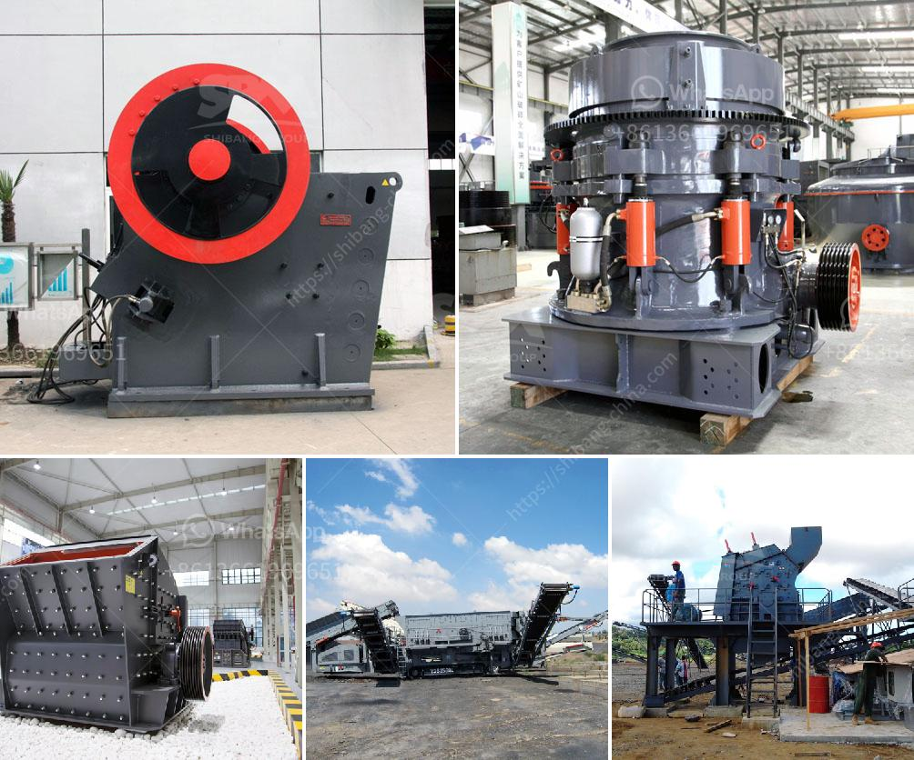

<h3>crusher machine tanzania</h3>
Crusher machines are widely used for crushing various materials into smaller sizes to facilitate efficient recycling or disposal. In Tanzania, crusher machines are widely used for processing various rocks and ores. There are many types of crusher machines available in the market, and each has its own unique features and advantages. This article will explore the crusher machine industry in Tanzania and discuss various aspects of their application.

One of the most popular crusher machines in Tanzania is the jaw crusher. Jaw crushers are primarily used for crushing larger rocks into smaller particles. They are designed to efficiently reduce the size of materials and are widely used in metallurgical, mining, and construction industries. These machines are known for their robust design, high production rates, and low maintenance requirements.

Cone crushers are another type of crusher machine commonly used in Tanzania. These machines are used to crush larger rocks into smaller particles, similar to jaw crushers. However, cone crushers have a different operating principle. They use a gyrating spindle along with an eccentric motion to crush the rocks between the mantle and concave.

Impact crushers are another popular type of crusher machine used in Tanzania. These machines are designed to crush materials with high hardness and are used in applications where the reduction ratio is high. Impact crushers utilize rapidly rotating hammers and impact plates to break down the materials into smaller particles.

Crusher machines in Tanzania are also available in mobile versions, allowing operators to move the crushing unit closer to the site of operation. This enables faster and more efficient crushing, and reduces the costs associated with transportation.

The demand for crusher machines in Tanzania is driven by the booming construction industry and the increasing demand for aggregates. These machines play a crucial role in processing raw materials for construction purposes. They are used to crush rocks, ores, and other materials to produce the desired size and quality of aggregates used in various construction projects.

In addition to the construction industry, crusher machines are also used in the mining sector in Tanzania. They are used to crush and process ores, such as gold, copper, and iron, to extract the desired minerals. These machines are crucial for the successful operation of mining operations and are designed to withstand the harsh conditions often encountered in mining sites.

In conclusion, crusher machines play a vital role in the processing of various materials in Tanzania. Whether it is for the construction or mining industry, these machines are essential for breaking down larger rocks and ores into smaller particles. The availability of different types of crusher machines, including jaw crushers, cone crushers, and impact crushers, provides operators with a wide range of options to choose from, depending on the specific requirements of their projects. With the continuous growth of the construction and mining sectors in Tanzania, the demand for crusher machines is expected to remain high in the coming years.
<h3>Contact us</h3><ul><li><strong>Whatsapp:&nbsp;<a href="https://wa.me/8613661969651">+8613661969651</a></strong></li><li><a href="https://swt.shibang-china.com/?git&amp;zhl&amp;crusher machine tanzania"><strong>Online Service(chat now)</strong></a></li></ul><h3>Related</h3><ul><li><a href='mobile stone crusher south africa.md'>mobile stone crusher south africa</a></li><li><a href='used nd hand coal crusher sizer.md'>used nd hand coal crusher sizer</a></li><li><a href='cone crusher company.md'>cone crusher company</a></li><li><a href='mobile stone crushing.md'>mobile stone crushing</a></li><li><a href='marbel grinder price in pakistan.md'>marbel grinder price in pakistan</a></li></ul>