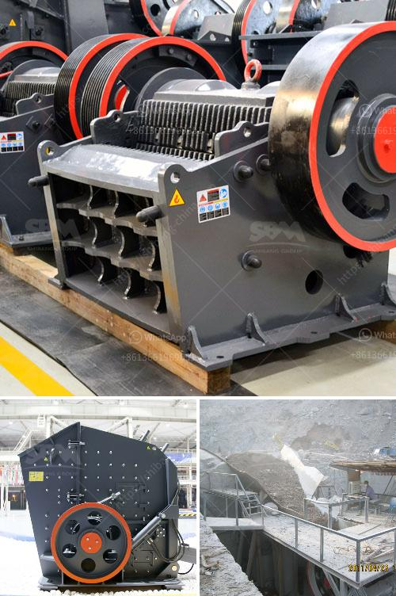

<h3>crusher machines suppliers in south africa</h3>
Crusher machines have widely applications in mining industry, construction, metallurgy as well as in other industries. Every year, suppliers of crusher machines in South Africa are plenty. However, these crusher machines have different functions and complete crushing production lines. There are plenty of suppliers of crushers machines in South Africa. So, what are these companies? What is the price trend for these crushers? Are there any special features of these machines? This article will provide a comprehensive overview of crusher machines suppliers in South Africa.

Crusher machines suppliers in South Africa mainly rely on the wide range of crushers from industrial machinery sectors, including impact crushers, jaw crushers, cone crushers, hammer crushers and so on. However, different crushers have different working principles. Therefore, when choosing a crusher, you need to determine the actual needs of the equipment to select the appropriate model.

In addition, each supplier also has different production techniques, manufacturing processes, and after-sales services. These factors not only affect the quality and life of the crusher but also the price of the equipment. Generally, speaking, the suppliers with strong comprehensive strength will have more competitive prices. However, the quality of the crushers produced by these suppliers is also guaranteed.

Among the suppliers of crusher machines in South Africa, Shanghai SBM is prominent. Mr. Seedsan, the Production Manager, said, "We have many suppliers in South Africa, but the quality of our products is guaranteed." He also considered that with the constant efforts of the government, the South African construction industry is gradually rising, which has a strong demand for crusher machines. Shanghai SBM has been working closely with many local construction companies to provide customers with one-stop solutions for their crushing projects.

Shanghai SBM has a strong R&D team and perfect after-sales service system. Possessing more than 30 patents, the advanced crusher machines, such as JC series jaw crusher, PF series impact crusher, HCS series hydraulic cylinder cone crusher, and HP series hydraulic cone crusher, are widely used in South Africa mining industry. Due to their high efficiency, low energy consumption, and considerate after-sales service, SBM crushers have won numerous praises from customers in South Africa.

Apart from Shanghai SBM, there are many other crusher machines suppliers in South Africa, such as Terex, Metso, and Lw. As a professional crusher machines supplier, Shanghai SBM can offer advanced technologies, high quality products and considerate after-sales service.

For the crusher machine buyers in South Africa, each type of crusher has a variety of models to choose from, such as JC series jaw crusher, HP series hydraulic cone crusher, PF series impact crusher, PFW series impact crusher, and so on. As a common type of crusher machine, cone crusher plays an important role in South Africa. This crusher machine is suitable for various different hardness materials, especially for these hard materials. With high efficiency and large capacity, cone crusher can be commonly used in South Africa mining, construction waste processing line and other industries.

In conclusion, crusher machines are critical equipment for many industries, including mining, construction, metallurgy, and others. In South Africa, crusher machines are always in the leading position in the mining industry. These crusher machines have different types and functions. Here are some popular types and models for you to choose from. Jaw crusher, impact crusher, or gyratory crushers are usually applied for primary size reduction. The crusher product size is controlled by the size of the crusher opening. These cone crushers are mainly used in iron stone, copper ore, granite, basalt, cobblestone, marble, limestone, and so on in South Africa mining sector.
<h3>Contact us</h3><ul><li><strong>Whatsapp:&nbsp;<a href="https://wa.me/8613661969651">+8613661969651</a></strong></li><li><a href="https://swt.shibang-china.com/?git&amp;zhl&amp;crusher machines suppliers in south africa"><strong>Online Service(chat now)</strong></a></li></ul><h3>Related</h3><ul><li><a href='diamond mining plant layout.md'>diamond mining plant layout</a></li><li><a href='marble milling machine for sale.md'>marble milling machine for sale</a></li><li><a href='price of ball mill for sale.md'>price of ball mill for sale</a></li><li><a href='station de concassage daun une carriere.md'>station de concassage daun une carriere</a></li><li><a href='hammer mill peru.md'>hammer mill peru</a></li></ul>