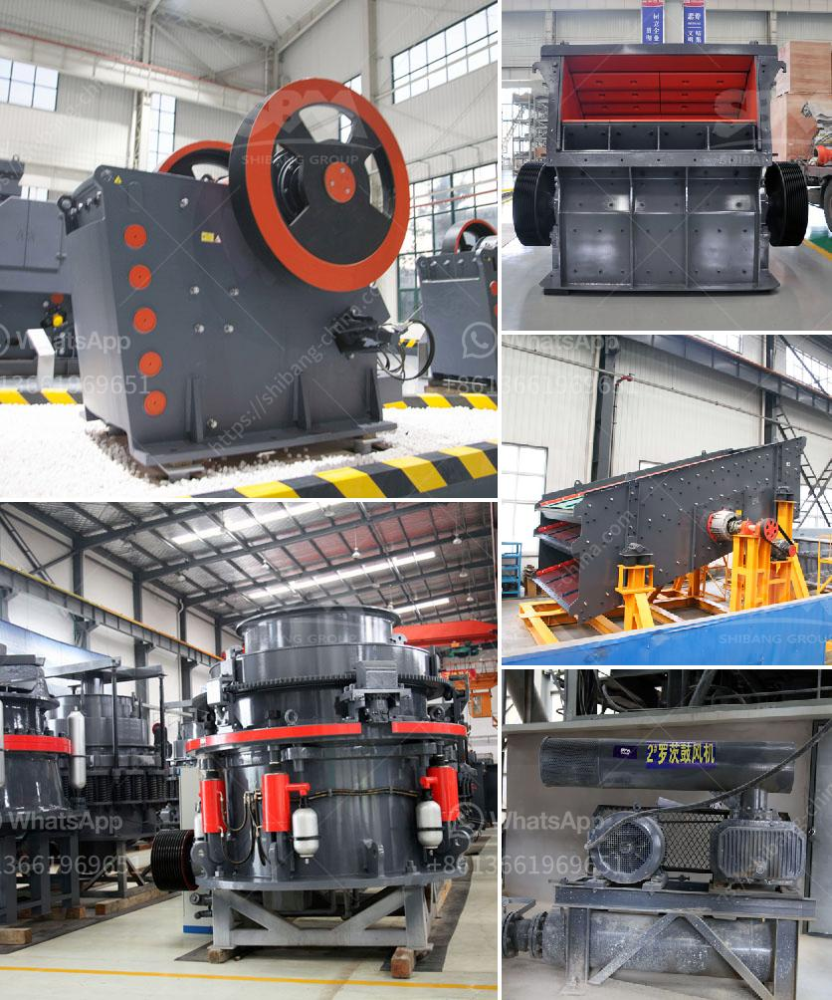

<h3>crusher manufacturer in pune</h3>
Pune, also known as the cultural capital of Maharashtra, is a prominent city in Western India. It is home to various educational institutions, industries, and businesses, making it a hub for manufacturing and innovation. One such industry that thrives in Pune is the stone crushing industry.

Crusher manufacturers in Pune refers to a group of specialized manufacturers who are involved in the production of crushers and their accessories. The manufacturing of these crushers is performed using state-of-the-art machinery, which enables the manufacturers to fulfill the increasing demand for crushers and other related products.

Pune is a vibrant city where infrastructure development is at its peak. Construction activities are on the rise, and the need for high-quality crushers is escalating. Being a well-established crusher manufacturer in Pune regarding infrastructure development ensures that the crushers manufactured are high-quality and reliable.

Owing to the growing demand for crushers, the market is highly competitive, and manufacturers must deliver reliable, efficient, and cost-effective products to survive. To meet these requirements, crusher manufacturers in Pune have entered into strategic partnerships with reputed suppliers of raw materials, specialized equipment, and technology.

These partnerships facilitate innovation, which is a key factor in producing crushers that are more efficient and reliable. Manufacturers focus on continuous research and development to stay ahead in the competition and provide cutting-edge solutions to their customers' crushing needs.

Furthermore, crusher manufacturers in Pune provide comprehensive after-sales service and support to their clients. This helps in building long-lasting relationships and instilling trust in their brand. Prompt service and support ensure that any issues or concerns faced by the customers are addressed and resolved in a timely manner, minimizing downtime and maximizing productivity.

Additionally, crusher manufacturers in Pune have a wide network of dealers and distributors, ensuring easy availability of their products across various locations. This network of dealers helps in reaching customers even in remote areas, catering to their specific crushing needs.

One of the key advantages of buying crushers from a manufacturer in Pune is the cost-effectiveness. As the manufacturers are located in the vicinity, transportation costs are significantly reduced. This enables them to offer competitive prices to their customers without compromising on the quality of the products.

Crusher manufacturers in Pune also prioritize environmental sustainability. They strive to minimize the environmental impact of their operations by implementing various eco-friendly practices. Efforts are made to conserve energy, minimize waste generation, and ensure proper waste disposal.

To sum it up, crusher manufacturers in Pune play a vital role in the stone crushing industry. Their continuous efforts and focus on innovation, quality, and after-sales service make them a reliable solution for crushing needs across diverse sectors and locations. With their wide range of products and commitment to customer satisfaction, they have established themselves as trustworthy partners in the growth and development of Pune and its surrounding regions.
<h3>Contact us</h3><ul><li><strong>Whatsapp:&nbsp;<a href="https://wa.me/8613661969651">+8613661969651</a></strong></li><li><a href="https://swt.shibang-china.com/?git&amp;zhl&amp;crusher manufacturer in pune"><strong>Online Service(chat now)</strong></a></li></ul><h3>Related</h3><ul><li><a href='captains of crusher zenith.md'>captains of crusher zenith</a></li><li><a href='stone crusher machine pr ice in nepal.md'>stone crusher machine pr ice in nepal</a></li><li><a href='stone crusher plant information.md'>stone crusher plant information</a></li><li><a href='crusher plant supplier in nepal.md'>crusher plant supplier in nepal</a></li><li><a href='crusher machine manufacturers shanghai.md'>crusher machine manufacturers shanghai</a></li></ul>