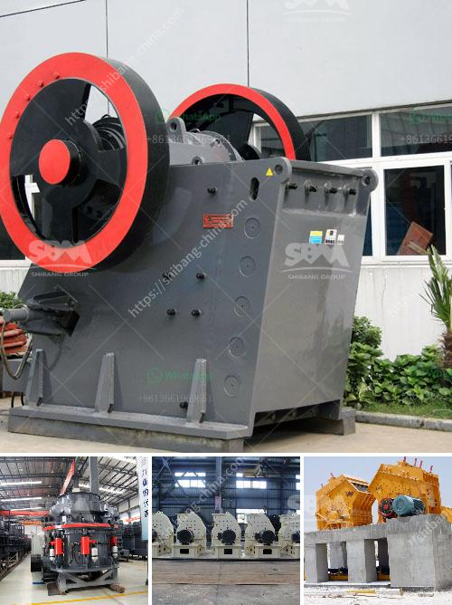

<h3>crusher mobile crusher peru</h3>
Peru's mining industry has been a backbone of its economy for centuries. With vast mineral reserves, including copper, gold, silver, and zinc, the country has attracted numerous companies, driving economic growth and employment opportunities.

In such a highly competitive industry, efficiency and productivity are paramount. This is where crusher mobile crushers have revolutionized the mining sector in Peru. These state-of-the-art machines have transformed the way mining operations are conducted, making the extraction process faster, safer, and more efficient.

A mobile crusher, as the name suggests, is a portable machine designed to crush rocks and minerals into smaller, more manageable sizes. It eliminates the need for transportation, thereby reducing costs and carbon emissions associated with moving large quantities of material. The mobility factor allows for immediate crushing on-site, where the minerals are extracted, saving valuable time and resources.

One of the key advantages of crusher mobile crushers is their ability to process a wide range of materials. From hard rocks to soft minerals, these machines can handle it all. This versatility enables mining companies to crush and process various materials simultaneously without the need for multiple machines, ultimately optimizing their operations and maximizing profits.

Additionally, crusher mobile crushers are equipped with advanced technology and features that enhance safety for workers. These machines are designed with safety in mind, incorporating features such as remote control operation, automatic shutdown in case of emergencies, and advanced warning systems. These safety measures minimize the risk of accidents and ensure a secure working environment for all personnel involved.

Another significant advantage of crusher mobile crushers is their low environmental impact. By eliminating the need for transportation, these machines drastically reduce carbon emissions. Furthermore, they can be powered by eco-friendly sources such as solar energy or biogas, further decreasing their ecological footprint. In a time when climate change is a global concern, these mobile crushers are a step towards sustainable mining practices.

Peru, being a geographically diverse country, often requires mining operations in remote locations. Traditional crushers often face logistical challenges when it comes to reaching these isolated areas. However, crusher mobile crushers are specifically designed for remote operations. Their compact size and mobility allow them to access even the most remote mining sites, ensuring that no mineral reserves are left untapped.

Overall, crusher mobile crushers have completely transformed the mining industry in Peru. They have become a game-changer, offering a range of benefits including increased efficiency, improved safety, reduced environmental impact, and enhanced access to remote mining sites. With their advanced technology and versatility, these machines have become an indispensable tool for mining companies seeking to optimize their operations and drive economic growth.

As Peru continues to be a key player in the global mining industry, crusher mobile crushers will undoubtedly play a crucial role in its future. These innovative machines have proven their worth, revolutionizing the mining sector and positioning Peru as a leader in sustainable and efficient mining practices.
<h3>Contact us</h3><ul><li><strong>Whatsapp:&nbsp;<a href="https://wa.me/8613661969651">+8613661969651</a></strong></li><li><a href="https://swt.shibang-china.com/?git&amp;zhl&amp;crusher mobile crusher peru"><strong>Online Service(chat now)</strong></a></li></ul><h3>Related</h3><ul><li><a href='stone cape crusher for sale china.md'>stone cape crusher for sale china</a></li><li><a href='quartz ball mill machinery.md'>quartz ball mill machinery</a></li><li><a href='hammer mill peru.md'>hammer mill peru</a></li><li><a href='mobile crusher medium manufacturers japan.md'>mobile crusher medium manufacturers japan</a></li><li><a href='industrial grinding plant.md'>industrial grinding plant</a></li></ul>