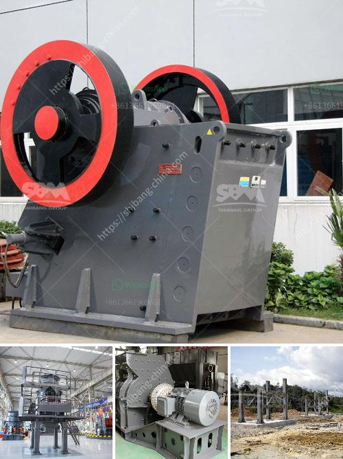

<h3>crusher mobile stone crusher</h3>
Technology has paved the way for innovation and revolutionized the way we do various tasks. One of the most significant technological advancements is the creation of mobile stone crushers. In the past, a stone crusher could only be operated in a stationary manner. However, advancements in technology have made this incredible machine accessible in a mobile version.

A crusher mobile stone crusher is a machine that is used to crush large rocks into smaller rocks or gravel for construction purposes. Mobile stone crushers are made of advanced technology and high-quality materials, allowing them to perform efficiently for extended periods. They are the perfect solution for those who require flexibility and convenience.

One of the biggest advantages of crusher mobile stone crushers is their portability. They can be easily transported from one location to another, making them suitable for construction projects in various areas. This mobility allows workers to conveniently move the machine to different sites without the hassle of dismantling and reassembling. It saves time and effort, making the overall construction process much more efficient.

The crusher mobile stone crusher also offers great versatility. It can crush a wide range of materials, including concrete, brick, rock, stone, limestone, and more. This versatility ensures that the machine can be used for various construction projects, regardless of the type of material being processed. Whether it's a road construction project or a building demolition, the mobile stone crusher can handle it with ease.

Another key feature of the crusher mobile stone crusher is its ease of operation. These machines are equipped with user-friendly controls that make it simple for operators to navigate and use. Whether it's adjusting the crushing size or changing the output capacity, operators can easily do it with a few simple steps. This ease of use ensures that workers can focus on their tasks, maximizing productivity and minimizing errors.

Crusher mobile stone crushers are also environmentally friendly. They are equipped with advanced dust suppression systems that reduce dust emissions during the crushing process. This is crucial for the health and safety of workers, as well as for nearby communities. Additionally, the machine's fuel consumption is optimized to minimize pollution and emissions.

In conclusion, crusher mobile stone crushers have revolutionized the construction industry. Their portability, versatility, ease of operation, and environmental friendliness make them an essential tool for any construction project. These machines provide a cost-effective and efficient solution for crushing various materials on site. Whether it's a small renovation project or a large-scale construction site, crusher mobile stone crushers are the future of the industry.
<h3>Contact us</h3><ul><li><strong>Whatsapp:&nbsp;<a href="https://wa.me/8613661969651">+8613661969651</a></strong></li><li><a href="https://swt.shibang-china.com/?git&amp;zhl&amp;crusher mobile stone crusher"><strong>Online Service(chat now)</strong></a></li></ul><h3>Related</h3><ul><li><a href='aggregate crushing flow chart.md'>aggregate crushing flow chart</a></li><li><a href='jaw crusher thailand.md'>jaw crusher thailand</a></li><li><a href='ball mill suppliers in south africa.md'>ball mill suppliers in south africa</a></li><li><a href='sand crusher price water.md'>sand crusher price water</a></li><li><a href='crushing plant aggregate type.md'>crushing plant aggregate type</a></li></ul>