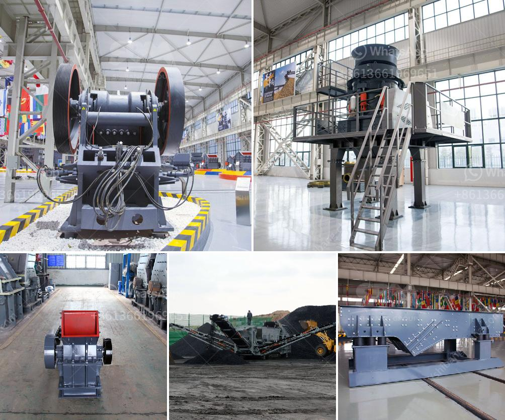

<h3>crusher new used for sale in uae</h3>
Crushers are essential heavy-duty machinery used in various industries to break down large rocks, concrete, or construction waste into smaller, more manageable pieces. These machines play a crucial role in the construction, mining, and demolition industries. In the United Arab Emirates (UAE), crushers are in high demand due to the booming construction and infrastructure development projects taking place across the country.

When it comes to purchasing crushers in the UAE, buyers have two options: buying new or used equipment. Both options have their advantages and considerations.

For those looking for a cost-effective solution, used crushers provide an excellent alternative. Used crushers are typically priced lower than new ones but can still offer similar performance levels. They have already gone through the initial depreciation, making them a more budget-friendly option for businesses.

In addition to financial benefits, buying a used crusher in the UAE can also offer faster delivery. Since the machine is physically available, buyers can usually expect a shorter waiting time for shipment. This can be crucial for businesses that need the equipment urgently to meet project deadlines.

While used crushers have their advantages, there are also some key factors to consider. The condition of the used machine should be thoroughly inspected to ensure it operates efficiently and meets the required standards. Proper maintenance records and service history should also be evaluated.

On the other hand, buying a new crusher in the UAE ensures the latest technology, improved performance, and longer lifespan. New crushers often come with warranties, providing peace of mind to buyers. Additionally, new equipment offers advanced features, enhanced safety measures, and better fuel efficiency, resulting in lower operational costs over time.

Regardless of whether buyers choose new or used crushers in the UAE, it is essential to work with reputable dealers or suppliers. These suppliers should have a strong track record of providing high-quality equipment, reliable customer service, and after-sales support.

In conclusion, crushers are crucial equipment in the UAE's construction industry, and both new and used machines can serve different needs. Buyers should carefully consider their requirements, budget, and the reputation of suppliers before making a final decision. Whether opting for new or used crushers, the goal is to invest in reliable machinery that delivers efficient performance and contributes to successful projects in the UAE.
<h3>Contact us</h3><ul><li><strong>Whatsapp:&nbsp;<a href="https://wa.me/8613661969651">+8613661969651</a></strong></li><li><a href="https://swt.shibang-china.com/?git&amp;zhl&amp;crusher new used for sale in uae"><strong>Online Service(chat now)</strong></a></li></ul><h3>Related</h3><ul><li><a href='cone crushers manufacturer.md'>cone crushers manufacturer</a></li><li><a href='how much is the mobile mill for small scale mining.md'>how much is the mobile mill for small scale mining</a></li><li><a href='what are the prices of crushing equipment.md'>what are the prices of crushing equipment</a></li><li><a href='construction conveyor for sale.md'>construction conveyor for sale</a></li><li><a href='process of quarrying limestone crusher.md'>process of quarrying limestone crusher</a></li></ul>