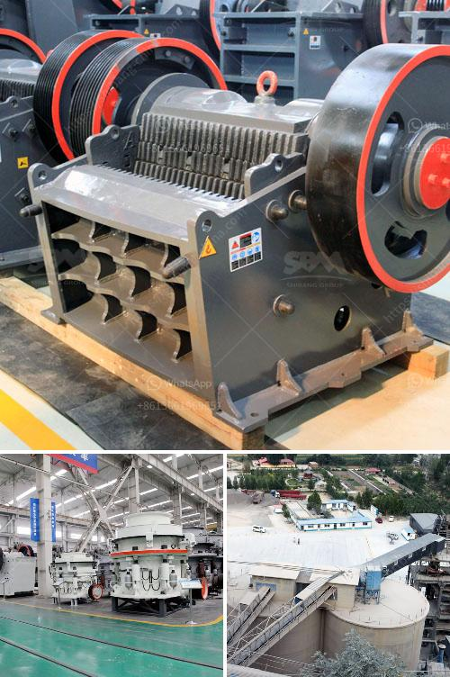

<h3>crusher plant dealer in pakistan</h3>
In Pakistan, crusher plants are commonly used for ore crushing and industrial grinding. Dealers in this industry can help customers in the procurement of these plants. A crusher plant deal in Pakistan offers a range of machinery in various types and sizes to meet customers' specific requirements. This article aims to provide an insight into the crusher plant dealer industry in Pakistan.

A crusher plant dealer primarily deals with various types of hard rocks, which are mined from quarries and blasted using explosives. The resulting rocks are crushed further using jaw crushers and then fed into cone crushers for further reduction in size. After the desired size is achieved, the crushed rocks are then screened and separated into different fractions based on their size. These fractions are then used as raw materials in various industries such as construction, steel, and cement.

The crusher plant dealer industry in Pakistan has seen tremendous growth in recent years. With the increasing demand for construction materials and the government's focus on infrastructure development, the need for crushing and screening plants has increased significantly. This growth has led to the emergence of several crusher plant dealers in the country.

A crusher plant dealer in Pakistan typically offers a comprehensive range of services to help customers meet their specific requirements. They not only provide high-quality machinery, but also assist in installation, commissioning, and after-sales support. These dealers often have a team of experienced technicians who are well-versed in the operation and maintenance of crusher plants.

When selecting a crusher plant dealer in Pakistan, customers should consider several factors. Firstly, they should ensure that the dealer provides machinery that meets their specific needs and is of high quality. Secondly, customers should inquire about the dealer's after-sales service and support. This is crucial, as regular maintenance and timely repairs are essential for the smooth operation of crusher plants. Additionally, customers should also consider the dealer's reputation in the market and their track record of customer satisfaction.

The crusher plant dealer industry in Pakistan is highly competitive, with many players vying for customers' attention. To stay ahead in this competitive market, dealers often offer attractive pricing packages, extended warranties, and other value-added services. They also constantly update their product offerings to keep up with the latest technological advancements.

In conclusion, the crusher plant dealer industry in Pakistan plays a vital role in providing the necessary machinery for ore crushing and industrial grinding. These dealers offer a wide range of crusher plants and services to meet customers' specific requirements. Customers should carefully choose a reputable dealer who can provide high-quality machinery and reliable after-sales support. By doing so, they can ensure the smooth operation and longevity of their crusher plant.
<h3>Contact us</h3><ul><li><strong>Whatsapp:&nbsp;<a href="https://wa.me/8613661969651">+8613661969651</a></strong></li><li><a href="https://swt.shibang-china.com/?git&amp;zhl&amp;crusher plant dealer in pakistan"><strong>Online Service(chat now)</strong></a></li></ul><h3>Related</h3><ul><li><a href='used mobile hammer mills for sale.md'>used mobile hammer mills for sale</a></li><li><a href='dolomite powder machine in sri lanka.md'>dolomite powder machine in sri lanka</a></li><li><a href='gypsum processing equipment.md'>gypsum processing equipment</a></li><li><a href='price of grinding powder manufacturing machine.md'>price of grinding powder manufacturing machine</a></li><li><a href='mantencion a cone crusher.md'>mantencion a cone crusher</a></li></ul>