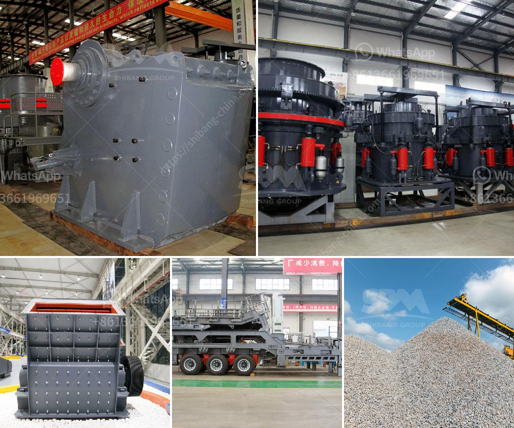

<h3>crusher plant for quartz crushing</h3>
Quartz is one of the most common minerals found on earth. It has a crystalline structure and is made up of silica, which gives it its unique hardness and durability. Quartz is used in a variety of industries including glass, ceramics, and electronics. For this reason, crushing the quartz into small particles is necessary for the manufacturing process.

A crusher plant is a machine that is designed to reduce the size of large rocks or gravel, for construction purposes. It can often be used as a primary or secondary crusher, so it is great for use in the mining industry. However, crusher plants are also indispensable for the crushing of other minerals such as granite, basalt, and limestone. Quartz crushing equipment plays an irreplaceable role in the mining industry.

To be honest, it is an inevitable fact that quartz crushing plants are wildly used in metallurgical, chemical, and electric industry, especially in the electric industry because of the quartz's hardness. In fact, quartz has so many advantages that even the little camps of used ones are quite valuable when compared to diamond.

Crusher plants are used in a variety of industries including mining, construction, and demolition. Although the purpose of this equipment is to break down large pieces of material into smaller, more manageable particles, it is not a one-size-fits-all solution. Understanding the requirements of each industry is vital for selecting the right equipment.

When it comes to crushing quartz, there are different methods and tools that are efficient. Depending on a plant's configuration, jaw, cone, and impact crushers can be used to achieve the desired size reduction. Depending on the hardness of the material, the jaw crusher can be equipped with various materials such as manganese steel, tungsten carbide, and zirconia.

In addition to the crushing process, a crusher plant can provide various ancillary equipment that can improve the efficiency of the entire operation. Vibrating screens, feeders, and conveyors are commonly used to transport materials to the crusher and separate the crushed quartz into different sizes. Magnetic separators can be used to remove impurities from the crushed quartz to enhance its purity. Dust control systems are also important to reduce airborne dust and protect workers' health.

Furthermore, crusher plants can be customized to suit the specific needs of the customer. For example, the crusher plant can be modified to accommodate different production capacities, different particle sizes, and different types of materials. It is important to consider these factors when selecting a crusher plant for quartz crushing.

In conclusion, quartz is an abundant mineral that is used in a variety of industries. Crusher plants are used to reduce the size of quartz and deliver its various forms such as gravel, rock, and sand for the manufacturing process. They are commonly used in the mining industry, construction, and demolition industries. Depending on the hardness of the material, jaw, cone, and impact crushers can be selected to achieve the desired size reduction. Ancillary equipment such as vibrating screens, feeders, and conveyors can further improve the efficiency of the operation. Customization options are available to suit the specific needs of the customer.
<h3>Contact us</h3><ul><li><strong>Whatsapp:&nbsp;<a href="https://wa.me/8613661969651">+8613661969651</a></strong></li><li><a href="https://swt.shibang-china.com/?git&amp;zhl&amp;crusher plant for quartz crushing"><strong>Online Service(chat now)</strong></a></li></ul><h3>Related</h3><ul><li><a href='portable crushers sweden.md'>portable crushers sweden</a></li><li><a href='cost of malaysia mobile crusher in india.md'>cost of malaysia mobile crusher in india</a></li><li><a href='china crusher exporters mails hotmail com.md'>china crusher exporters mails hotmail com</a></li><li><a href='crusher jaw crusher 10 36.md'>crusher jaw crusher 10 36</a></li><li><a href='stone crusher cost.md'>stone crusher cost</a></li></ul>