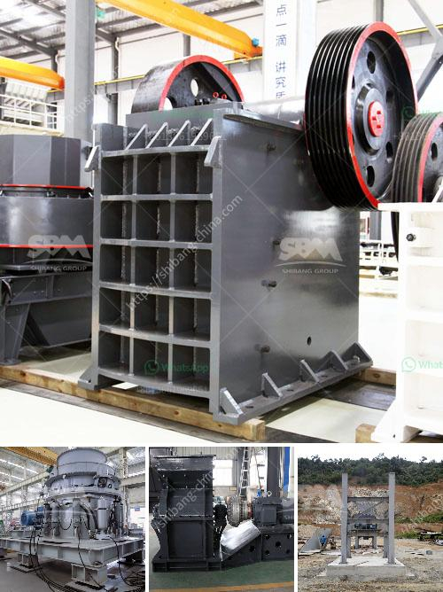

<h3>crusher plant in turkey</h3>
Turkey, officially known as the Republic of Turkey, is a large and diverse country located at the crossroads of Europe and Asia. With its rich history and cultural heritage, Turkey has become a prominent player in various industries, including the mining sector. One important aspect of the mining industry is the crushing and screening plant, which helps extract and process the valuable resources from the earth.

A crusher plant, also known as a crushing and screening plant, crushes various types of raw materials into smaller particle sizes. It is a crucial step in the mining and construction industries, where it enables the extraction of valuable metals, minerals, and aggregates from the earth.

One of the key players in the Turkish market for crushing and screening plants is FABO Machinery. FABO manufactures and installs mobile and stationary type stone crushing and screening plants according to customer requirements. The company's extensive product range includes crushers, screens, feeders, and washing equipment, all designed to deliver exceptional performance and efficiency.

FABO's crusher plants are widely used in various sectors, such as mining, quarries, and construction. They offer a wide range of crushing solutions to meet the diverse needs of their customers. From primary jaw crushers to secondary cone crushers and tertiary impact crushers, FABO provides reliable and efficient equipment for every stage of the crushing process.

Moreover, FABO's crusher plants are designed to be highly mobile, allowing for easy transportation and rapid deployment to different job sites. This mobility is particularly beneficial in Turkey, where infrastructure projects are booming, and the need for on-site crushing and screening is prevalent.

Furthermore, FABO's crusher plants are equipped with advanced automation systems, which ensure seamless operation and maximum productivity. These automation systems can be integrated with the customer's existing control systems or provided as a standalone solution.

In addition to their high-quality products and advanced technology, FABO also provides exceptional after-sales service and support. They have a dedicated team of experts who are readily available to assist customers with any technical issues or inquiries they may have. This commitment to customer satisfaction has earned FABO a reputable position in the Turkish market.

Turkey's crusher plant industry is poised for significant growth in the coming years. The country has been investing heavily in infrastructure projects, which is driving the demand for crushers and screening plants. Additionally, the rise in mining activities and the growth of the construction industry are further boosting the market for crushing and screening plants.

In conclusion, crusher plants play a crucial role in the mining and construction industries in Turkey. FABO Machinery, a leading manufacturer and supplier of crusher plants, offers a wide range of solutions to meet the diverse needs of its customers. With their advanced technology, high-quality products, and excellent after-sales service, FABO is well-positioned to cater to the growing demand for crushing and screening plants in Turkey.
<h3>Contact us</h3><ul><li><strong>Whatsapp:&nbsp;<a href="https://wa.me/8613661969651">+8613661969651</a></strong></li><li><a href="https://swt.shibang-china.com/?git&amp;zhl&amp;crusher plant in turkey"><strong>Online Service(chat now)</strong></a></li></ul><h3>Related</h3><ul><li><a href='conveyor belts specifications.md'>conveyor belts specifications</a></li><li><a href='200mm crusher sieve opening sizes.md'>200mm crusher sieve opening sizes</a></li><li><a href='price rock crusher.md'>price rock crusher</a></li><li><a href='portable hammer mill australia in perth.md'>portable hammer mill australia in perth</a></li><li><a href='basalt impact crusher price.md'>basalt impact crusher price</a></li></ul>