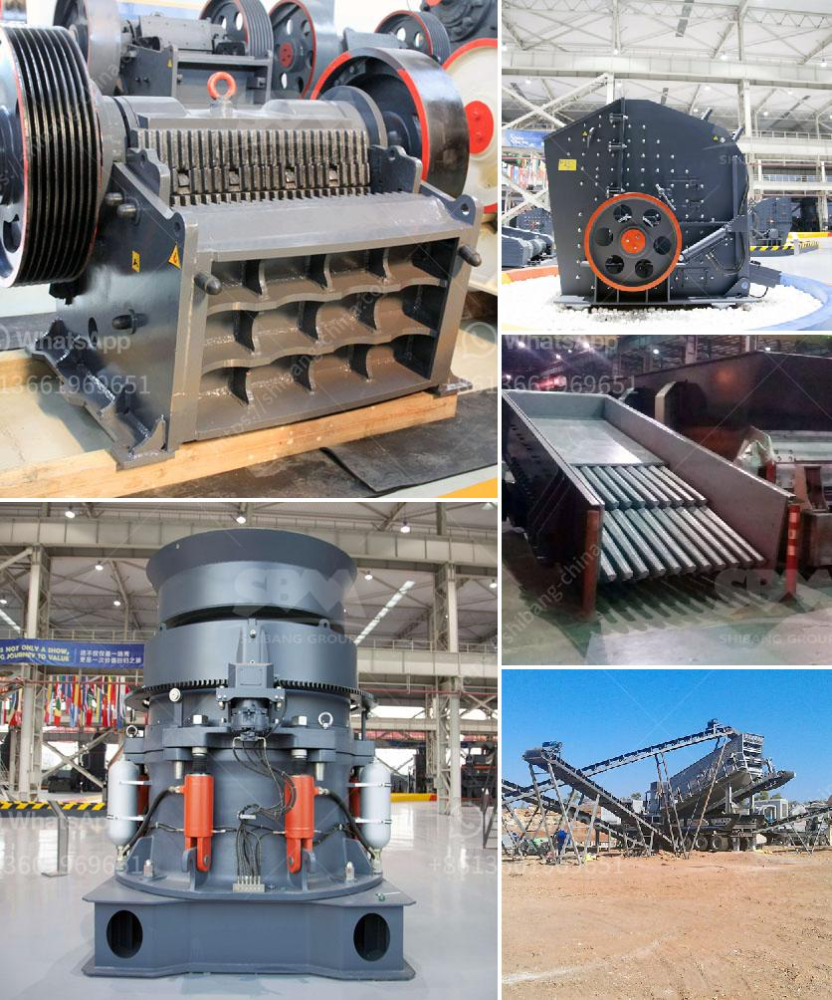

<h3>crusher plant manufacturer</h3>
Crusher plants are heavy machinery designed to break the stone into small fragments called aggregates. Crushing involves reducing the size of the stones to facilitate easier handling, transportation, and storage. Crushers are used in a variety of industries such as mining, construction, material recycling, and others.

A crusher plant manufacturer plays a crucial role in the production of aggregates. Various types of crushers are used in the crushing industry. These include jaw crushers, impact crushers, cone crushers, and gyratory crushers. These machines perform different tasks to produce the desired shape and size of the aggregates.

A crusher plant manufacturer takes responsibility for the whole process of designing, manufacturing, and assembling the machines in accordance with the industry standards and quality parameters. They ensure that the crushers are durable, efficient, and can withstand demanding working conditions.

Having a reliable crusher plant manufacturer is essential for any construction or mining project. The manufacturer should have extensive experience in the industry, a good reputation, and a track record of producing high-quality equipment. They should be able to provide technical support, maintenance services, and spare parts whenever required.

A reputable crusher plant manufacturer will also offer customized solutions based on the specific needs of their customers. They understand that different applications require different types of crushers. By understanding the customer's requirements, they can suggest the best equipment that will deliver optimal performance and productivity.

It is crucial to choose a crusher plant manufacturer that adheres to safety standards and regulations. Safety is paramount in any construction or mining site, and the manufacturer should prioritize it during the design and manufacturing process.

In conclusion, a crusher plant manufacturer plays a vital role in the production of aggregates. They design, manufacture, and assemble high-quality crushing machines that meet the industry standards. Choosing a reliable manufacturer ensures the efficiency, productivity, and safety of the crushing process.
<h3>Contact us</h3><ul><li><strong>Whatsapp:&nbsp;<a href="https://wa.me/8613661969651">+8613661969651</a></strong></li><li><a href="https://swt.shibang-china.com/?git&amp;zhl&amp;crusher plant manufacturer"><strong>Online Service(chat now)</strong></a></li></ul><h3>Related</h3><ul><li><a href='used mobile crusher in uae.md'>used mobile crusher in uae</a></li><li><a href='mobile crusher medium manufacturers japan.md'>mobile crusher medium manufacturers japan</a></li><li><a href='rolls crusher for sale.md'>rolls crusher for sale</a></li><li><a href='list of equipments for a quarry crusher.md'>list of equipments for a quarry crusher</a></li><li><a href='buy mobile crusher in usa.md'>buy mobile crusher in usa</a></li></ul>