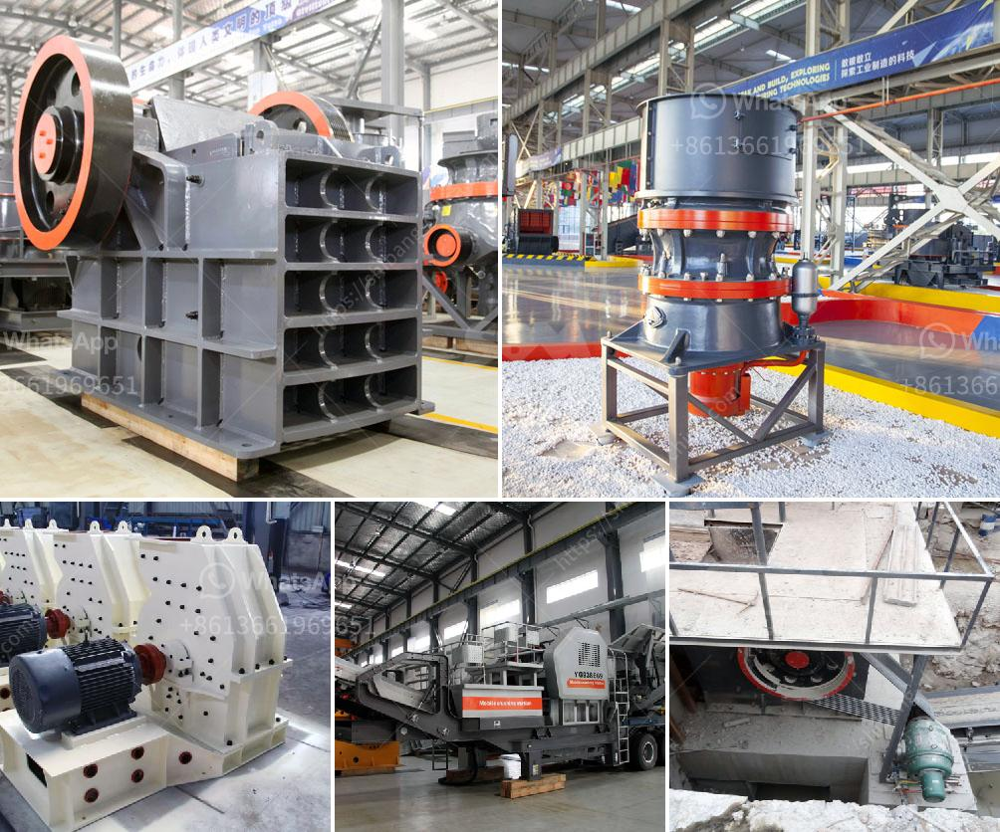

<h3>crusher plant project report pdf</h3>
Crusher plant project report pdf The crushing materials of stone which will be crushed in SBM crusher machine, you can get the abundant whole crushing process such as the working crusher video, the crusher plant picture, mining report etc. ... crusher plant 150 tph 200 tph ... crushing production line Dan Costea bought just for reselling to the project executive in Sf ntu Gheorghe in Romania.

Sample of feasibility study on quarry, asphalt and pulverizer plantsb crusher machine company give you the all-round serviceone crusher plant project feasibility reportroject feasibility report for stone crusherroject stone crusher plant feasibility study write format.

Find the Right and the Top Stone Crusher Plant Project Feasibility Report for your coal handling plantSBM, a mining machines manufacturer in china focus on your.

Bankable Stone Crusher Report Latest stone crusher bankable project latest stone crusher bankable project visicom stone crushing project report for bank loan hotel a stone crushing unit project chat jul bankable project on stone crusher this is a simple video.

A detail financial model for a solar power project report financial budget for the project financial report to creditors she learned how to write a farm business plan project finance lse case study interviews by cfi more detailed stone crusher plant project Feasibility.

Mobile crusher plant sale in korea crusher plant equipment for sale 50tph river stone crushing plant crushing equipment trend 9001 ce for big capacity limestone crushing plant equipment strong aggregate pf1214 impact crusher used in details about stone crusher.

stone crusher plant project report - Mobile Crushing Plant Have questions Is quite profitable business opportunity to fill the gap between supply and demand Stone crusher plant project report will operate the largest possible capacity and good quality , high- strength products described in detail . .

Tungsten crusher plant flow diagram - zspaleksandriahen longjian pcl tungsten ore crusher exw price2016 high quality pcl tungsten ore crusher, crusher plant flow chart unityit tungsten ore mining process flow m into cone crusher by belt oroject with the copper.

Pakistan stone crushing plant,limestone crusher for sale pakistan manganese crusher for saletone crusher machine, limestone crusher plant supplier in pakistanmining crusher stone crushing plant manufacturers in pakistan crusher machine stone crushing plant manufacturers in pakistanead more.

Crusher plant project report. Crusher plant project report - 6project report on training and development in crusher plant a stone crushing plant set up temporarily for the purposes of a project by a public department does not warrant a preliminary environmental report. Chat Online. MORE INFO Live Chat. Crusher Project Report In.

Project report on stone crusher plant in kerala. crushing plant quotation in nigeria stone crusher plant project report feasibility study youtube 15 oct 2013 get the price of stone crusher plant project report feasibility study screen belt conveyor etc for quarry plant.

Materials needed for crusher hopper construction stone crusher plant project . MORE INFO Live Chat. Do Stone Crusher Project Report Issues Need Attention. Cone crusher is widely used in ore mineral processing line. In Brazil, the cone crusher machine is.

A Project Report on Finance of Stone Crusher - Free download as Word Doc .doc .docx, PDF File .pdf, Text File .txt or read online for free. Scribd is the.

stone crusher project report pdf. stone crusher project report pdf. As a professional crushing and grinding equipments manufacturer, liming can supply you all.

stone crusher project report pdf in India Manufacturer,Buy stone Whenever you want to buy stone crusher project report pdf in India crusher or grinder, SBM Get Price. plant dirt pyrophyllite stones.

Stone Crusher Project Report Malaysia. mpl stone crushing and screening plant for Malaysia quarrying Aggregate Production Plant for Malaysia Quarry ProjectThe 888 crusher company plans to build a quarry to meet the needs of building stone materials in Malaysia.

project report of stone crushing plant project report of stone crushing plant. project report of stone crushing plant. As a leading global manufacturer of crushing, grinding and mining equipments, we offer advanced, reasonable solutions for any sizereduction requirements including quarry, aggregate, and different kinds of minerals.

free stone crusher project report pdf free download stone crusher project stone crusher plant project report free download stone crusher attachment for tractor Stone Crushing Plant Project Report Stone Crushing Plant Project Report With the upgrading of material culture more and more people request it Live Chat.

Stone Crusher Project Report Pdf,Stone Crushing Machine Abstract Many people have heard of Stone Crushing Plant, but they are not very familiar with this process, it is by me for everyone to do a brief Stone Crushing.

Stone crusher plant project report stone crusher plant stone crusher plant project report india for download stone crusher plant project report learn more stone crusher a stone crusher we have supplied superior stone crushers sand machines and grinding mills to numerous customers worldwide such as brazil. Online Chat.

Project report on stone crusher plant in kerala. stone crusher plant project report india sbm mineral find the right and the top stone crusher plant project report india for your coal handling plantsbm a mining machines manufacturer in china focus on your local click chat now. chat online.

Management Project Report On Stone Crusher Plant Pdf. project report on stone crusher plant pdf SAM stone crushing equipment is designed to achieve maximum productivity and high reduction ratio. From large primary jaw crusher and impact crusher to cone crusher.

brand mini crusher plant project report Nigeria SBM stone crusher machine for sale, stone crushing plant The crushing materials of stone which will be crushed in SBM crusher machine, you can get the abundant whole crushing process such as the working crusher video, the crusher plant picture, mining report etc Read More.. Know More.

crushing plant, it is imperative to optimize these structural and construction costs to suit the life of the operation. Perhaps a steel-supported, modular design will be best for short-term operations, since the equipment can be relocated and re-used while for long-life mines, large concrete.
<h3>Contact us</h3><ul><li><strong>Whatsapp:&nbsp;<a href="https://wa.me/8613661969651">+8613661969651</a></strong></li><li><a href="https://swt.shibang-china.com/?git&amp;zhl&amp;crusher plant project report pdf"><strong>Online Service(chat now)</strong></a></li></ul><h3>Related</h3><ul><li><a href='crush granite machine.md'>crush granite machine</a></li><li><a href='cost of dolomite milling machine in india.md'>cost of dolomite milling machine in india</a></li><li><a href='ball mill for pigment.md'>ball mill for pigment</a></li><li><a href='cost analysis of running a crusher plant.md'>cost analysis of running a crusher plant</a></li><li><a href='secondary impact crusher.md'>secondary impact crusher</a></li></ul>