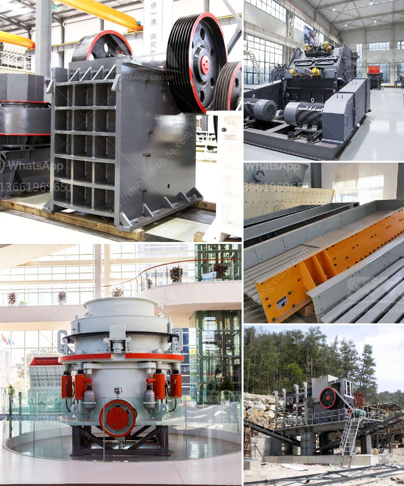

<h3>crusher plant supplier in nepal</h3>
Nepal is rich in many mineral resources, including various types of stone and rocks. In recent years, there has been a surge in the mining industry in Nepal, with numerous crusher plants springing up all over the country. With the increasing demand for stones and aggregates, these plants have been flourishing in Nepal, attracting investment from both domestic and foreign entities.

A crusher plant supplier in Nepal is a lucrative business opportunity, especially for investors who want to set up a large-scale project. Individuals or companies interested in investing in a crusher plant supplier in Nepal can expect good returns by starting and operating their own crushing business. The market for crushed stones and aggregates is rapidly growing, as construction projects in Nepal are in full swing.

A crusher plant supplier in Nepal can supply a wide range of crushers, from small and medium-sized crushers to large-sized crushers. These machines are designed to break rocks and stones into smaller pieces, thus making them suitable for use in construction and other industries. The crushers come in different types, such as jaw crushers, gyratory crushers, cone crushers, impact crushers, etc., each with its own unique features and advantages.

In addition to supplying crushers, a crusher plant supplier in Nepal can also provide installation and maintenance services. This ensures that the crushers are properly installed and maintained, maximizing their efficiency and prolonging their lifespan. Additionally, some crusher plant suppliers may also offer training and technical support to their clients, ensuring that they can operate the crushers effectively.

Along with supplying crushers, some suppliers may also offer other complementary products, such as screens, feeders, conveyors, and other equipment required for the crushing process. This makes it convenient for clients to source all their crushing equipment needs from a single supplier.

In conclusion, the crusher plant supplier industry in Nepal is booming, thanks to the rapid growth in the construction sector. Setting up a crusher plant in Nepal can be a profitable venture for individuals or companies looking for business opportunities in the mining industry. With the right machinery, installation, and maintenance support, a crusher plant supplier can cater to the increasing demand for crushed stones and aggregates in Nepal.
<h3>Contact us</h3><ul><li><strong>Whatsapp:&nbsp;<a href="https://wa.me/8613661969651">+8613661969651</a></strong></li><li><a href="https://swt.shibang-china.com/?git&amp;zhl&amp;crusher plant supplier in nepal"><strong>Online Service(chat now)</strong></a></li></ul><h3>Related</h3><ul><li><a href='crushed calcite manufacturer in rajasthan.md'>crushed calcite manufacturer in rajasthan</a></li><li><a href='used heavy duty jaw crushing machine.md'>used heavy duty jaw crushing machine</a></li><li><a href='list price vibrating screen.md'>list price vibrating screen</a></li><li><a href='crusher machine business.md'>crusher machine business</a></li><li><a href='stone crusher for sale in usa.md'>stone crusher for sale in usa</a></li></ul>