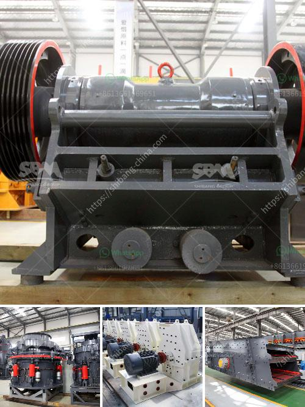

<h3>crusher production line</h3>
Crusher production line plays a significant role in driving the industrial development. With the continuous progress of technology, the crusher industry has also experienced a significant evolution. Today, crushers are widely used in various industries, including mining, construction, metallurgy, chemical, and more. They are essential tools for breaking down large rocks into smaller, more manageable sizes. 

A crusher production line typically consists of several crushers, screens, conveyors, and other auxiliary equipment. These machines work together to process materials and produce the desired final products. The specific configuration of the production line depends on the type and size of the materials being crushed, as well as the desired final product. 

The primary crusher in a production line is responsible for reducing the size of the materials to a manageable level. It may be a jaw crusher, gyratory crusher, or impact crusher, depending on the hardness, abrasiveness, and size of the materials. Once the materials are crushed, they move on to the secondary crushers for further processing. These secondary crushers, such as cone or impact crushers, refine the materials into smaller sizes. 

Screens are an essential part of the crusher production line, as they separate the crushed materials into different sizes. This allows for further processing or direct use of the materials, depending on the intended application. Conveyors transport the materials between different stages of the production line, ensuring a smooth and efficient operation. 

A well-designed crusher production line can greatly improve productivity and reduce operational costs. By automating the process and optimizing equipment performance, production can be increased while minimizing downtime and maintenance costs. Additionally, modern crushers are equipped with advanced technologies and features, such as adjustable settings, material tracking systems, and remote monitoring, which further enhance their efficiency and reliability. 

Furthermore, a crusher production line contributes to environmental sustainability. By recycling and reusing materials, the demand for new raw materials is reduced, thereby preserving natural resources. In addition, crushers can process waste materials and turn them into useful products, such as recycled concrete aggregates or crushed stones used for road construction. 

In conclusion, a crusher production line is a necessary part of industrial development. It enables the efficient processing of raw materials, producing desired final products used in various industries. By utilizing advanced technologies and optimizing equipment performance, crusher production lines enhance productivity while minimizing operational costs. Furthermore, they contribute to environmental sustainability by recycling and reusing materials. As industries continue to evolve and grow, crusher production line will remain a vital component in meeting their material processing needs.
<h3>Contact us</h3><ul><li><strong>Whatsapp:&nbsp;<a href="https://wa.me/8613661969651">+8613661969651</a></strong></li><li><a href="https://swt.shibang-china.com/?git&amp;zhl&amp;crusher production line"><strong>Online Service(chat now)</strong></a></li></ul><h3>Related</h3><ul><li><a href='crusher for granite.md'>crusher for granite</a></li><li><a href='roller mill corrugation.md'>roller mill corrugation</a></li><li><a href='suppliers of ld slag crushing plants in india.md'>suppliers of ld slag crushing plants in india</a></li><li><a href='mini coke processing plant.md'>mini coke processing plant</a></li><li><a href='used portable gravel screens for sale.md'>used portable gravel screens for sale</a></li></ul>