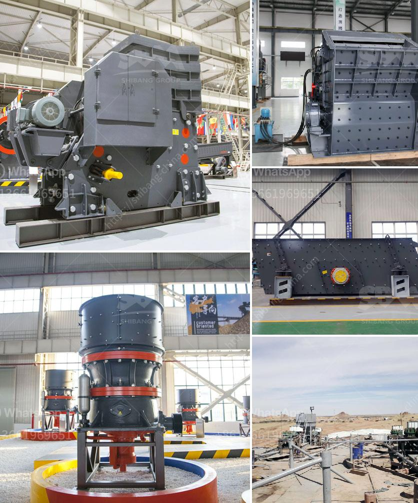

<h3>crusher stone for sale</h3>
Crusher stone has become a popular choice for construction and landscaping projects due to its durability and affordability. Also known as crushed stone or angular rock, this material is produced by crushing larger rocks into smaller pieces for various uses in the construction industry. From driveways to pathways, crusher stone is a versatile and essential material that ensures durability and functionality.

One of the primary uses of crusher stone is for creating road and driveway surfaces. Its ability to bind together and form a solid base makes it ideal for this purpose. Whether you are constructing a new driveway or maintaining an existing one, crusher stone provides a stable and long-lasting solution. Its angular shape helps to interlock the stones, preventing them from shifting or settling over time.

In addition to driveways, crusher stone is also commonly used for creating paths and walkways. Whether it's a garden path or a walkway around your property, crusher stone offers a practical and visually appealing option. Its natural texture and color blend well with the surrounding landscape, enhancing the overall aesthetic appeal of your outdoor area.

Crusher stone is also an important component in the construction of retaining walls. These walls are designed to hold soil in place, preventing erosion and ensuring stability. The compacted crusher stone acts as a solid foundation for these walls, providing the necessary support and stability to withstand the pressure exerted by the soil behind them.

Furthermore, crusher stone is often used for drainage purposes. Its porosity allows water to flow through, preventing the accumulation of water on the surface. This feature is particularly useful in areas with heavy rainfall or in situations where proper drainage is required, such as around buildings or in landscaping projects.

When selecting crusher stone for your construction project, it is essential to consider the size and quality of the material. Different projects may require various sizes of crusher stone, ranging from small gravel-like pieces to larger stones. It is advisable to consult with a professional or supplier to determine the most suitable option for your specific needs.

Nowadays, crusher stone is readily available for purchase from various suppliers. Local stone yards and home improvement stores often stock a range of crusher stone options. Additionally, many suppliers offer delivery services, making it convenient for homeowners and contractors to access the material directly at the construction site.

In conclusion, crusher stone is an invaluable construction material due to its versatility and durability. From driveways to pathways and retaining walls, crusher stone provides a reliable and long-lasting solution. Its ability to aid in proper drainage further adds to its usefulness. When considering crusher stone for sale, it is essential to choose the appropriate size and quality for your specific project. With the availability of this material from various suppliers, obtaining crusher stone has become more accessible, making it an increasingly popular choice in the construction industry.
<h3>Contact us</h3><ul><li><strong>Whatsapp:&nbsp;<a href="https://wa.me/8613661969651">+8613661969651</a></strong></li><li><a href="https://swt.shibang-china.com/?git&amp;zhl&amp;crusher stone for sale"><strong>Online Service(chat now)</strong></a></li></ul><h3>Related</h3><ul><li><a href='disintegrator grinder pulverizer.md'>disintegrator grinder pulverizer</a></li><li><a href='used mobile hammer mills for sale.md'>used mobile hammer mills for sale</a></li><li><a href='grinding mill for limestone italy in bergamo.md'>grinding mill for limestone italy in bergamo</a></li><li><a href='crusher machine tanzania.md'>crusher machine tanzania</a></li><li><a href='ton per hour hammer mill grinding mill china.md'>ton per hour hammer mill grinding mill china</a></li></ul>