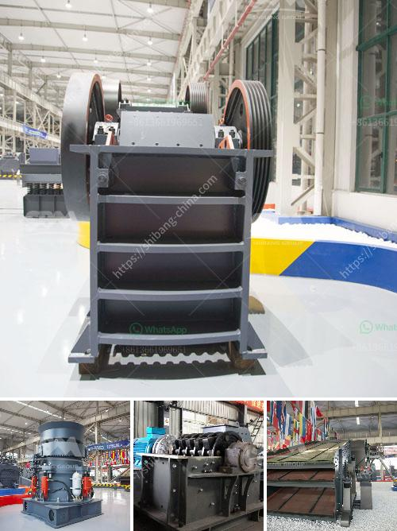

<h3>crusher suppliers usa</h3>
Crushers play a crucial role in the mining and construction industries by breaking down large rocks into smaller, more manageable sizes. They are essential equipment for processing various materials, including ores, aggregates, and demolition waste. In the United States, crusher suppliers offer a wide range of machines to meet the diverse crushing requirements of different industries.

One of the leading crusher suppliers in the USA is ABC Machinery. With years of experience in the industry, ABC Machinery has established a strong reputation for providing reliable and efficient crushing solutions. They offer a wide range of crushers, including jaw crushers, impact crushers, cone crushers, and more. These machines are designed to deliver high productivity, excellent reduction ratios, and long-lasting performance.

ABC Machinery understands the importance of tailored solutions for individual projects. They work closely with their clients to analyze their specific requirements and provide custom-designed crushers that meet their unique needs. Whether it's a small-scale project or a large-scale mining operation, ABC Machinery has the expertise and resources to deliver the right crusher for the job.

Another reputable crusher supplier in the USA is XYZ Corporation. They specialize in high-quality crushers that are built to last. Their product range includes primary, secondary, and tertiary crushers, as well as mobile crushing plants for on-site crushing. XYZ Corporation focuses on providing efficient crushing solutions that maximize productivity, reduce downtime, and ultimately, increase profitability for their clients.

In addition to offering top-notch crushers, both ABC Machinery and XYZ Corporation pride themselves on providing excellent after-sales service. They have a team of experienced professionals who offer technical support, maintenance, and spare parts to ensure their customers' crushing equipment operates smoothly and efficiently.

With the ever-increasing demand for aggregates and minerals, the need for efficient and reliable crushers is more significant than ever. Thankfully, crusher suppliers in the USA are ready to meet this demand by offering a wide range of high-quality machines tailored to various industries. Companies like ABC Machinery and XYZ Corporation are leading the way in providing innovative and efficient crushing solutions that help their clients achieve their goals and stay ahead in their respective industries.
<h3>Contact us</h3><ul><li><strong>Whatsapp:&nbsp;<a href="https://wa.me/8613661969651">+8613661969651</a></strong></li><li><a href="https://swt.shibang-china.com/?git&amp;zhl&amp;crusher suppliers usa"><strong>Online Service(chat now)</strong></a></li></ul><h3>Related</h3><ul><li><a href='mining and quarrying machinery and equipment.md'>mining and quarrying machinery and equipment</a></li><li><a href='ball mills for calcium.md'>ball mills for calcium</a></li><li><a href='hammer crusher kapasitas 10 ton per jam dan ukurannya.md'>hammer crusher kapasitas 10 ton per jam dan ukurannya</a></li><li><a href='river pebble crusher manufacturer.md'>river pebble crusher manufacturer</a></li><li><a href='marble mine processing equipment manufacturers in india.md'>marble mine processing equipment manufacturers in india</a></li></ul>