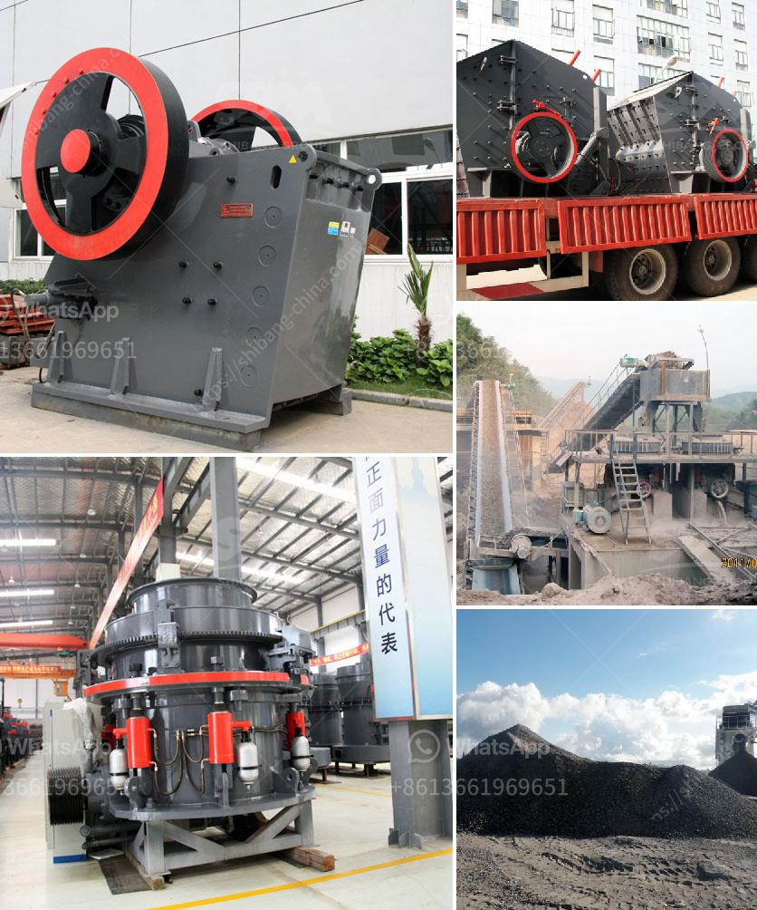

<h3>crusher unit daily production capacity</h3>
In today's construction industry, the demand for various building materials is soaring. With infrastructure development projects and residential construction on the rise, the need for crushed stones, sand, and other aggregates is higher than ever. To meet this growing demand, crusher units play a vital role in supplying the required materials. One crucial aspect that determines their efficiency is the daily production capacity.

A crusher unit refers to a machine that crushes big rocks into smaller aggregates for various construction purposes. It can be stationary or mobile, depending on the project's requirements. The daily production capacity of a crusher unit provides an insight into its efficiency and the amount of material it can produce within a specific time frame.

The capacity of a crusher unit is typically measured in tons per hour (TPH). This measurement evaluates the machine's ability to process rocks and produce aggregates in large quantities. For example, a crusher unit with a production capacity of 300 TPH can generate 300 tons of material per hour. Similarly, a crusher unit with a production capacity of 500 TPH can generate 500 tons per hour.

Several factors influence the daily production capacity of a crusher unit. Firstly, the type of rock being crushed plays a significant role. Some rocks are harder than others and may require more power and time to break down. This affects the overall productivity of the crusher unit. Additionally, the size and quality of the input rocks also impact the production rate.

The power and efficiency of the crusher unit itself are crucial factors in determining its production capacity. Modern crusher units are equipped with advanced technologies and innovative features. They have powerful motors, sturdy frames, and efficient crushing mechanisms that allow for higher productivity. Additionally, automated systems enable smoother operations, reducing downtime and maximizing output.

Regular maintenance and servicing of crusher units also contribute to their daily production capacity. Proper lubrication, inspection of components, and timely repair can ensure that the machine runs smoothly and at its optimal efficiency. Neglecting maintenance can lead to breakdowns, decreased production, and additional costs for repairs.

Moreover, the skill and experience of the machine operators can impact the crusher unit's performance. Experienced operators understand the machine's capabilities and how to optimize its settings for efficient crushing. They can also identify potential issues and take necessary actions to prevent production delays.

The daily production capacity of a crusher unit directly impacts meeting market demands. When construction projects have tight deadlines, the availability of materials becomes critical. A crusher unit with a higher production capacity ensures a steady supply of aggregates, enabling contractors to meet their deadlines and complete projects successfully.

In conclusion, the daily production capacity of a crusher unit is a crucial factor in meeting the market's demand for construction materials. With the infrastructure boom, the need for crushed stones, sand, and other aggregates is increasing rapidly. A crusher unit with a higher capacity ensures a steady supply of materials, helping construction projects stay on schedule. Factors such as the type of rock, machine efficiency, regular maintenance, and operator skills all contribute to achieving maximum daily production capacity. By investing in modern technologies and proper maintenance, crusher unit operators can effectively meet market demands and contribute to the growth of the construction industry.
<h3>Contact us</h3><ul><li><strong>Whatsapp:&nbsp;<a href="https://wa.me/8613661969651">+8613661969651</a></strong></li><li><a href="https://swt.shibang-china.com/?git&amp;zhl&amp;crusher unit daily production capacity"><strong>Online Service(chat now)</strong></a></li></ul><h3>Related</h3><ul><li><a href='sales of crusher machines.md'>sales of crusher machines</a></li><li><a href='crush diabase machine.md'>crush diabase machine</a></li><li><a href='plant layout mini cement plant pdf.md'>plant layout mini cement plant pdf</a></li><li><a href='stone crushers in bangalore.md'>stone crushers in bangalore</a></li><li><a href='mill price for minerals in bolivia.md'>mill price for minerals in bolivia</a></li></ul>