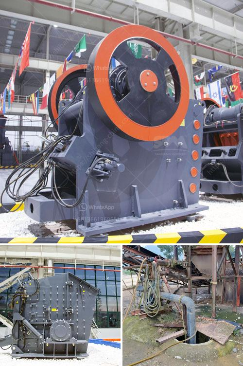

<h3>crushers for rent in oman</h3>
Oman is known for its rugged terrain, diverse landscapes, and wealth of natural resources. The country's diverse geographical features have made it a significant destination for quarrying and mining activities. The extraction of minerals such as limestone, gravel, and sand is essential for construction projects and infrastructure development. However, with the demand for these resources on the rise, quarry operators face significant challenges in meeting their production targets effectively.

One of the critical challenges in quarrying operations is the need for specialized equipment to crush and process large rocks and materials. Crushers play a crucial role in the quarrying industry, as they break down larger rocks into more manageable sizes for further use in construction and other applications. However, investing in crushers can be costly, especially for smaller quarry operators or those with short-term projects.

Fortunately, the option to rent crushers has emerged as a viable solution for quarry operators in Oman. Renting crushers allows quarry operators to save on upfront capital investments and ensure that they have access to the latest crushing technology to meet their production goals. Additionally, renting crushers provides flexibility, allowing operators to adjust their equipment needs based on changing project requirements.

Renting crushers in Oman is facilitated by an extensive network of equipment rental companies that offer a wide range of crushers to cater to various quarrying needs. These companies provide both short and long-term rental options, with trained technicians available to support customers throughout the rental period.

Not only does the availability of crushers for rent benefit quarry operators financially, but it also promotes sustainability. By renting crushers instead of purchasing them outright, quarry operators can utilize the latest energy-efficient models. These crushers are designed to reduce energy consumption and minimize environmental impact, aligning with Oman's commitment to sustainable development.

In conclusion, the availability of crushers for rent in Oman offers quarry operators a practical and cost-effective solution to address their crushing needs. With rental options ranging from short to long-term contracts, operators can access the latest crushing technology to achieve their production targets. Furthermore, renting crushers promotes sustainability by utilizing energy-efficient models. Consequently, crushers for rent have become an indispensable solution for quarry operators in Oman, ensuring efficient quarrying activities and contributing to the nation's development.
<h3>Contact us</h3><ul><li><strong>Whatsapp:&nbsp;<a href="https://wa.me/8613661969651">+8613661969651</a></strong></li><li><a href="https://swt.shibang-china.com/?git&amp;zhl&amp;crushers for rent in oman"><strong>Online Service(chat now)</strong></a></li></ul><h3>Related</h3><ul><li><a href='malaysia hammer mills.md'>malaysia hammer mills</a></li><li><a href='ball mill conique occasion allemand.md'>ball mill conique occasion allemand</a></li><li><a href='cone crusher plant for sale.md'>cone crusher plant for sale</a></li><li><a href='ceremacs ball mill pictures.md'>ceremacs ball mill pictures</a></li><li><a href='the cost of stone crusher in pakistan.md'>the cost of stone crusher in pakistan</a></li></ul>