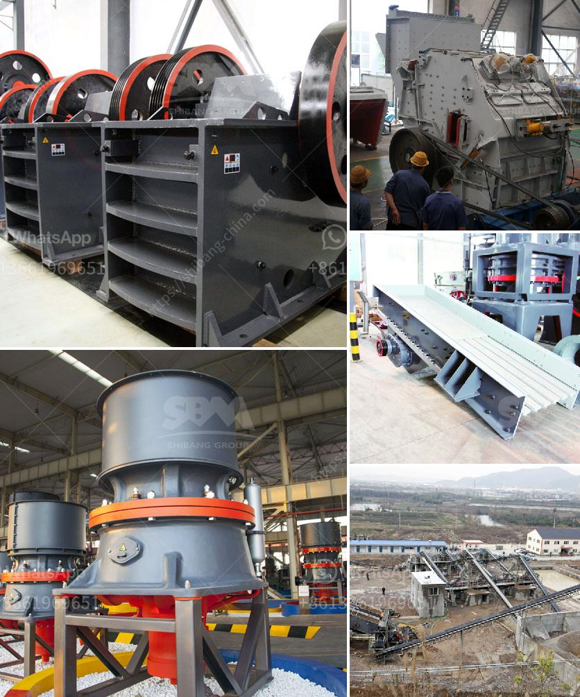

<h3>crushers of germany</h3>
Germany is renowned for its engineering and manufacturing prowess, and this reputation extends to the world of crushers. German crushers are widely recognized for their superior quality, reliability, and durability, making them highly sought after both domestically and internationally. In this article, we delve into the crushers of Germany, exploring their features, benefits, and contributions to the global construction industry.

German crushers are at the forefront of technological advancements in the industry. Equipped with cutting-edge features and innovative designs, these crushers provide optimal performance and efficiency. From mobile jaw crushers to impact crushers, Germany's machinery manufacturers continue to invest in research and development to stay ahead of the competition.

The German approach to production places a heavy emphasis on quality control, ensuring that crushers manufactured in the country meet and exceed the most stringent global standards. Advanced testing procedures and thorough quality checks guarantee that each component is meticulously crafted, resulting in crushers that are built to withstand the toughest operating conditions.

Durability is a hallmark of German crushers. Designed to endure heavy-duty operations, these machines are engineered to minimize downtime and maximize productivity. With robust construction and components, German crushers offer operators long-term reliability, reducing maintenance costs and enhancing overall operational efficiency.

Germany's commitment to eco-friendly practices extends to the crusher manufacturing industry. Many German crushers incorporate green technologies that prioritize energy efficiency and emissions reduction. By promoting sustainable manufacturing processes, these crushers help preserve the environment and contribute to eco-friendly construction practices.

The superiority of German crushers is recognized all over the world. German manufacturers export their machinery to various international markets, helping to drive progress and development in diverse construction projects globally. Their reputation for excellence and reliability positions Germany as a trusted source for high-quality crushing and screening equipment.

The crushers of Germany embody the country's dedication to precision engineering, technological innovation, and high-quality craftsmanship. Renowned for their durability, reliability, and eco-friendly approach, German crushers continue to play a crucial role in the global construction industry. With state-of-the-art technology and a commitment to excellence, these crushers serve as an inspiration and benchmark for manufacturers worldwide.
<h3>Contact us</h3><ul><li><strong>Whatsapp:&nbsp;<a href="https://wa.me/8613661969651">+8613661969651</a></strong></li><li><a href="https://swt.shibang-china.com/?git&amp;zhl&amp;crushers of germany"><strong>Online Service(chat now)</strong></a></li></ul><h3>Related</h3><ul><li><a href='used mobile hammer mills for sale.md'>used mobile hammer mills for sale</a></li><li><a href='stone crusher quote list.md'>stone crusher quote list</a></li><li><a href='crusher machine manufacturers shanghai.md'>crusher machine manufacturers shanghai</a></li><li><a href='dolomite processing plan in ethiopia.md'>dolomite processing plan in ethiopia</a></li><li><a href='silica sand crushing plant in pakistan.md'>silica sand crushing plant in pakistan</a></li></ul>