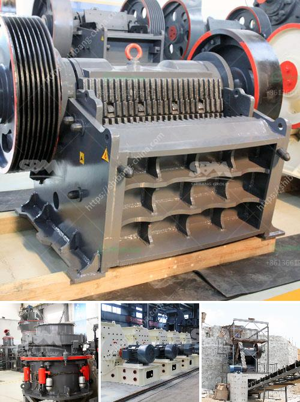

<h3>crushers plant cost</h3>
Crushers are machines used to break or compress materials into smaller fragments. They are used in a variety of industries, including mining, construction, demolition, and recycling. The cost of a crusher plant depends on various factors, such as the equipment type, capacity, and location.

One of the primary considerations in determining the cost of a crusher plant is the equipment type. This includes the type of crusher(s) to be used, such as jaw, cone, gyratory, impact, or VSI crushers. Each type of crusher has different performance characteristics and advantages, so the choice of equipment will impact the cost.

The capacity of the crusher plant is another important factor in determining the cost. The capacity refers to the maximum amount of material the crusher can process per hour or per day. Higher capacity plants often require larger and more expensive equipment, resulting in higher costs. However, a higher capacity plant can also improve productivity and efficiency, which can offset the initial investment.

The location of the crusher plant also affects the cost. If the plant is located in a remote area, transportation costs may be higher. Additionally, the availability of skilled labor and materials in the area can influence the cost. For example, if there is a shortage of skilled labor, it may be necessary to bring in workers from other areas, which can increase the overall cost.

Other factors that can impact the cost of a crusher plant include the complexity of the project, site preparation requirements, and the quality of the materials used. Complex projects, such as those involving multiple crushers or custom-built equipment, may require additional engineering and design work, resulting in higher costs. Similarly, if the site requires extensive preparation, such as clearing land or building foundations, the cost can increase.

The quality of the materials used in the construction of the crusher plant can also affect the cost. High-quality materials and components may be more expensive upfront, but they can result in a more durable and reliable plant, reducing maintenance and replacement costs over time.

In conclusion, the cost of a crusher plant depends on various factors, including the equipment type, capacity, location, complexity of the project, site preparation requirements, and the quality of the materials used. It is important to carefully evaluate these factors and consider both the upfront investment and the long-term operational costs before making a purchasing decision. Consulting with industry experts and conducting a thorough cost analysis can help ensure that the crusher plant investment is cost-effective and meets the specific needs of the project.
<h3>Contact us</h3><ul><li><strong>Whatsapp:&nbsp;<a href="https://wa.me/8613661969651">+8613661969651</a></strong></li><li><a href="https://swt.shibang-china.com/?git&amp;zhl&amp;crushers plant cost"><strong>Online Service(chat now)</strong></a></li></ul><h3>Related</h3><ul><li><a href='m sand manufacturers in india.md'>m sand manufacturers in india</a></li><li><a href='new crushing machine in south africa.md'>new crushing machine in south africa</a></li><li><a href='ball mill suppliers.md'>ball mill suppliers</a></li><li><a href='ball mill for size reduction.md'>ball mill for size reduction</a></li><li><a href='mini crusher for gravel sale in philippines.md'>mini crusher for gravel sale in philippines</a></li></ul>