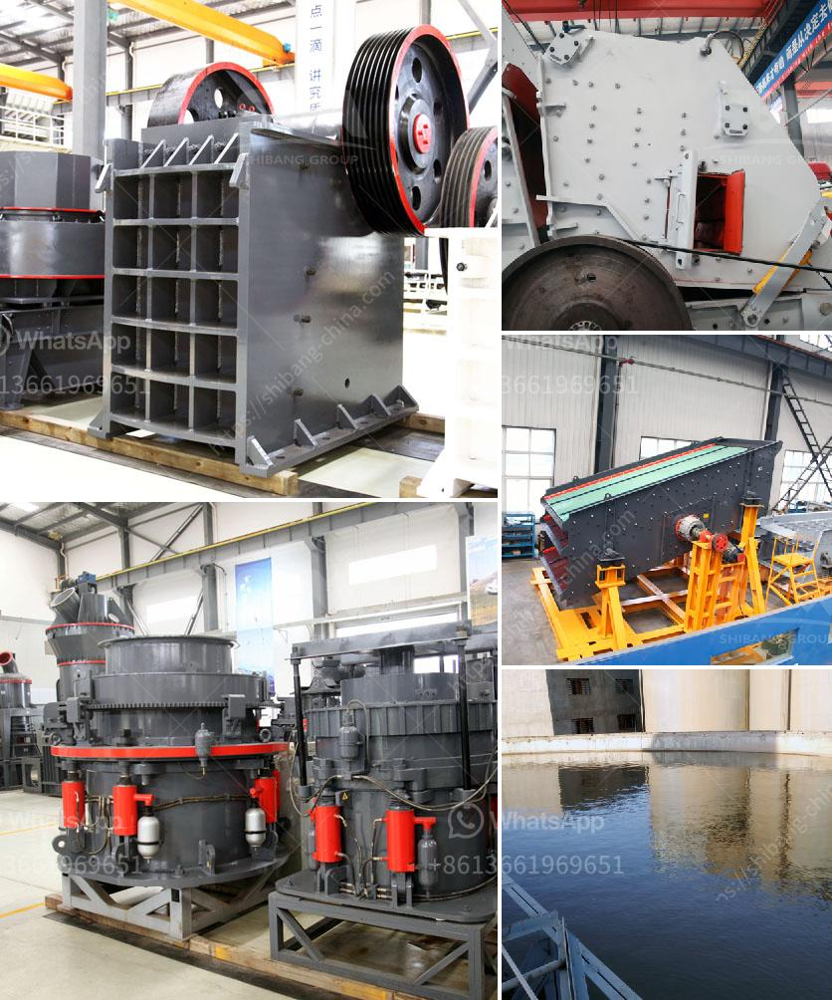

<h3>crushing and screening contractors in gauteng</h3>
Crushing and screening contractors play a crucial role in the construction and mining industries in Gauteng, South Africa. These contractors are responsible for the production of aggregates and various other materials used in the construction of buildings, roads, bridges, and other infrastructure projects.

One of the key services offered by crushing and screening contractors is the crushing of large rocks and boulders into smaller sizes. This crushed material is then used as a base for roads or as aggregate in concrete and asphalt production. This process is essential for ensuring the proper functioning and safety of infrastructure projects.

Similarly, screening contractors are responsible for the separation of different materials based on their size and quality. This process ensures that only the desired material is used in construction projects, improving the overall quality and durability of the final product.

Gauteng is a hub of construction and mining activities in South Africa, making the presence of proficient crushing and screening contractors essential. These contractors have the necessary equipment, expertise, and experience to handle large-scale projects efficiently and effectively.

By hiring reliable contractors, construction companies and project owners can save both time and money by outsourcing the crushing and screening process. These contractors have the knowledge to suggest the most suitable materials and processes for specific projects, ensuring maximum efficiency and reducing wastage.

A significant advantage of hiring professional contractors is their adherence to safety regulations and environmental standards. Contractors have the necessary training and experience to handle hazardous materials and maintain a safe working environment. They also ensure that their activities comply with environmental regulations, minimizing any adverse impact on the surroundings.

Crushing and screening contractors in Gauteng play a vital role in the overall success of construction and mining projects. Their expertise, efficiency, and adherence to safety and environmental standards make them an essential component of the industry. When selecting a contractor, it is crucial to consider their experience, reputation, and track record to ensure the best results for any project.
<h3>Contact us</h3><ul><li><strong>Whatsapp:&nbsp;<a href="https://wa.me/8613661969651">+8613661969651</a></strong></li><li><a href="https://swt.shibang-china.com/?git&amp;zhl&amp;crushing and screening contractors in gauteng"><strong>Online Service(chat now)</strong></a></li></ul><h3>Related</h3><ul><li><a href='graphite processing plant.md'>graphite processing plant</a></li><li><a href='manual stone crusher in kenya.md'>manual stone crusher in kenya</a></li><li><a href='grinding equipment cost estimate.md'>grinding equipment cost estimate</a></li><li><a href='precipitated calcium carbonate manufacturing machinery.md'>precipitated calcium carbonate manufacturing machinery</a></li><li><a href='coal washing plant design.md'>coal washing plant design</a></li></ul>