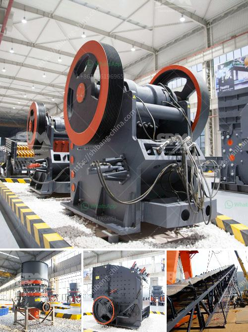

<h3>crushing and screening plant supplier china</h3>
Crushing and screening plants are essential in the mining and construction industry. In these plants, rocks, minerals, and other materials are broken down and transformed into usable products. However, finding the right supplier for these plants can be a daunting task, especially with the countless options available. One of the leading crushing and screening plant suppliers in the market is China.

China has emerged as a dominant player in the global manufacturing industry, and the crushing and screening plant sector is no exception. With a vast pool of skilled labor and technological advancements, China has been able to meet the increasing demands of the industry, as well as offer competitive pricing for the machines.

One of the key advantages of choosing a crushing and screening plant supplier from China is the extensive range of products that they offer. From jaw crushers and cone crushers to impact crushers and screens, they have a wide selection to suit various needs and budgets. This allows customers to find the perfect equipment that meets their specific requirements.

In addition to the variety of products, Chinese suppliers also excel in quality control and reliability. They have stringent quality management systems in place, ensuring that each machine delivered meets the highest standards. This commitment to quality is crucial, as crushing and screening plants operate under harsh conditions, and any equipment failure can result in costly downtime.

Furthermore, Chinese suppliers have invested heavily in research and development, constantly improving their product offerings. This includes adopting the latest technologies, such as advanced automation systems and energy-saving features. By staying at the forefront of innovation, Chinese suppliers can provide customers with cutting-edge solutions that enhance productivity and efficiency.

Another advantage of choosing a crushing and screening plant supplier from China is their ability to provide after-sales support. Chinese suppliers have established a global distribution and service network, ensuring prompt delivery and technical assistance. This ensures that customers can rely on their equipment and receive timely support whenever needed.

With the growing demand for crushing and screening plants globally, Chinese suppliers have also expanded their international presence. They actively participate in industry exhibitions and trade fairs, showcasing their latest products and establishing partnerships with customers worldwide. By doing so, they are able to reach a wider market and cater to the diverse needs of customers across different regions.

However, it is important to note that not all crushing and screening plant suppliers from China may offer the same level of quality and service. Therefore, it is essential for buyers to conduct thorough research and due diligence before making a purchasing decision. Reading customer reviews, visiting manufacturing facilities, and requesting product demonstrations can help ensure that the chosen supplier is reliable and trustworthy.

In conclusion, choosing a crushing and screening plant supplier from China offers numerous advantages. These include a wide range of products, high-quality equipment, innovation, and global support. By partnering with a reputable Chinese supplier, customers can access top-of-the-line crushing and screening plants that meet their requirements and enhance their operations.
<h3>Contact us</h3><ul><li><strong>Whatsapp:&nbsp;<a href="https://wa.me/8613661969651">+8613661969651</a></strong></li><li><a href="https://swt.shibang-china.com/?git&amp;zhl&amp;crushing and screening plant supplier china"><strong>Online Service(chat now)</strong></a></li></ul><h3>Related</h3><ul><li><a href='10tph mobile stone crusher with vibrating screen.md'>10tph mobile stone crusher with vibrating screen</a></li><li><a href='ball mills for mica powder.md'>ball mills for mica powder</a></li><li><a href='aggregate crusher supplier tanzania.md'>aggregate crusher supplier tanzania</a></li><li><a href='vibration ranges for jaw crusher.md'>vibration ranges for jaw crusher</a></li><li><a href='hand operated rock crusher.md'>hand operated rock crusher</a></li></ul>