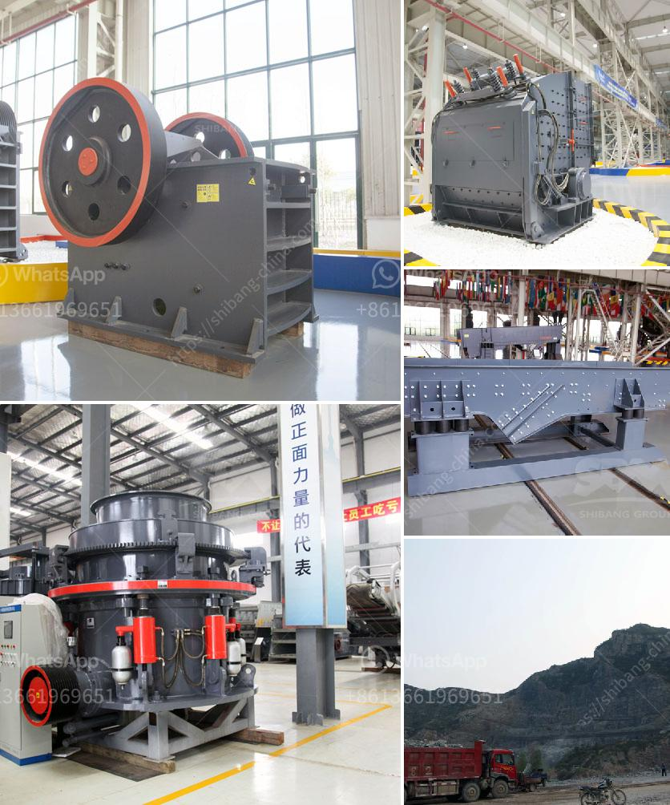

<h3>crushing b vsi crusher</h3>
Crushing, a vital process in many industries, requires advanced equipment that can effectively break down materials into smaller, more manageable sizes. In this article, we aim to highlight the cutting-edge features of the B VSI Crusher, a powerful machine designed to optimize crushing efficiency and enhance production capabilities.

The B VSI Crusher, also known as the Vertical Shaft Impactor, boasts a superior design that sets it apart in the crushing industry. With its remarkable capabilities, it offers numerous advantages over conventional crushers. The machine utilizes a high-speed rotor with wear-resistant tips to deliver efficient and precise crushing actions.

The B VSI Crusher is engineered to handle a wide variety of materials, including hard, abrasive rocks, multiple minerals, and even recycled materials. From limestone to granite, the machine delivers consistent results by exerting high pressure on the fragmented materials. Its versatile design allows for quick adjustments to accommodate different types of materials.

With its precise and powerful crushing mechanism, the B VSI Crusher ensures increased efficiency and productivity in crushing operations. The machine's ability to generate cubical-shaped end products minimizes the amount of waste material produced during the process. It can reduce energy consumption by up to 50%, making it an ideal choice for environmentally conscious organizations.

The B VSI Crusher is designed with user-friendliness in mind. It incorporates easy-to-use controls and a simple maintenance process, minimizing downtime and increasing overall operational efficiency. The machine is equipped with a hydraulic lifting system that allows quick and convenient access to the inside components, reducing the time required for regular maintenance and inspection.

Due to its unrivaled performance and versatility, the B VSI Crusher finds applications across various industries, including mining, construction, and recycling. It can handle different sizes of aggregates, improving the quality of construction materials. Additionally, the machine's ability to produce fine sand from coarse materials makes it a valuable asset in the manufacturing of concrete and asphalt.

The B VSI Crusher stands as a game-changer in the crushing industry, offering improved efficiency, high productivity, and precise crushing actions. With its unrivaled design and user-friendly features, it is well-suited for a wide range of applications. Embracing this cutting-edge technology can revolutionize crushing operations and maximize productivity.

Note: The number of words may vary slightly depending on the depth of information provided for each section.
<h3>Contact us</h3><ul><li><strong>Whatsapp:&nbsp;<a href="https://wa.me/8613661969651">+8613661969651</a></strong></li><li><a href="https://swt.shibang-china.com/?git&amp;zhl&amp;crushing b vsi crusher"><strong>Online Service(chat now)</strong></a></li></ul><h3>Related</h3><ul><li><a href='small grinding machine for limestone.md'>small grinding machine for limestone</a></li><li><a href='bentonite crusher machine.md'>bentonite crusher machine</a></li><li><a href='small gold crushing plant for sale.md'>small gold crushing plant for sale</a></li><li><a href='stone crusher design philippines.md'>stone crusher design philippines</a></li><li><a href='hammer mill furniture.md'>hammer mill furniture</a></li></ul>