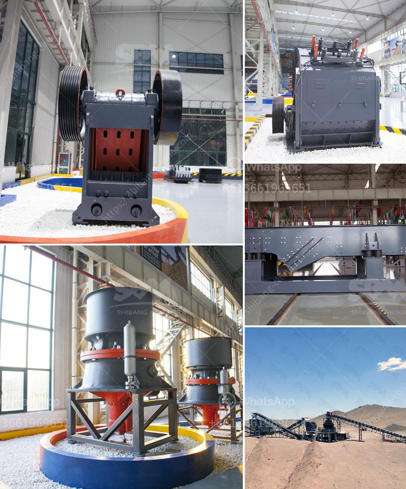

<h3>crushing equipment with price</h3>
When it comes to construction projects, a key component that cannot be overlooked is crushing equipment. This equipment is vital for breaking down large rocks, boulders, and other materials into smaller, more manageable pieces. Whether it's limestone, granite, or even concrete, crushing equipment is an essential tool that plays a significant role in the construction industry.

Available in various sizes and capacities, crushing equipment is designed to efficiently transform hefty materials into smaller particles. These smaller particles can then be used as aggregates in construction projects such as road building, foundations, and paving. The versatility of crushing equipment makes it a valuable asset on any construction site, ensuring efficient and cost-effective operations.

One of the primary factors to consider when investing in crushing equipment is the price. The price of crushing equipment can vary widely depending on factors such as the size, capacity, and features of the machine. Additionally, the brand and the supplier can also impact the cost.

When it comes to size and capacity, it's essential to choose equipment that aligns with the specific needs of the project. Smaller capacity crushing equipment may be suitable for smaller construction sites or projects with lower demands, while larger capacity equipment is often preferred for heavy-duty construction projects. It's important to strike a balance between the required capacity and the upfront investment to ensure cost-effectiveness.

The features of crushing equipment also influence the price. Advanced features such as automatic control systems, high-speed operation, and the ability to handle a wide range of materials can make the equipment more expensive. However, these features can also enhance productivity and efficiency, making them a worthwhile investment in the long run.

Choosing a reputable brand and a trusted supplier is crucial when purchasing crushing equipment. Renowned brands often offer high-quality machines that are built to last and deliver exceptional performance. Additionally, a reliable supplier can provide comprehensive customer support, including maintenance and spare parts, ensuring the equipment remains operational and minimizes downtime.

The price of crushing equipment can range from a few thousand dollars to several hundred thousand dollars, depending on the size and capacity. Small portable jaw crushers can start from as low as $3,500 and can go up to $90,000, while large-scale stationary crushers can cost millions of dollars. However, there are various financing options available to ease the financial burden and make the investment more manageable.

In conclusion, crushing equipment is an indispensable tool in the construction industry. It enables the transformation of large materials into smaller particles, facilitating efficient construction operations. When purchasing crushing equipment, factors such as size, capacity, features, brand, and supplier should be considered. While the price can vary widely, weighing the upfront cost against the long-term benefits and productivity improvements is essential. With the right investment, crushing equipment can significantly contribute to the success of construction projects of any scale.
<h3>Contact us</h3><ul><li><strong>Whatsapp:&nbsp;<a href="https://wa.me/8613661969651">+8613661969651</a></strong></li><li><a href="https://swt.shibang-china.com/?git&amp;zhl&amp;crushing equipment with price"><strong>Online Service(chat now)</strong></a></li></ul><h3>Related</h3><ul><li><a href='concrete crushing for sale germany.md'>concrete crushing for sale germany</a></li><li><a href='large gravel powder machine.md'>large gravel powder machine</a></li><li><a href='mtm trapezium mill.md'>mtm trapezium mill</a></li><li><a href='list of crusher plant.md'>list of crusher plant</a></li><li><a href='jaw crusher for sale in south africa.md'>jaw crusher for sale in south africa</a></li></ul>