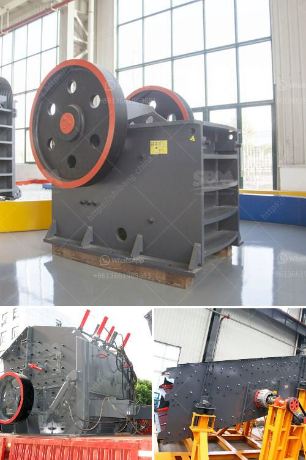

<h3>crushing machine for chromium and chromite ore</h3>
A crushing machine is essential in the mining industry to reduce the ore to a manageable size for further processing. Depending on the chromium and chromite ore processing, there are various crushing machines available, which are capable of reducing the ore size from large rocks to a flour-like consistency.

One of the commonly used machines for crushing chromium and chromite ore is a jaw crusher. This machine works by using compressive force to break down the ore into smaller pieces. The ore is fed into a chamber with a fixed jaw plate and a movable jaw plate. As the movable jaw moves towards the fixed jaw, the ore gets crushed between them. This process continues until the ore is small enough to pass through the gap at the bottom of the chamber.

Another commonly used crushing machine for chromium and chromite ore is an impact crusher. This machine uses high-speed impact forces to crush the ore. The ore is fed into a chamber with a spinning rotor that contains hammers or blow bars. The hammers or blow bars strike the ore, causing it to break into smaller pieces. The crushed ore then exits the chamber through a discharge opening.

A cone crusher is also commonly used in the crushing of chromium and chromite ore. This machine operates on a similar principle to the jaw crusher but uses a different crushing chamber design. The ore is fed into the chamber through a hopper and crushed between a mantle and a concave. The crushed ore then exits the chamber through a discharge opening.

In addition to these crushing machines, there are also vibrating screens and conveyors used in the process to separate the crushed ore into different sizes and transfer it to the next stage of processing.

In conclusion, a crushing machine is an essential piece of equipment in the chromium and chromite ore mining industry. It is used to reduce the ore to a manageable size for further processing. Whether it is a jaw crusher, impact crusher, or cone crusher, these machines play a crucial role in providing the necessary crushing power to extract valuable minerals from the ore.
<h3>Contact us</h3><ul><li><strong>Whatsapp:&nbsp;<a href="https://wa.me/8613661969651">+8613661969651</a></strong></li><li><a href="https://swt.shibang-china.com/?git&amp;zhl&amp;crushing machine for chromium and chromite ore"><strong>Online Service(chat now)</strong></a></li></ul><h3>Related</h3><ul><li><a href='superfine grinding mill.md'>superfine grinding mill</a></li><li><a href='precio trituradora de tierras en pakistan.md'>precio trituradora de tierras en pakistan</a></li><li><a href='quarries crusher in nigeria.md'>quarries crusher in nigeria</a></li><li><a href='conveyor belt price per meter.md'>conveyor belt price per meter</a></li><li><a href='aggregate jaw crushers saudi.md'>aggregate jaw crushers saudi</a></li></ul>