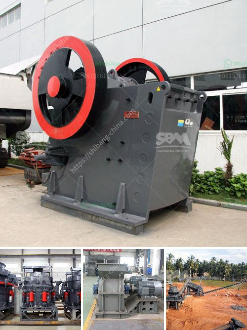

<h3>crushing machine malaysia</h3>
In recent years, Malaysia has witnessed a rapid advancement in its industrial sector. With companies expanding their operations and new businesses emerging, the need for efficient machinery and equipment has become crucial. One such machine that has gained immense popularity in Malaysia is the crushing machine.

A crushing machine, also known as a crusher, is a machine that breaks down large rocks and stones into more manageable sizes. This equipment is widely used in various industries, such as mining, metallurgy, building materials, highways, railways, water conservancy, and chemical industries. It plays a significant role in crushing raw materials into smaller particles that can be further processed or used for various purposes.

The demand for crushing machines in Malaysia has been on the rise due to the rapid expansion of industries, especially in the construction and mining sectors. These machines have proven to be essential in the production process, as they help break down and crush materials efficiently, saving time and labor costs.

One of the main advantages of using crushing machines is their ability to handle a wide range of materials, from soft to hard rocks and from brittle to tough materials. This versatility ensures that companies can process a variety of materials, catering to different project requirements.

Moreover, crushing machines are designed to be durable and robust, making them suitable for heavy-duty operations. They are equipped with advanced technologies, such as hydraulic systems, which enhance their efficiency and effectiveness. These machines are also designed to be energy efficient, reducing the overall operational costs for businesses.

Malaysia's crushing machine manufacturers have also made significant advancements in research and development to cater to the changing needs of industries. They continuously innovate and upgrade their products, incorporating cutting-edge technologies to stay competitive in the market.

Furthermore, the government of Malaysia has been supportive of the industrial sector, providing incentives and initiatives to promote growth and development. This support has facilitated the growth of local crushing machine manufacturers and encouraged foreign investors to set up their operations in Malaysia, boosting the country's economy.

With the increasing demand for crushing machines, Malaysia has become a hub for manufacturing and supplying these machines to various industries around the world. The country's strategic location in Southeast Asia and its well-established logistics infrastructure make it an ideal choice for international businesses.

In conclusion, crushing machines have emerged as an essential industrial equipment in Malaysia, assisting various industries in the process of breaking down raw materials. Their versatility, durability, and energy efficiency make them highly sought after by businesses. With the support of the government and advancements in technology, Malaysia's crushing machine manufacturers are well-positioned to cater to the growing demand in both domestic and international markets.
<h3>Contact us</h3><ul><li><strong>Whatsapp:&nbsp;<a href="https://wa.me/8613661969651">+8613661969651</a></strong></li><li><a href="https://swt.shibang-china.com/?git&amp;zhl&amp;crushing machine malaysia"><strong>Online Service(chat now)</strong></a></li></ul><h3>Related</h3><ul><li><a href='fly ash processing plant machinery.md'>fly ash processing plant machinery</a></li><li><a href='mobile crushing and screening to hire south africa.md'>mobile crushing and screening to hire south africa</a></li><li><a href='stone jaw crusher machinery supplier.md'>stone jaw crusher machinery supplier</a></li><li><a href='cost of set up mini cement plant in india.md'>cost of set up mini cement plant in india</a></li><li><a href='difference between vsi and hsi.md'>difference between vsi and hsi</a></li></ul>