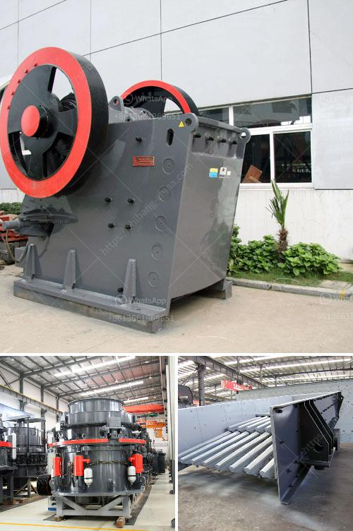

<h3>crushing machine manufacturer in pakistan price</h3>
Crushing machines have become an essential part of the construction and mining industry in Pakistan. With the increasing workload and high pressure faced by contractors and miners, having a reliable crushing machine supplier in Pakistan can make a big difference. This is why choosing a reliable and reputable crushing machine manufacturer is so important. 

There are a few things to consider when looking for a crushing machine manufacturer in Pakistan: quality, affordability, and after-sales service. Quality is crucial to ensure that the machines are durable, efficient, and can withstand the harsh conditions of the job site. Affordability, on the other hand, is essential for contractors and miners who are looking to maximize their profits. Lastly, after-sales service is vital to ensure that any issues or problems are addressed promptly and professionally.

Fortunately, there are several crushing machine manufacturers in Pakistan that meet these criteria. They offer a wide range of crushing machines, including jaw crushers, impact crushers, cone crushers, and vertical shaft impact crushers. These machines are designed to break down large rocks into smaller rocks, gravel, or sand, allowing construction and mining companies to use them in various applications.

One such manufacturer is XYZ Machinery. XYZ Machinery is a leading crushing machine manufacturer in Pakistan, offering a wide range of crushing machines. Their machines are known for their durability, efficiency, and great performance. With a focus on the needs of their customers and providing top-notch after-sales service, XYZ Machinery is a reliable choice for any crushing machine needs.

One of the key factors that sets XYZ Machinery apart from other manufacturers is their commitment to affordability. They understand the challenges faced by contractors and miners when it comes to budget constraints. Therefore, they offer their machines at competitive prices without compromising on quality. This makes them a cost-effective solution for those looking to invest in a crushing machine in Pakistan.

In addition to their quality machines and affordable prices, XYZ Machinery also provides excellent after-sales service. They have a dedicated team of technicians who are available to assist with any queries or concerns. This ensures that customers get the support they need, even after the purchase of the machine.

Furthermore, XYZ Machinery is continuously investing in research and development to improve their machines and stay up-to-date with the latest industry trends. This commitment to innovation allows them to meet the evolving needs of their customers.

In conclusion, finding a reliable and affordable crushing machine manufacturer in Pakistan is essential for contractors and miners. XYZ Machinery is a great choice, as they offer high-quality machines at competitive prices, along with excellent after-sales service. Their commitment to customer satisfaction and continuous improvement makes them a trusted and reputable crushing machine manufacturer in Pakistan. So, if you are in need of a crushing machine, consider XYZ Machinery for a great combination of quality and affordability.
<h3>Contact us</h3><ul><li><strong>Whatsapp:&nbsp;<a href="https://wa.me/8613661969651">+8613661969651</a></strong></li><li><a href="https://swt.shibang-china.com/?git&amp;zhl&amp;crushing machine manufacturer in pakistan price"><strong>Online Service(chat now)</strong></a></li></ul><h3>Related</h3><ul><li><a href='dolomite lime manufacturers in ghana.md'>dolomite lime manufacturers in ghana</a></li><li><a href='components of the nigerian mining industry.md'>components of the nigerian mining industry</a></li><li><a href='portable copper ore processing machines in usa.md'>portable copper ore processing machines in usa</a></li><li><a href='for sale rock crushing plant 150 tons.md'>for sale rock crushing plant 150 tons</a></li><li><a href='hammer mill dimensions.md'>hammer mill dimensions</a></li></ul>