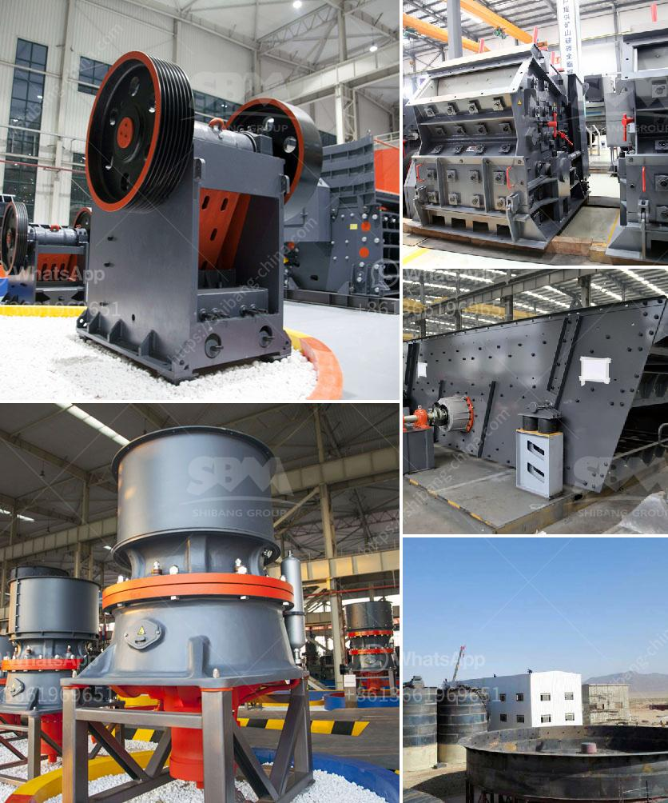

<h3>crushing machine manufacturer</h3>
In today's fast-paced economy, crushing and grinding operations play a crucial role in the overall production process. And as the extractive industry continues to grow, the need for efficient crushing machines intensifies. This is where a crushing machine manufacturer steps in, providing state-of-the-art equipment to meet the evolving demands of the mining industry.

A crushing machine manufacturer specializes in the design and manufacture of crushing equipment for mining companies. With their expertise, they can provide durable and reliable machinery that delivers optimal performance in the toughest of conditions. These machines have the ability to efficiently reduce large rocks into smaller, more manageable sizes, making them easier to handle, transport, and process further down the line.

One of the key advantages of partnering with a reputable crushing machine manufacturer is their ability to customize equipment to meet specific mining requirements. As mines vary greatly in terms of geological properties, size, and production capacity, a tailored solution is necessary to maximize productivity and efficiency. By collaborating closely with their clients, these manufacturers can design crushing machines that are perfectly suited to their needs, ensuring smoother operations and higher profitability.

Moreover, crushing machine manufacturers prioritize safety features, recognizing the hazardous nature of mining operations. Their machines are equipped with advanced safety mechanisms, reducing the risk of accidents and injuries for operators. Additionally, they focus on energy efficiency, incorporating the latest technologies to minimize power consumption and environmental impact.

As the mining industry continues to expand, the role of crushing machine manufacturers becomes even more crucial. Their innovative solutions help operations increase productivity, reduce operational costs, and improve overall efficiency. By investing in high-quality equipment, mining companies can stay ahead of the competition, all while ensuring the safety and well-being of their workforce.

In conclusion, crushing machine manufacturers play a vital role in the mining industry. Their cutting-edge equipment revolutionizes mining operations by improving productivity, customization, and safety. As mining continues to grow, it is essential for companies to partner with reliable crushing machine manufacturers to optimize their processes and achieve sustainable success.
<h3>Contact us</h3><ul><li><strong>Whatsapp:&nbsp;<a href="https://wa.me/8613661969651">+8613661969651</a></strong></li><li><a href="https://swt.shibang-china.com/?git&amp;zhl&amp;crushing machine manufacturer"><strong>Online Service(chat now)</strong></a></li></ul><h3>Related</h3><ul><li><a href='mobile crusher manufacturers.md'>mobile crusher manufacturers</a></li><li><a href='chart of accounts for cement factory.md'>chart of accounts for cement factory</a></li><li><a href='cost of mobile coal crusher.md'>cost of mobile coal crusher</a></li><li><a href='stone crusher machine sale nederland.md'>stone crusher machine sale nederland</a></li><li><a href='calculations on the capacity of cone crusher.md'>calculations on the capacity of cone crusher</a></li></ul>