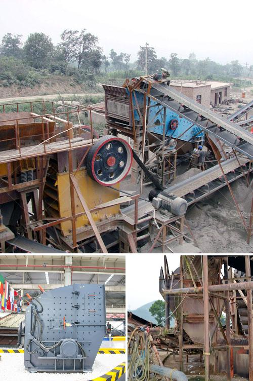

<h3>crushing mill and impact mill</h3>
In industries that deal with grinding, such as mining, minerals processing, and construction, two common types of mills are often used - the crushing mill and the impact mill. While both share the same purpose of reducing large-sized materials to smaller particles, there are distinct differences between them. Let's take a closer look at the crushing mill and the impact mill, and compare their features and benefits.

The crushing mill, also known as a jaw crusher, operates by mechanically breaking down materials into smaller pieces. This type of mill uses a fixed jaw and a moving jaw, with the material being crushed between them. The moving jaw exerts force on the material, causing it to break apart. Crushing mills are commonly used in quarrying and mining operations as primary crushers. They are suitable for handling a wide range of materials, including hard rocks, ores, and minerals.

On the other hand, the impact mill, also known as an impact crusher, utilizes the principle of rapid impact to pulverize materials. This mill consists of a rotor that spins rapidly, striking the material with a combination of centrifugal force and impact. Impact mills are highly efficient in reducing the size of materials and are commonly used in the recycling and aggregate industries. They are particularly effective at crushing softer materials such as limestone and gypsum.

When comparing the two mills, several factors come into play. Firstly, the crushing mill is generally more suitable for handling larger-sized materials, while the impact mill excels at pulverizing smaller materials efficiently. Secondly, the crushing mill is a relatively simple and robust machine, requiring less maintenance compared to the impact mill, which has more moving parts and thereby more susceptibility to wear and tear.

In terms of versatility, the crushing mill offers greater flexibility as it can be used for a wider range of materials, making it more suitable for diverse applications. In contrast, the impact mill may be limited in terms of the materials it can effectively process due to its rapid impact mechanism.

Ultimately, the choice between a crushing mill and an impact mill depends on the specific requirements of the industry and the materials being processed. Both mills have their advantages and disadvantages, and it is essential to consider factors such as material hardness, desired particle size, and maintenance needs when selecting the most suitable mill for a particular application.

In conclusion, the crushing mill and the impact mill serve the purpose of reducing materials, but they differ in their mechanisms and capabilities. By understanding the differences between these mills, industry professionals can make informed decisions to optimize their grinding processes and achieve desired outcomes efficiently.
<h3>Contact us</h3><ul><li><strong>Whatsapp:&nbsp;<a href="https://wa.me/8613661969651">+8613661969651</a></strong></li><li><a href="https://swt.shibang-china.com/?git&amp;zhl&amp;crushing mill and impact mill"><strong>Online Service(chat now)</strong></a></li></ul><h3>Related</h3><ul><li><a href='mm granite stone jaw crusher.md'>mm granite stone jaw crusher</a></li><li><a href='secondary impact crusher.md'>secondary impact crusher</a></li><li><a href='100tpd slag cement plant.md'>100tpd slag cement plant</a></li><li><a href='for sale rock crushing plant 150 tons.md'>for sale rock crushing plant 150 tons</a></li><li><a href='how much price of ball mill.md'>how much price of ball mill</a></li></ul>