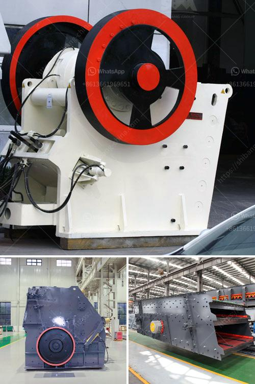

<h3>crushing plant aggregate type</h3>
When it comes to construction materials, most people would think of concrete, cement, and bricks. However, there is one essential material that often goes unnoticed: aggregates. Aggregates are the foundation of any construction project, as they make up around 70-80% of the total volume of concrete. Therefore, the choice of the right type of aggregate is crucial.

One popular option in the construction industry is the crushing plant aggregate type. A crushing plant efficiently crushes aggregates into smaller pieces, ensuring the desired size and shape of the final product. With a wide range of aggregate types available, it is important to understand their characteristics and select the most suitable one for the specific project requirements.

The first factor to consider when choosing a crushing plant aggregate type is the desired end product. Different projects require different aggregate sizes and shapes. For instance, if the project involves road construction, a coarse aggregate with angular edges and a specific gradation may be needed. On the other hand, if the project involves constructing a smooth-surfaced concrete floor, a fine aggregate with rounded edges might be more suitable.

The second factor to consider is the source of the aggregate. Aggregates are commonly sourced from natural deposits such as riverbeds, quarries, or crushed rocks. Each source has its own unique characteristics that can affect the aggregate's performance. For example, aggregates sourced from riverbeds tend to have smooth surfaces, which are ideal for producing workable concrete. On the other hand, aggregates sourced from quarries or crushed rocks may have angular shapes, making them suitable for high-strength concrete.

Another important consideration is the durability and hardness of the aggregate. Aggregates should be hard enough to resist abrasion, shape change, and weathering. If the aggregate is too soft, it may break down easily, compromising the structural integrity of the concrete. On the other hand, if the aggregate is too hard, it may be difficult to work with during the mixing process.

Additionally, it is crucial to assess the availability and cost of the chosen aggregate type. Some aggregates may be readily available locally, reducing transportation costs and environmental impact. However, in some cases, specialized aggregates may need to be imported, leading to higher expenses and longer lead times.

Furthermore, the crushing plant technology used to produce aggregates can significantly impact the quality and properties of the final product. Modern crushing plants employ advanced equipment like jaw crushers, cone crushers, and impact crushers, which efficiently break down aggregates without causing excessive damage. The choice of equipment should be based on factors such as the project scale, desired output, and budget constraints.

In conclusion, the selection of the right crushing plant aggregate type is essential for any construction project. Factors such as the desired end product, aggregate source, durability, availability, and cost should be carefully considered. With the right choice, construction professionals can ensure the production of high-quality aggregates that meet the specific project requirements, ultimately leading to the successful completion of the project.
<h3>Contact us</h3><ul><li><strong>Whatsapp:&nbsp;<a href="https://wa.me/8613661969651">+8613661969651</a></strong></li><li><a href="https://swt.shibang-china.com/?git&amp;zhl&amp;crushing plant aggregate type"><strong>Online Service(chat now)</strong></a></li></ul><h3>Related</h3><ul><li><a href='feldspar stone processing plant.md'>feldspar stone processing plant</a></li><li><a href='used gypsum plant for sale europe.md'>used gypsum plant for sale europe</a></li><li><a href='roller mill vs hammer mill.md'>roller mill vs hammer mill</a></li><li><a href='jaw crushing machine.md'>jaw crushing machine</a></li><li><a href='the process of preparation coal.md'>the process of preparation coal</a></li></ul>