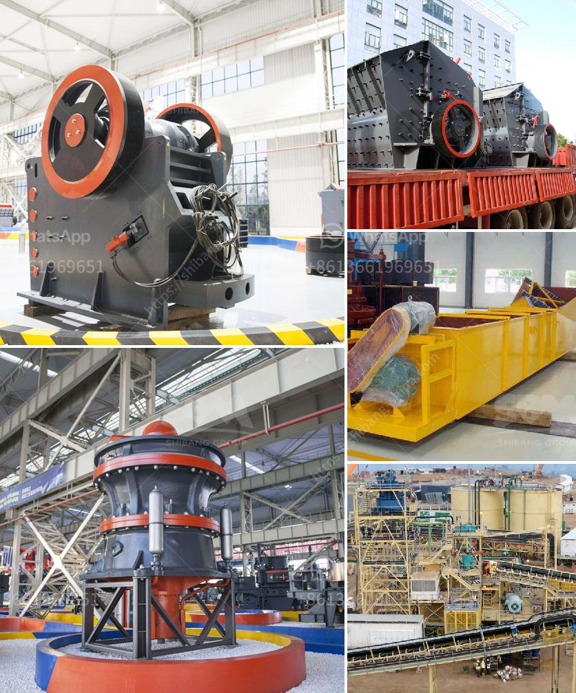

<h3>crushing plant application</h3>
A crushing plant is a machine that reduces the size of materials such as rocks and ores. It is used for various industrial purposes such as crushing large rocks into smaller pieces for further processing or breaking down ores into finer particles for extraction. Although crushing is an essential process in mining operations, its application extends beyond the mining industry.

In mining operations, the primary function of a crushing plant is to reduce the size of ore into smaller sections suitable for further processing. The extracted materials are then processed through various stages to extract valuable minerals or metals. The crushing plant plays a crucial role in this process by reducing the size of large pieces of ore into smaller fragments that can be easily handled and processed.

The crushing plant application is not limited to the mining industry. It is also widely used in the construction industry as well as in recycling and waste management applications. In construction, a crushing plant is used to produce aggregates for road construction, concrete foundations, and other building materials. These aggregates are essential in creating a solid base for construction projects.

Furthermore, the recycling and waste management industry heavily relies on crushing plants to process materials such as concrete, asphalt, and other construction waste. These plants break down the waste into reusable materials, reducing the amount of waste sent to landfills and conserving resources.

The process of crushing involves several stages to ensure the desired outcome. Firstly, the feed material is loaded into the crushing chamber of the plant. The material is then crushed by the rotating hammers or jaws of the machine, depending on the type of crusher being used. Once the material reaches the desired size, it exits the crusher through an outlet.

There are different types of crushing plants available depending on the application and desired output. Jaw crushers, impact crushers, and cone crushers are commonly used in mining operations and construction projects. Each type of crusher has different features and performance capabilities, making them suitable for various applications.

The efficiency and reliability of a crushing plant are crucial to its overall performance. It is essential to choose a high-quality crushing plant that is capable of handling the required workload and delivering the desired output. Regular maintenance and proper operation of the plant are also necessary to ensure its longevity and optimal performance.

In conclusion, a crushing plant is a vital part of mining operations and various other industries. Its application extends beyond mining and includes construction, recycling, and waste management. The crushing plant plays a significant role in reducing the size of materials and extracting valuable minerals from ores. It is essential to choose a reliable and efficient crushing plant that meets the specific requirements of the application to ensure successful operations and achieve desired outcomes.
<h3>Contact us</h3><ul><li><strong>Whatsapp:&nbsp;<a href="https://wa.me/8613661969651">+8613661969651</a></strong></li><li><a href="https://swt.shibang-china.com/?git&amp;zhl&amp;crushing plant application"><strong>Online Service(chat now)</strong></a></li></ul><h3>Related</h3><ul><li><a href='vertical shaft crusher.md'>vertical shaft crusher</a></li><li><a href='diamond making machines germany.md'>diamond making machines germany</a></li><li><a href='stone quarry plant.md'>stone quarry plant</a></li><li><a href='jaw crushing machine.md'>jaw crushing machine</a></li><li><a href='grinding mills for ore.md'>grinding mills for ore</a></li></ul>