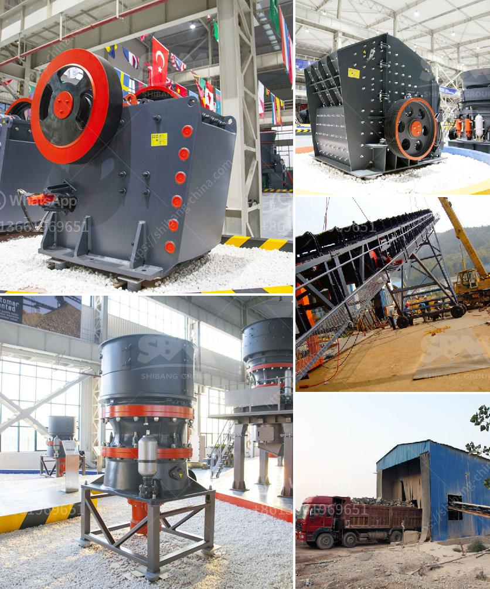

<h3>crushing plant for sale</h3>
When it comes to crushing plants, there are many factors that need to be considered in order to ensure you are getting the right equipment for your specific needs. Whether you are looking to crush rocks, ores, or even construction debris, finding the right crushing plant for sale is crucial for maximizing productivity and efficiency in your operations.

One of the first things to consider when searching for a crushing plant for sale is the type of material you will be processing. Different crushing plants are designed to handle different types of materials, so it's important to find one that is specifically designed to handle the material you will be working with. For example, if you are crushing rocks, you will need a plant that is capable of handling high volume and abrasive materials.

Another important factor to consider is the capacity of the plant. The capacity of a crushing plant refers to the maximum amount of material it can handle at any given time. It's important to choose a plant with a capacity that matches your production needs. If you have a high volume of material to process, choosing a plant with a higher capacity will ensure you can keep up with demand and minimize downtime.

In addition to capacity, it's also important to consider the size of the plant. The size of the plant will depend on factors such as the available space at your site and the mobility requirements of your operations. If you have limited space or need to move the plant between different locations, a compact and mobile crushing plant may be ideal for your needs.

When searching for a crushing plant for sale, it's also essential to consider the quality and reliability of the equipment. A crushing plant is a significant investment, so you want to ensure that it is built with high-quality materials and designed for durability. Look for reputable manufacturers that have a track record of producing reliable and efficient crushing plants.

Furthermore, it's important to consider the maintenance requirements of the plant. Regular maintenance is necessary to keep the plant operating at its maximum potential and to prevent unexpected breakdowns. Make sure to ask about the maintenance requirements and availability of spare parts before finalizing your purchase.

Lastly, consider your budget when looking for a crushing plant for sale. While it's important to find a plant that meets all your operational needs, it's equally important to find one that fits within your budget. Shop around and compare prices from different suppliers to ensure you are getting a fair deal.

In conclusion, finding the right crushing plant for sale involves considering various factors such as the type of material, capacity, size, quality, maintenance requirements, and budget. By thoroughly evaluating these factors and doing your due diligence, you can find a crushing plant that will meet your specific needs and provide long-term value for your investment.
<h3>Contact us</h3><ul><li><strong>Whatsapp:&nbsp;<a href="https://wa.me/8613661969651">+8613661969651</a></strong></li><li><a href="https://swt.shibang-china.com/?git&amp;zhl&amp;crushing plant for sale"><strong>Online Service(chat now)</strong></a></li></ul><h3>Related</h3><ul><li><a href='start up procedure for ball mill.md'>start up procedure for ball mill</a></li><li><a href='suppliers of conveyor belts.md'>suppliers of conveyor belts</a></li><li><a href='crushing powder machine germany.md'>crushing powder machine germany</a></li><li><a href='aggregate crusher supplier tanzania.md'>aggregate crusher supplier tanzania</a></li><li><a href='costruire une machine pour broyer des briques.md'>costruire une machine pour broyer des briques</a></li></ul>