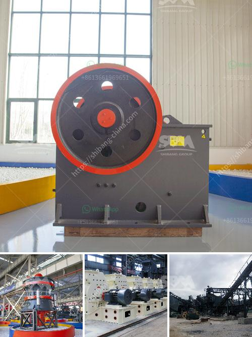

<h3>crushing plant process flow</h3>
A crushing plant is a subsystem of the quarry life cycle system that consists of different stages. It is responsible for reducing the size of rocks and stones into smaller pieces so that they can be used for further processing.

The process flow of a crushing plant mainly consists of several stages. First, raw materials are evenly and gradually conveyed into the jaw crusher for primary crushing. The crushed materials are then transferred to the impact crusher for secondary crushing through a belt conveyor. After the secondary crushing, the materials are conveyed into a vibrating screen for sieving.

During the sieving process, the materials that meet the desired size requirements are sent to the finished product area through a conveyor belt. On the other hand, the oversized materials are returned to the impact crusher for re-crushing.

The entire crushing plant process flow can be easily adjusted according to the specific requirements of different materials and finished products. For example, if the final product needs to be fine-grained, a cone crusher can be added in the middle crushing stage, or if the raw material is very hard, a vertical shaft impact crusher can be used as the primary crusher.

In addition to the main crushing equipment, a crushing plant process flow also includes various auxiliary equipment such as vibrating feeders, vibrating screens, conveyor belts, and control systems. These auxiliary equipment work together to ensure the smooth operation and high efficiency of the crushing plant.

Overall, the crushing plant process flow plays a crucial role in the quarry life cycle system as it ensures the production of high-quality materials that meet the specific requirements of various industries. It not only improves the economic benefits but also promotes sustainable development by reducing waste and conserving resources.
<h3>Contact us</h3><ul><li><strong>Whatsapp:&nbsp;<a href="https://wa.me/8613661969651">+8613661969651</a></strong></li><li><a href="https://swt.shibang-china.com/?git&amp;zhl&amp;crushing plant process flow"><strong>Online Service(chat now)</strong></a></li></ul><h3>Related</h3><ul><li><a href='sand powder milling machine.md'>sand powder milling machine</a></li><li><a href='impact crushers turkey.md'>impact crushers turkey</a></li><li><a href='stone crusher user manual.md'>stone crusher user manual</a></li><li><a href='basalt crushing equipment.md'>basalt crushing equipment</a></li><li><a href='regulatory conveyor belts.md'>regulatory conveyor belts</a></li></ul>