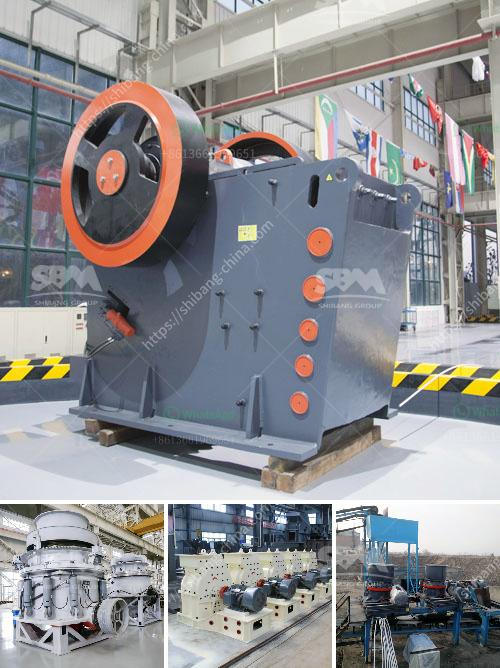

<h3>crushing powder machine germany</h3>
Germany has long been recognized worldwide for its excellence in engineering and manufacturing. From automobiles to machinery, German-made products are considered to be synonymous with quality and innovation. One such example is the crushing powder machine, which has become a benchmark in terms of technology and efficiency in Germany.

A crushing powder machine is an essential tool that is widely used in many industries, including mining, construction, and pharmaceuticals. Its purpose is to break down large chunks of raw material into smaller, more manageable particles. This process aids in the extraction and refining of minerals, production of construction materials, and preparation of powdered substances for various applications.

What sets the German crushing powder machine apart from others is its unmatched precision and reliability. German manufacturers pride themselves on their meticulous attention to detail and adherence to strict quality control standards. The machines are built to last, with durable materials and robust construction, ensuring longevity even in the most demanding environments.

In terms of technology, German crushing powder machines incorporate state-of-the-art features that enhance efficiency and productivity. Automated controls and advanced algorithms allow for precise adjustments, resulting in optimal crushing performance. Additionally, safety measures are rigorously implemented to protect operators and prevent accidents, ensuring a secure working environment.

Furthermore, German manufacturers are committed to sustainable practices. Crushing powder machines are designed with energy-efficient components and systems that minimize energy consumption and environmental impact. This aligns with Germany's strong emphasis on sustainability and its efforts to reduce carbon emissions.

The reputation of German-made crushing powder machines extends beyond the borders of the country. They are highly sought after globally, attracting customers who value reliability and precision. The machines have gained widespread recognition for their ability to handle diverse materials, such as ores, rocks, and even delicate substances like pharmaceutical powders.

In conclusion, the crushing powder machine Germany stands as a testament to German engineering prowess. Its combination of advanced technology, precision, and sustainability sets it apart from competitors. These machines not only excel in efficiency but also contribute to the global push for a greener future. As industries continue to evolve, German manufacturers will undoubtedly continue to innovate, pushing the boundaries of what is possible in crushing technology.
<h3>Contact us</h3><ul><li><strong>Whatsapp:&nbsp;<a href="https://wa.me/8613661969651">+8613661969651</a></strong></li><li><a href="https://swt.shibang-china.com/?git&amp;zhl&amp;crushing powder machine germany"><strong>Online Service(chat now)</strong></a></li></ul><h3>Related</h3><ul><li><a href='costs of conveyor belts.md'>costs of conveyor belts</a></li><li><a href='aggregate crushers for sale saudi arabia.md'>aggregate crushers for sale saudi arabia</a></li><li><a href='start up procedure for ball mill.md'>start up procedure for ball mill</a></li><li><a href='limestone primary crushing plant.md'>limestone primary crushing plant</a></li><li><a href='harare changfa diesel engine.md'>harare changfa diesel engine</a></li></ul>