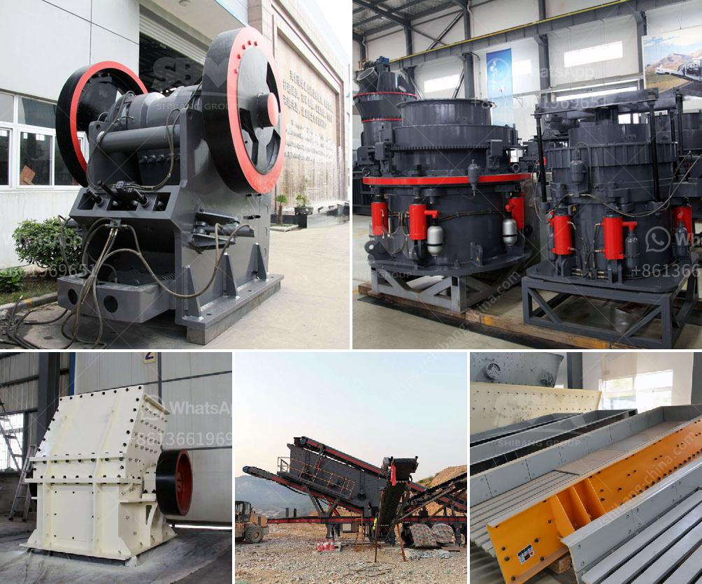

<h3>crushing rock export manufacturers india</h3>
India, the world's second-most populous country, has emerged as a prominent player in the global construction and infrastructure sector. With a rapidly expanding economy, the demand for high-quality building materials has soared, especially in the construction of roads, bridges, and other infrastructure projects. In this context, the crushing rock export manufacturers in India have found themselves at the forefront of a promising growth opportunity.

Crushing rock, sometimes referred to as aggregate, is the process of reducing large rocks into smaller fragments, commonly used as construction material. Crushing rock is a critical step in the production of concrete, asphalt, and various other building materials. Consequently, the demand for crushed rock has been steadily increasing in India, prompting the rise of crushing rock export manufacturers.

One of the biggest advantages of the crushing rock export manufacturers in India is their access to abundant natural resources. India is blessed with sprawling reserves of various types of rocks, such as granite, limestone, and sandstone. These resources serve as the primary raw materials for crushing rock manufacturers, resulting in a significant cost advantage compared to other countries.

Furthermore, the Indian government's increased focus on infrastructure development has fueled the demand for crushed rock. Major initiatives like the "Bharatmala Pariyojana" and the "Smart Cities Mission" have led to a surge in the construction of roads, bridges, and urban infrastructure. As a result, the demand for crushed rock has experienced exponential growth, presenting lucrative opportunities for crushing rock export manufacturers.

Another factor favoring the crushing rock export manufacturers is India's robust shipping infrastructure. The presence of numerous ports across the country facilitates the smooth transportation of crushed rock to various international destinations. This efficient logistics network ensures that Indian manufacturers can reach-out to global markets with ease, establishing their prominence on the global stage.

Additionally, the crushing rock export manufacturers in India have undergone significant technological advancements, enabling them to produce high-quality aggregates. Sophisticated machinery, such as crushers, sieving machines, and conveyor systems, have improved production efficiency and product consistency. Consequently, Indian manufacturers can provide the international market with superior quality crushed rock.

Despite these promising prospects, there are a few challenges that crushing rock export manufacturers in India need to address. The industry should focus on implementing sustainable practices to mitigate the environmental impact of rock mining and crushing. This can be achieved through improved extraction techniques, responsible waste management, and reclamation of disturbed areas.

Moreover, the industry needs to actively promote quality standards and certifications to build trust among international buyers. Compliance with global benchmarks will improve customer confidence and bolster India's reputation as a reliable source of crushed rock. Collaborating with international industry associations can also provide valuable insights into best practices and quality control.

In conclusion, the crushing rock export manufacturers in India are poised to capitalize on the country's robust construction sector and abundant natural resources. With increasing demand for high-quality crushed rock and a favorable shipping infrastructure, Indian manufacturers have the potential to establish themselves as significant players on the global stage. By prioritizing sustainable practices and adhering to international quality standards, India can solidify its position as a reliable and leading exporter of crushed rock.
<h3>Contact us</h3><ul><li><strong>Whatsapp:&nbsp;<a href="https://wa.me/8613661969651">+8613661969651</a></strong></li><li><a href="https://swt.shibang-china.com/?git&amp;zhl&amp;crushing rock export manufacturers india"><strong>Online Service(chat now)</strong></a></li></ul><h3>Related</h3><ul><li><a href='vertical vertical grinding machine.md'>vertical vertical grinding machine</a></li><li><a href='project of crushing and screening stone crusher machine.md'>project of crushing and screening stone crusher machine</a></li><li><a href='iron crushing equipment for sale.md'>iron crushing equipment for sale</a></li><li><a href='calcite crushing equipment.md'>calcite crushing equipment</a></li><li><a href='capital requirement for one ton cement mill.md'>capital requirement for one ton cement mill</a></li></ul>