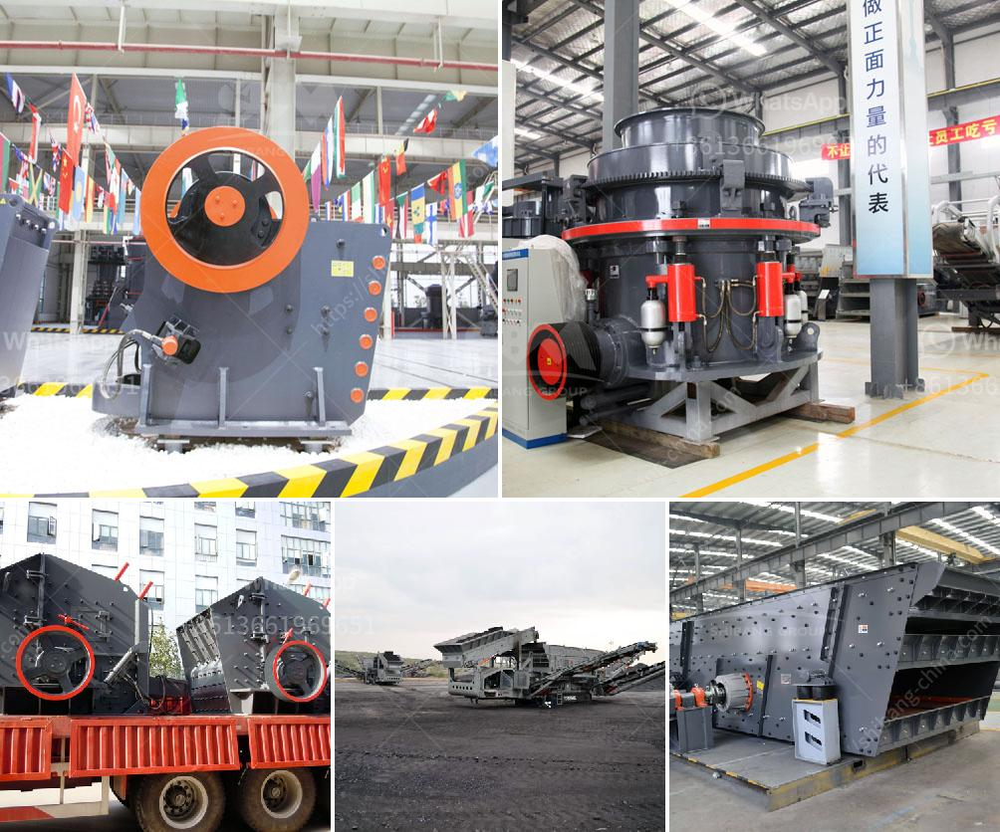

<h3>crushing service with peru jaw crusher</h3>
When it comes to the crushing of materials, finding the right equipment is essential. In Peru, one of the most efficient and effective solutions for crushing service is the Peru Jaw Crusher. With its superior performance and durability, this jaw crusher has become a popular choice among mining and construction companies.

The Peru Jaw Crusher is a versatile crushing machine that can be used for a variety of applications. It is equipped with advanced technology and features a sturdy construction, making it suitable for even the toughest crushing tasks. Whether it is gravel, stones, or minerals, this jaw crusher can effectively process them all.

One of the standout features of the Peru Jaw Crusher is its high crushing ratio. With this crusher, you can expect uniform product size and minimal fines generation. This is especially important in industries such as mining, where a consistent product size is required for downstream processes. The high crushing ratio of the Peru Jaw Crusher ensures that the material is efficiently crushed to the desired size.

Another notable feature of the Peru Jaw Crusher is its ease of operation. Designed with user-friendliness in mind, this crusher can be easily operated by anyone, from experienced operators to beginners. The intuitive control panel allows for precise control over the crushing process, ensuring optimal performance and productivity.

In addition, the Peru Jaw Crusher is known for its low maintenance requirements. The robust construction of this crusher ensures long-lasting durability, reducing the need for frequent repairs. This translates to increased uptime and lower operational costs for companies using this equipment.

Safety is always a top priority, especially in industries such as mining and construction. The Peru Jaw Crusher prioritizes safety with its many safety features. The crusher is equipped with a safety toggle plate that protects the operator in case of accidental overload or tramp metal entering the crushing chamber. Additionally, the crusher is equipped with a reliable hydraulic system that ensures safe and easy adjustment of the crushing gap.

Furthermore, the Peru Jaw Crusher is designed with energy efficiency in mind. With its optimized crushing chamber and advanced engineering, this crusher consumes less energy compared to other crushers in its class. This not only reduces operational costs but also contributes to a greener and more sustainable operation.

In conclusion, the Peru Jaw Crusher is a reliable and efficient solution for crushing service in various industries. Its versatility, high crushing ratio, ease of operation, low maintenance requirements, safety features, and energy efficiency make it a top choice for companies looking to enhance their crushing operations. Whether it is for mining, construction, or any other industry requiring efficient crushing, the Peru Jaw Crusher is the perfect solution.
<h3>Contact us</h3><ul><li><strong>Whatsapp:&nbsp;<a href="https://wa.me/8613661969651">+8613661969651</a></strong></li><li><a href="https://swt.shibang-china.com/?git&amp;zhl&amp;crushing service with peru jaw crusher"><strong>Online Service(chat now)</strong></a></li></ul><h3>Related</h3><ul><li><a href='chinese manufacturer for crusher screens vibrating feeders.md'>chinese manufacturer for crusher screens vibrating feeders</a></li><li><a href='cone crusher company.md'>cone crusher company</a></li><li><a href='limestone processing plant price.md'>limestone processing plant price</a></li><li><a href='what is the cost of crusher.md'>what is the cost of crusher</a></li><li><a href='washing plant for silica.md'>washing plant for silica</a></li></ul>