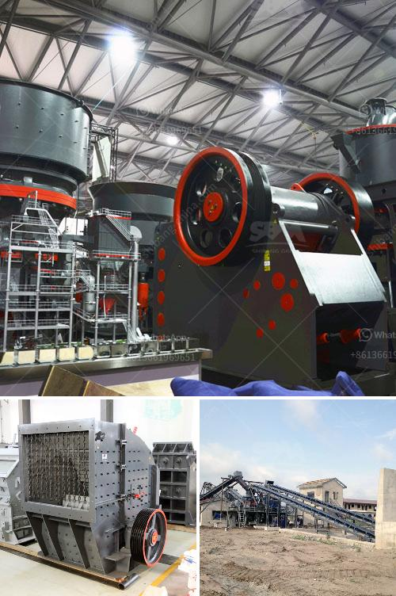

<h3>crushing to micron sized powder</h3>
In many industries, ranging from pharmaceuticals to chemicals, the requirement to grind materials to micron-sized particles is an essential step in the manufacturing process. Achieving the desired particle size is crucial as it can significantly impact the product's properties, reactivity, and functionality. To achieve such precision, one of the most effective techniques employed is crushing materials down to a micron-sized powder.

Crushing materials to micron-sized powder involves reducing the size of the particles to a level where they exhibit desirable attributes such as increased surface area, enhanced dissolution rates, and improved dispersibility. To accomplish this, various crushing machines such as crushers, hammer mills, and pulverizers are used, depending on the specific requirements of the materials being processed.

The process of crushing to micron-sized powder begins with selecting the appropriate equipment that can handle the intended material properties, such as hardness, brittleness, and moisture content. The chosen machine ensures optimal crushing efficiency while minimizing damage to the material's integrity. By using a combination of crushing mechanisms like impact, compression, and attrition, the desired particle size reduction can be achieved.

An important consideration when crushing materials to micron-sized powder is the control of particle size distribution. Uniform particle size distribution is often desired to ensure consistent and predictable behavior of the material during subsequent processing stages. This can be achieved through precise control of the crushing parameters, such as feed rate, rotor speed, and screen configuration.

The micron-sized powder obtained through this crushing process finds applications in various industries. In the pharmaceutical sector, crushing materials to micron size improves drug solubility, enhancing their bioavailability. In the chemical industry, micron-sized powders facilitate better mixing and reaction rates, leading to improved product quality. Additionally, in the food and ceramic industries, obtaining micron-sized particles contributes to better texture, taste, and surface finish.

Crushing materials to micron-sized powder represents an essential and versatile technique with widespread industrial applications. It enables manufacturers to tailor the characteristics of their products in line with specific requirements, leading to improved performance, enhanced quality, and increased value. As technology advances, more precise and efficient crushing methods will continue to emerge, further expanding the possibilities for micron-sized powder production and its utilization.
<h3>Contact us</h3><ul><li><strong>Whatsapp:&nbsp;<a href="https://wa.me/8613661969651">+8613661969651</a></strong></li><li><a href="https://swt.shibang-china.com/?git&amp;zhl&amp;crushing to micron sized powder"><strong>Online Service(chat now)</strong></a></li></ul><h3>Related</h3><ul><li><a href='2nd hand mobile crusher in dubai.md'>2nd hand mobile crusher in dubai</a></li><li><a href='fluorite ore processing equipment manufacturer.md'>fluorite ore processing equipment manufacturer</a></li><li><a href='cone crusher for sale in south africa.md'>cone crusher for sale in south africa</a></li><li><a href='nigeria crusher price.md'>nigeria crusher price</a></li><li><a href='small aggregate wash plants.md'>small aggregate wash plants</a></li></ul>