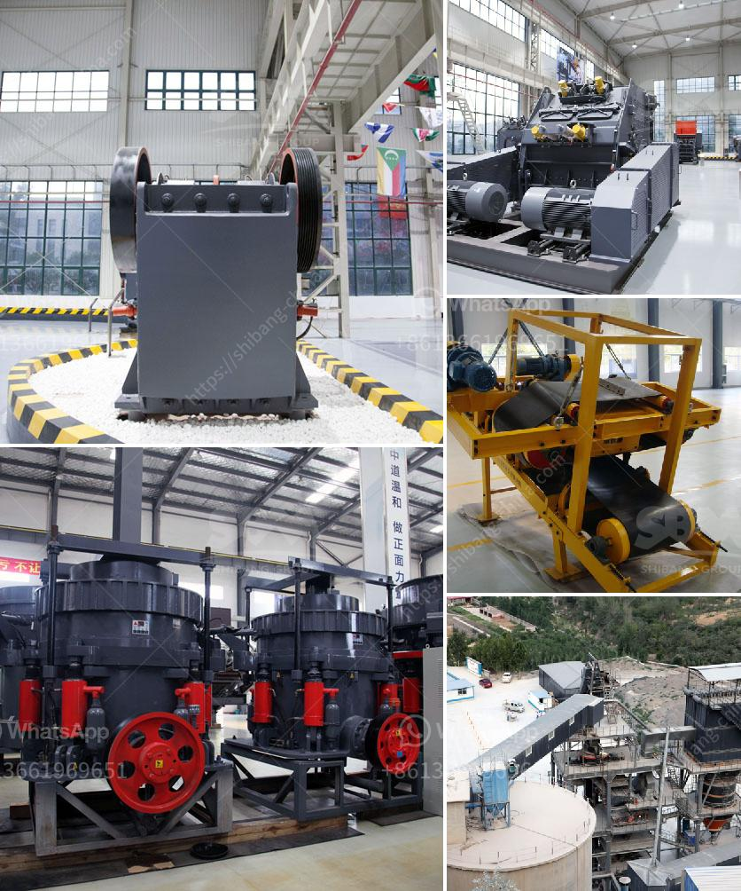

<h3>dealer of steel balls for ball mill in manila</h3>
The Ball Mill is a rotating cylinder that contains steel balls which act as the grinding media. If you are looking to purchase steel balls for your ball mill machine in Manila, you may want to consider those made of chrome steel. While stainless steel balls are also effective grinding media, they tend to be more expensive than chrome steel balls.

One reputable dealer for steel balls in Manila is Hardware Essentials Trading. They offer a wide range of chrome steel balls that are suitable for ball mill grinding. They guarantee high hardness, toughness, and resistance to wear and corrosion. These qualities are essential for the efficient operation of the ball mill, ensuring it delivers consistent performance over time.

Hardware Essentials Trading's steel balls are manufactured to meet industry standards, ensuring they are of superior quality. Their products are carefully crafted using advanced steel-making techniques, resulting in reliable and durable grinding media.

By choosing the right steel balls for your ball mill, you can optimize the milling process, achieving precise and consistent particle size reduction. This directly impacts the efficiency and productivity of your operation. The use of high-quality steel balls not only enhances the performance of your ball mill but also reduces operational costs in the long run.

When evaluating dealers of steel balls for a ball mill, it is crucial to consider their experience and reputation in the industry. Hardware Essentials Trading has been serving clients in Manila for many years, earning a stellar reputation for their quality products and outstanding customer service.

Their team of professionals is knowledgeable and can provide expert advice on the ideal steel balls for your specific needs. From the initial consultation to the final delivery, Hardware Essentials Trading ensures a smooth and hassle-free transaction, making them a reliable partner for your ball mill requirements.

In conclusion, when searching for a dealer of steel balls for your ball mill in Manila, it is essential to prioritize quality and reliability. Hardware Essentials Trading offers chrome steel balls that are manufactured to meet industry standards, guaranteeing superior performance, durability, and cost-effectiveness. By choosing them as your supplier, you can optimize your milling process, ensuring efficient and consistent particle size reduction. With their extensive experience and commitment to customer satisfaction, Hardware Essentials Trading is a trusted partner for all your ball mill grinding media needs.
<h3>Contact us</h3><ul><li><strong>Whatsapp:&nbsp;<a href="https://wa.me/8613661969651">+8613661969651</a></strong></li><li><a href="https://swt.shibang-china.com/?git&amp;zhl&amp;dealer of steel balls for ball mill in manila"><strong>Online Service(chat now)</strong></a></li></ul><h3>Related</h3><ul><li><a href='mobile crushing plant philippines.md'>mobile crushing plant philippines</a></li><li><a href='granite processing machines china.md'>granite processing machines china</a></li><li><a href='cement industry processes.md'>cement industry processes</a></li><li><a href='ultra fine grinding mill.md'>ultra fine grinding mill</a></li><li><a href='vibrating screen in the philippines.md'>vibrating screen in the philippines</a></li></ul>