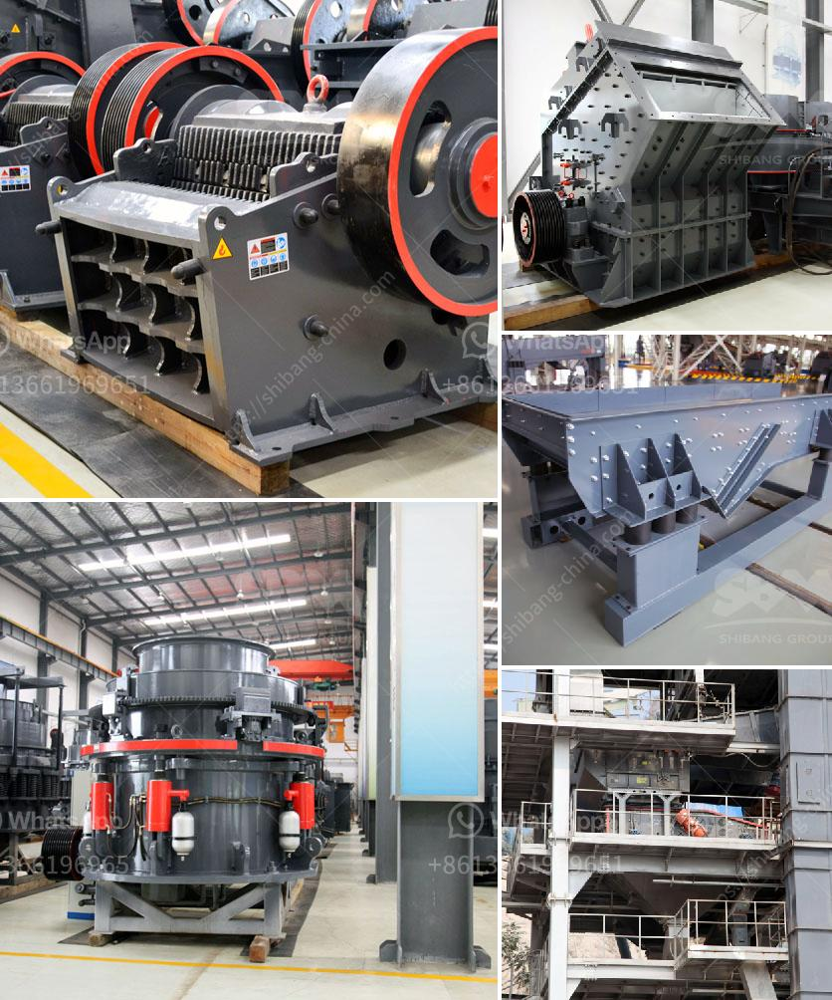

<h3>desain mesin crusher tempurung kelapa</h3>
Coconut waste is a big problem in many tropical countries. With the vast amount of coconut trees spread across these regions, the production of coconut waste is unavoidable. However, instead of being perceived as a problem, coconut waste can be transformed into a valuable resource. One effective solution is the use of a machine called "mesin crusher tempurung kelapa" or coconut shell crusher.

This machine utilizes the mechanical principles of cutting and grinding to extract valuable materials from coconut waste. It is commonly used in various industries, including food processing, chemical manufacturing, and waste management. The desain mesin crusher tempurung kelapa is specifically designed to reduce the size of coconut shells, making it easier to process and utilize.

One of the primary applications of the mesin crusher tempurung kelapa is in the production of activated carbon. Coconut shell activated carbon is widely used in water purification, air filtration, and gas separation due to its high adsorption capacity. The desain mesin crusher tempurung kelapa plays a crucial role in processing and preparing coconut shells for the production of activated carbon.

The machine consists of several components, including a feed hopper, a crushing chamber, and a discharge chute. Coconut shells are fed into the machine through the feed hopper, where they are crushed by rotating blades or hammers. The crushed coconut shell pieces then pass through the crushing chamber, where further grinding processes occur. The final product is discharged through the chute, ready for further processing or utilization.

The desain mesin crusher tempurung kelapa offers several advantages. First, it helps reduce the amount of coconut waste that goes to landfills or is burnt, causing environmental pollution. By processing coconut shells into valuable materials, the machine promotes more sustainable waste management practices.

Second, the machine increases the utilization of coconut waste, turning it into a valuable resource. Coconut shells are not only used for activated carbon production but also as a raw material for various other products. For example, they can be used in the manufacturing of furniture, handicrafts, and even as a fuel source.

Lastly, the desain mesin crusher tempurung kelapa enhances the economic potential of coconut waste. By extracting valuable materials, such as activated carbon, from coconut shells, it creates new business opportunities and income streams for local communities. This can contribute to the economic development of coconut-producing regions.

In conclusion, the desain mesin crusher tempurung kelapa is an innovative solution to the problem of coconut waste. Through its effective cutting and grinding mechanisms, it transforms coconut shells into valuable materials for various industries. By reducing waste, increasing resource utilization, and enhancing economic potential, this machine offers not only environmental benefits but also social and economic advantages. With proper implementation and support, the mesin crusher tempurung kelapa can make a significant impact in turning coconut waste into a valuable resource.
<h3>Contact us</h3><ul><li><strong>Whatsapp:&nbsp;<a href="https://wa.me/8613661969651">+8613661969651</a></strong></li><li><a href="https://swt.shibang-china.com/?git&amp;zhl&amp;desain mesin crusher tempurung kelapa"><strong>Online Service(chat now)</strong></a></li></ul><h3>Related</h3><ul><li><a href='limestone ball mill.md'>limestone ball mill</a></li><li><a href='stone quarry crusher in ghana.md'>stone quarry crusher in ghana</a></li><li><a href='roller mill corrugation.md'>roller mill corrugation</a></li><li><a href='hammer mill dimensions.md'>hammer mill dimensions</a></li><li><a href='marble milling machine.md'>marble milling machine</a></li></ul>