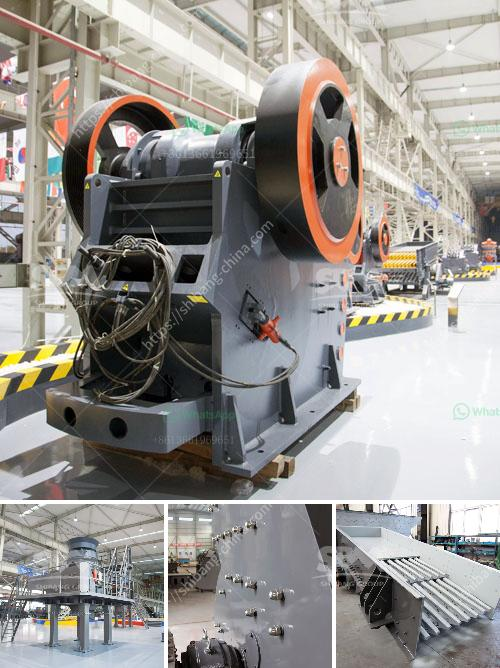

<h3>design for stone crusher plant</h3>
Designing a stone crusher plant can be overwhelming for a novice to the industry. With so many options available in the market, it is not easy to choose the right equipment. But with the right design considerations, it becomes a lot easier to navigate through the maze.

The first thing to consider when designing a stone crusher plant is the budget. Budget is a crucial factor in any industry, because it determines the margin of profit. Such constraints often cross the mind of a plant owner. So, it is essential to invest in a machine that suits the budget and fulfills the operational requirements.

The second aspect to consider is the size of the stone crusher plant. The size of the plant determines the scope of production. A plant with a smaller footprint requires less operating space, while a larger plant can accommodate more machinery and equipment. It is essential to choose a plant size that matches the expected production volume.

Another important consideration is the type of material being processed. Different types of stone require different equipment. For example, a hard granite stone needs a specialized crusher designed to break it down efficiently. On the other hand, a soft limestone stone can be crushed using a simple mobile jaw crusher. This allows for flexibility when choosing the right equipment.

The design of the stone crushing plant is also influenced by the site layout, topography, and environmental conditions. The process involves a lot of factors that need to be taken into account. In essence, stone crushing plants are responsible for handling hundreds of tons of materials per hour. That means they have to be equipped with a wide variety of machines for efficient operation. The key machines in a typical crushing plant include crushers, feeders, screens, conveyors, and surge bins.

The size of the equipment required depends on the size and hardness of the feed material. Additionally, considerations should also be given to the maintenance requirements of these machines. All the equipment should be easily accessible for proper maintenance and repair.

Safety is another crucial aspect when designing a stone crusher plant. Machines that are not properly designed can pose serious safety risks. Therefore, it is essential to take safety into account at every stage of the design process. Safety features like emergency stop buttons, proper machine guarding, and dust suppression systems should be implemented to ensure the safety of the plant operators.

Lastly, it is important to consider the future expansion of the stone crusher plant. A well-designed plant should be able to handle future upgrades and additions without major disruptions. The machinery and equipment should be modular and scalable, allowing for easy expansion and adaptation to changing needs.

Designing a stone crusher plant requires a thoughtful and meticulous approach. By considering factors such as budget, size, material type, site layout, and safety, it is possible to create a plant that maximizes productivity and profitability. With the right design, a stone crusher plant can be a worthwhile investment for any stone crushing business.
<h3>Contact us</h3><ul><li><strong>Whatsapp:&nbsp;<a href="https://wa.me/8613661969651">+8613661969651</a></strong></li><li><a href="https://swt.shibang-china.com/?git&amp;zhl&amp;design for stone crusher plant"><strong>Online Service(chat now)</strong></a></li></ul><h3>Related</h3><ul><li><a href='quarry equipment for sale in nigeria.md'>quarry equipment for sale in nigeria</a></li><li><a href='crusher machine price in sri lanka.md'>crusher machine price in sri lanka</a></li><li><a href='impact crusher from china.md'>impact crusher from china</a></li><li><a href='basalt crusher price in senegal.md'>basalt crusher price in senegal</a></li><li><a href='vertical vertical grinding machine.md'>vertical vertical grinding machine</a></li></ul>