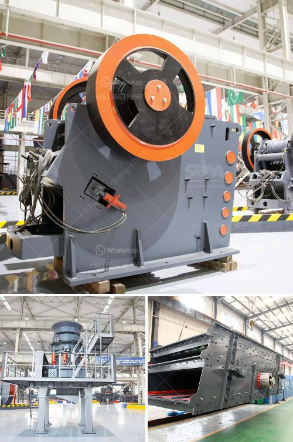

<h3>detail project report on quartz powder plant</h3>
Quartz powder, also known as silica powder, is a non-metallic mineral commonly used in industries like construction, ceramics, and electronics. It is used as a raw material in the production of glass, ceramics, and various other industrial products. With the growing demand for such products, setting up a quartz powder plant can be a profitable venture. In this article, we will discuss the detailed project report on a quartz powder plant.

The quartz powder plant will be located at XYZ Industrial Estate, Phase 3, in XYZ city, where there are ample resources available for the project. These resources include raw materials like quartz, limestone, and dolomite, as well as skilled manpower and technical expertise.

The total project cost for setting up the quartz powder plant is estimated to be around $250,000. This includes the cost of machinery, land, building, and other miscellaneous assets. The machinery and equipment required for the plant include crushers, ball mills, sifters, magnetic separators, and dryers.

The plant will have a production capacity of 10 tons per day. The raw materials required for the production process will be sourced locally. Quartz, limestone, and dolomite will be procured from nearby mines and quarries. These raw materials will be crushed, milled, and processed to obtain the desired quartz powder.

The project will be implemented in three phases. In the first phase, the land will be acquired, and the necessary infrastructure will be developed. This includes constructing the plant building, setting up machinery, installing utilities, and obtaining necessary permits and clearances.

In the second phase, the machinery and equipment will be commissioned, and test runs will be conducted. This phase will also involve hiring and training personnel for operating the plant. Quality control measures will be put in place to ensure the production of high-quality quartz powder.

Once the plant is fully operational, it will enter the third phase, which involves marketing and distribution of the quartz powder. The powder will be packed in bags of various sizes to cater to different customer requirements. Efforts will be made to establish long-term partnerships with glass, ceramic, and electronics companies to secure regular orders.

The estimated revenue from the quartz powder plant is projected to be around $500,000 per year. The profitability of the project will depend on several factors like the quality of the product, pricing, market demand, and operational efficiency. With proper planning, efficient operations, and effective marketing strategies, the project can generate substantial returns on investment.

In conclusion, setting up a quartz powder plant can be a lucrative business opportunity. The project report highlights the potential of such a plant in terms of cost, production capacity, and revenue generation. It also emphasizes the importance of acquiring the necessary resources, establishing a robust infrastructure, and implementing effective marketing strategies for the success of the project. With careful planning and execution, the quartz powder plant can become a profitable venture in the long run.
<h3>Contact us</h3><ul><li><strong>Whatsapp:&nbsp;<a href="https://wa.me/8613661969651">+8613661969651</a></strong></li><li><a href="https://swt.shibang-china.com/?git&amp;zhl&amp;detail project report on quartz powder plant"><strong>Online Service(chat now)</strong></a></li></ul><h3>Related</h3><ul><li><a href='ballast crusher machine price.md'>ballast crusher machine price</a></li><li><a href='output of crushing plant.md'>output of crushing plant</a></li><li><a href='gypsum processing plant in.md'>gypsum processing plant in</a></li><li><a href='slag grindimg in ball mill.md'>slag grindimg in ball mill</a></li><li><a href='superfine grinding mill.md'>superfine grinding mill</a></li></ul>