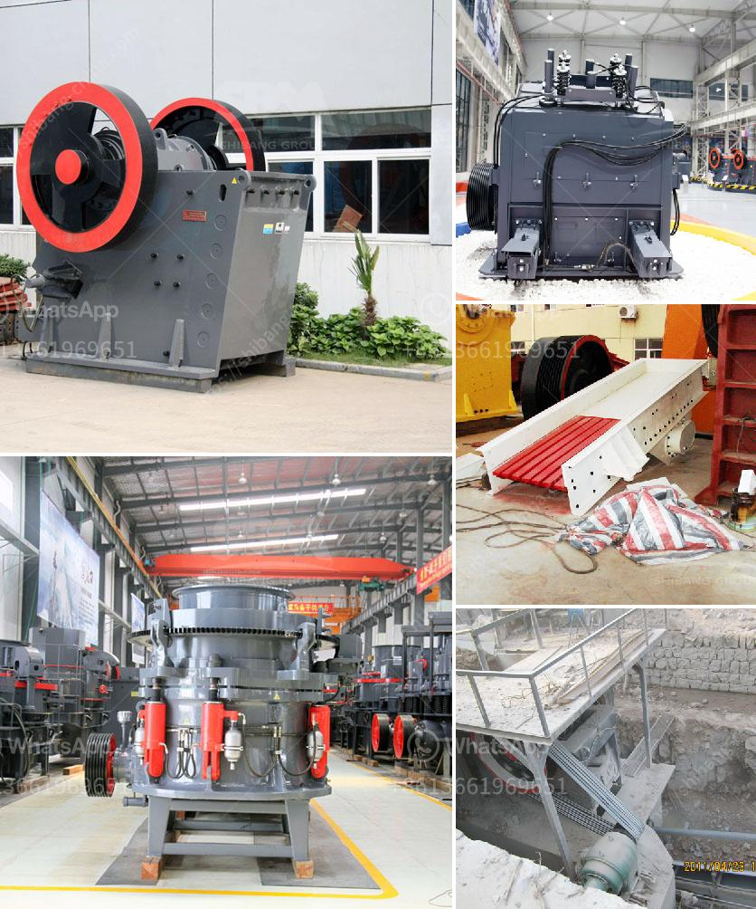

<h3>diamond equipment for mining for sale south africa</h3>
Diamond mining is an essential industry in South Africa as it has been a prominent source of revenue for the country. It is also known for its rich diamond reserves, making it a top player in the global diamond industry. With state-of-the-art equipment and cutting-edge technology, diamond miners use advanced techniques to extract these precious stones.

One of the crucial elements required to maximize productivity and ensure the safety of miners is the equipment used in diamond mining. Given the harsh and challenging conditions of diamond mining in South Africa, it is crucial to invest in high-quality equipment that can withstand these conditions.

There are various types of diamond mining equipment available in the market, and it is important to choose the right equipment based on the specific requirements of the mining operation. Here are some of the commonly used diamond mining equipment for sale in South Africa:

1. Excavators: Excavators are essential for removing overburden and extracting diamonds. These powerful machines can efficiently dig, transport, and load the material onto trucks. Excavators come in various sizes, and the choice depends on the scale of the mining operation.

2. Bulldozers: Bulldozers are used for clearing out the mining area and creating access roads. They are equipped with blades, making it easier to move earth and debris. Bulldozers are essential for creating a safe working environment and ensuring efficient mining operations.

3. Crushers: In diamond mining, crushers are used to break down the large rocks and make them suitable for extraction. They reduce the size of the ore and facilitate the extraction process. Crushers come in different sizes, depending on the desired output size and capacity.

4. Screening Plants: Screening plants are used to separate the material based on size. They ensure that only the desired-sized material is sent for further processing, minimizing waste and maximizing efficiency.

5. Jigs: Jigs are an integral part of diamond recovery. They are used to separate diamonds from other minerals and materials present in the mining mixture. Jigs work on the principle of density separation, allowing lighter material to be washed away, leaving behind the valuable diamonds.

6. X-ray Diamond Sorters: Modern diamond sorting technology utilizes X-ray technology to quickly and accurately detect and separate diamonds from the mining material. These tools improve the efficiency of the sorting process, ensuring accurate diamond recovery.

Investing in high-quality diamond mining equipment in South Africa is crucial to ensure the success and profitability of diamond mining operations. Companies must opt for reliable suppliers who provide equipment that is durable, efficient, and capable of withstanding the challenging mining conditions.

Additionally, mining companies should prioritize the safety of their workers by investing in equipment that meets the necessary safety standards and regulations. This includes equipment with advanced safety features such as fire suppression systems, advanced ventilation systems, and emergency response protocols.

In conclusion, diamond mining in South Africa is a lucrative industry that requires top-notch equipment to be successful. Investing in high-quality, reliable equipment is essential for maximizing productivity and ensuring the safety of the miners. By choosing the right equipment, companies can effectively extract and recover diamonds, contributing to the economic growth and prosperity of South Africa.
<h3>Contact us</h3><ul><li><strong>Whatsapp:&nbsp;<a href="https://wa.me/8613661969651">+8613661969651</a></strong></li><li><a href="https://swt.shibang-china.com/?git&amp;zhl&amp;diamond equipment for mining for sale south africa"><strong>Online Service(chat now)</strong></a></li></ul><h3>Related</h3><ul><li><a href='price list sag mill for sale.md'>price list sag mill for sale</a></li><li><a href='financial projection of a quarry business.md'>financial projection of a quarry business</a></li><li><a href='sand making plant sand washing plant.md'>sand making plant sand washing plant</a></li><li><a href='crusher machine price in the philippines.md'>crusher machine price in the philippines</a></li><li><a href='crusher for quartz.md'>crusher for quartz</a></li></ul>