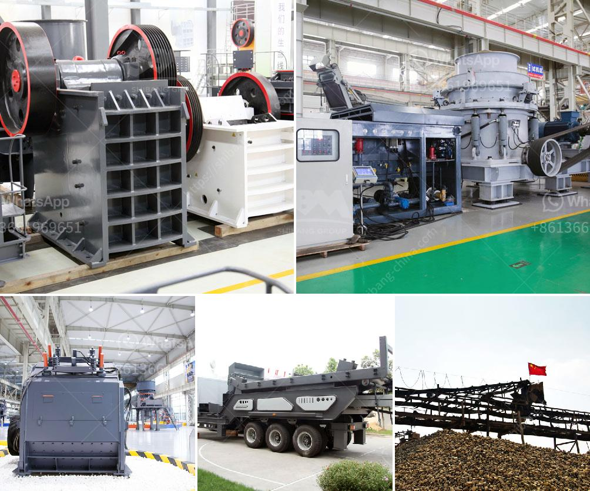

<h3>diamond making machines germany</h3>
Germany is renowned for its engineering excellence and precision technology. It comes as no surprise that the country is at the forefront of diamond making machines, creating cutting-edge technology to manufacture diamonds. These machines have revolutionized the diamond industry, providing an alternative to traditional mining and offering a sustainable solution.

German diamond making machines are designed to mimic the natural formation of diamonds, replicating the high temperature and pressure needed to create these precious gemstones. These machines use a process called chemical vapor deposition (CVD), which involves the growth of a diamond layer on a substrate. This substrate can be a natural diamond or a standard piece of carbon. The CVD process allows for controlled and precise growth of diamonds, resulting in high-quality gemstones.

The advantages of diamond making machines are numerous. First and foremost, they offer an ethical and sustainable way to produce diamonds. Unlike traditional mining, which often leads to environmental degradation and human rights issues, these machines create diamonds in a controlled laboratory setting. This has significant implications for the future of the diamond industry, as consumers increasingly prioritize ethical and sustainable products.

Additionally, diamond making machines provide consistent quality and reliable production. The precise control over the growth process ensures that each diamond produced is of the highest quality, with consistent color, clarity, and cut. This makes them highly desirable for use in jewelry and industrial applications.

Germany's expertise in engineering and technology is evident in the development of diamond making machines. The country is home to leading manufacturers and researchers who continue to push the boundaries of this technology. German-made machines have gained international recognition for their exceptional quality and reliability.

In conclusion, German diamond making machines have revolutionized the industry by offering an ethical and sustainable alternative to traditional mining. They enable the production of high-quality diamonds with consistent characteristics, meeting the increasing demand for ethically sourced gemstones. With German engineering excellence leading the way, these machines continue to shape the future of the diamond industry.
<h3>Contact us</h3><ul><li><strong>Whatsapp:&nbsp;<a href="https://wa.me/8613661969651">+8613661969651</a></strong></li><li><a href="https://swt.shibang-china.com/?git&amp;zhl&amp;diamond making machines germany"><strong>Online Service(chat now)</strong></a></li></ul><h3>Related</h3><ul><li><a href='ball mill for mineral grinding india.md'>ball mill for mineral grinding india</a></li><li><a href='mobile stone crusher south africa.md'>mobile stone crusher south africa</a></li><li><a href='basalt impact crusher price.md'>basalt impact crusher price</a></li><li><a href='dolomite processing plan in ethiopia.md'>dolomite processing plan in ethiopia</a></li><li><a href='used mobile jaw crushers for sale in uae.md'>used mobile jaw crushers for sale in uae</a></li></ul>