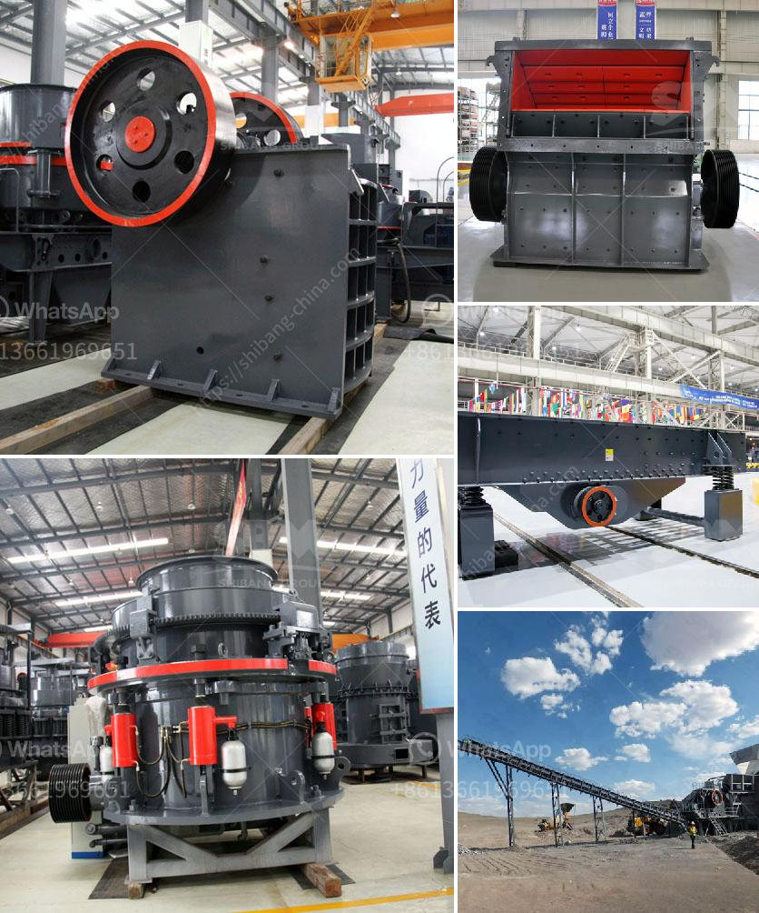

<h3>diamond mining plant layout</h3>
Diamonds, the most coveted gemstone in the world, have been synonymous with luxury and beauty for centuries. Mined from various parts of the globe, diamonds are extracted through a meticulous process that involves sophisticated mining plants. To maximize productivity and optimize the extraction of these precious gems, a well-planned diamond mining plant layout is crucial. In this article, we will explore the components and factors that contribute to an efficient diamond mining plant layout.

The first step in designing a diamond mining plant layout is to conduct extensive geological surveys to identify potential diamond-bearing areas. This reconnaissance work helps determine the optimal location for the plant, taking into consideration factors such as accessibility, proximity to the mining site, and available infrastructure.

Once the ideal location is established, the layout planning can commence. A key component of the diamond mining plant layout is a primary crusher, which is essential for reducing the rock size into smaller fragments suitable for further processing. This primary crusher is typically located adjacent to the mining area, enabling efficient transportation of the mined material to the plant without unnecessary delays.

Upon arrival at the plant, the material is transported to a secondary crusher where further size reduction takes place. This secondary crusher is strategically placed to optimize the material flow within the plant, ensuring a seamless processing operation. The crushed rock then undergoes various stages of diamond extraction processes such as crushing, screening, and sorting.

To achieve the desired efficiency, an important consideration in the diamond mining plant layout is the arrangement of the processing equipment. Each stage of the extraction process requires specialized machinery, such as scrubbers, dense media separators, and X-ray machines, to name a few. These machines should be arranged in a logical sequence, allowing for a smooth transition from one process to another while minimizing material handling.

An efficient diamond mining plant layout should also account for the management of waste material. Tailings, which are the by-products of the extraction process, need to be properly disposed of to minimize environmental impact. A well-designed plant layout incorporates an area dedicated to the storage and management of tailings, ensuring that it is easily accessible for disposal and adheres to environmental regulations.

Additionally, the proximity of the plant to water sources is an important consideration. Water is an essential component in the diamond extraction process, used for activities such as washing and separating the diamonds from other materials. Therefore, an adequate water supply needs to be factored into the plant layout plan, minimizing transportation costs and optimizing operational efficiency.

In conclusion, a carefully planned diamond mining plant layout is crucial for optimal efficiency in extracting these highly valuable gems. The layout should accommodate all necessary equipment, from primary crushers to specialized machinery for processing and waste management. It should also take into account logistics, such as proximity to the mining site and available infrastructure. By considering these factors, diamond mining operators can enhance their productivity while reducing costs and minimizing environmental impact.
<h3>Contact us</h3><ul><li><strong>Whatsapp:&nbsp;<a href="https://wa.me/8613661969651">+8613661969651</a></strong></li><li><a href="https://swt.shibang-china.com/?git&amp;zhl&amp;diamond mining plant layout"><strong>Online Service(chat now)</strong></a></li></ul><h3>Related</h3><ul><li><a href='stone crushing feasibility study.md'>stone crushing feasibility study</a></li><li><a href='conveyor belts for sale in china.md'>conveyor belts for sale in china</a></li><li><a href='silica flour mill.md'>silica flour mill</a></li><li><a href='grinding mill for limestone italy in bergamo.md'>grinding mill for limestone italy in bergamo</a></li><li><a href='project of crushing and screening stone crusher machine.md'>project of crushing and screening stone crusher machine</a></li></ul>