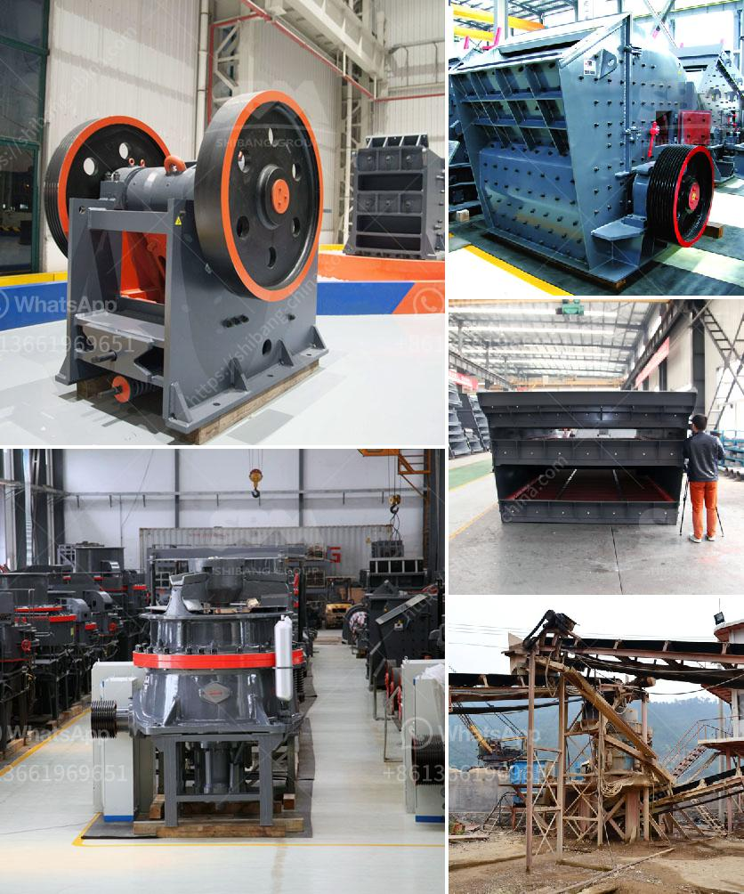

<h3>diamond screening plant for hire south africa</h3>
South Africa is known for its rich diamond deposits, making it one of the leading nations in the diamond mining industry. To extract these precious gems, efficient and technologically advanced equipment is required. This is where diamond screening plants come into play. These plants are specifically designed to sort and separate diamonds from the mined material effectively. Hiring a diamond screening plant in South Africa can significantly enhance mining operations, ensuring maximum productivity and profitability.

A diamond screening plant is a mobile unit that can be transported to different mining sites as per requirements. These plants are equipped with advanced machinery and technology to efficiently screen and separate diamonds based on their size and other characteristics. The screening process is essential to minimize the loss of diamonds and optimize their value.

One of the significant advantages of hiring a diamond screening plant is its flexibility and mobility. Mining sites often change, and hiring a stationary screening plant may limit the scope and efficiency of operations. A mobile screening plant, on the other hand, can be easily transported to different locations, allowing miners to access remote areas with ease. This mobility ensures maximum coverage of the mining area, increasing the chances of finding diamonds.

Diamond screening plants are designed to handle large quantities of material efficiently. The initial mining process involves extracting vast amounts of rock and soil containing diamonds. These materials are then fed into the screening plant. The plant uses a series of screens and sorting mechanisms to separate the diamonds from the surrounding material. The screened diamonds are then further processed for grading and valuation. The ability to handle large quantities of material and quickly process it significantly enhances the productivity of diamond mining operations.

Hiring a diamond screening plant also eliminates the need for significant capital investment in purchasing and maintaining the equipment. The cost of purchasing a screening plant can be quite high, especially for smaller mining companies. By opting to hire a plant, these companies can focus their financial resources on other essential aspects of their operations. Additionally, maintenance and repair costs are also minimized as the responsibility lies with the equipment rental company.

When considering hiring a diamond screening plant in South Africa, it is important to choose a reputable and reliable equipment rental company. The company should have a strong track record and an extensive fleet of well-maintained equipment. It is also crucial to ensure that the plant meets all safety and regulatory requirements to avoid any legal complications.

In conclusion, hiring a diamond screening plant in South Africa is a strategic move for mining companies looking to optimize their operations. These mobile plants offer flexibility, mobility, and an efficient methodology to separate diamonds from the surrounding material. By choosing the right rental company, mining operators can access state-of-the-art equipment without the need for significant capital investments. With the ability to handle large quantities of material, diamond screening plants significantly enhance the productivity and profitability of mining operations in South Africa.
<h3>Contact us</h3><ul><li><strong>Whatsapp:&nbsp;<a href="https://wa.me/8613661969651">+8613661969651</a></strong></li><li><a href="https://swt.shibang-china.com/?git&amp;zhl&amp;diamond screening plant for hire south africa"><strong>Online Service(chat now)</strong></a></li></ul><h3>Related</h3><ul><li><a href='mill price for minerals in bolivia.md'>mill price for minerals in bolivia</a></li><li><a href='ball milling in chemistry.md'>ball milling in chemistry</a></li><li><a href='primary crusher pe 400x600 pm 15 single.md'>primary crusher pe 400x600 pm 15 single</a></li><li><a href='types of crushers ppt.md'>types of crushers ppt</a></li><li><a href='sand making machine indonesia.md'>sand making machine indonesia</a></li></ul>