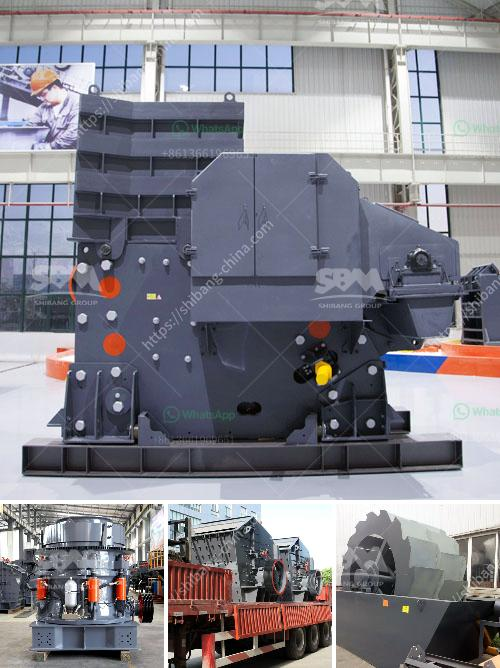

<h3>diatomite impact grinding mill</h3>
The diatomite impact grinding mill is a versatile machine in the processing of coarse powder and fine powder. The diatomite impact grinding mill can process various stones, minerals with a Mohs hardness of less than 9.3 and a humidity of less than 6%, such as quartz, feldspar, calcite, limestone, talc, ceramic, iron ore, carborundum, bauxite, rock phosphate, coal and other materials, total about 400 kinds of materials. 

The diatomite impact grinding mill is an indispensable equipment for diatomite processing and production. As an ideal equipment for promoting the application value of diatomite, Guilin Hongcheng vertical roller mill becomes more and more popular. It has excellent grinding effect and advanced technical level. It is an ideal equipment for non-metallic mineral processing. Guilin Hongcheng has always been a well-known enterprise in the field of powder making, the production of diatomite grinding mill is of high quality, environmental protection, energy saving and efficiency, and it has created great profits and value for the majority of diatomite powder customers.

With the continuous improvement of Hongcheng's technology in recent years, the performance of diatomite vertical roller mill has been greatly improved, and the vertical roller mill equipment is dedicated to grinding 325-2500 mesh powder, which has become a favorite grinding mill equipment for increasing production of diatomite powder. The grinding mill integrates drying, grinding, grading, and conveying. The equipment has high grinding efficiency, low energy consumption, large processing capacity, and low comprehensive investment cost. The diatomite vertical roller mill equipment produced by Hongcheng is abundant in output, high in powder efficiency, and low in energy consumption.

The diatomite impact grinding mill is suitable for grinding materials with low hardness and low abrasiveness, such as diatomite, barite, quartz sand, feldspar, limestone, talc, ceramic, etc. It is mainly composed of main engine, feeder, classifier, blower, pipeline device, storage hopper, electric control system, collection system, etc. The grinding roller is made of high-manganese steel, which is more wear-resistant and has a longer service life. The internal structure of the grinding mill is reasonable, the grinding efficiency is high, the output is large, and the finished product has good particle shape and fineness.

In summary, the diatomite impact grinding mill is a new type of grinding equipment with high production efficiency and low energy consumption. The diatomite grinding mill has become more and more popular in the industry, and it has created a wider range of application prospects for diatomite production and processing. It is an ideal grinding equipment for promoting the rapid growth of diatomite enterprises.
<h3>Contact us</h3><ul><li><strong>Whatsapp:&nbsp;<a href="https://wa.me/8613661969651">+8613661969651</a></strong></li><li><a href="https://swt.shibang-china.com/?git&amp;zhl&amp;diatomite impact grinding mill"><strong>Online Service(chat now)</strong></a></li></ul><h3>Related</h3><ul><li><a href='silica quartz crusher processing.md'>silica quartz crusher processing</a></li><li><a href='ball mill for size reduction.md'>ball mill for size reduction</a></li><li><a href='vertical vertical grinding machine.md'>vertical vertical grinding machine</a></li><li><a href='25 tph vsi crushers.md'>25 tph vsi crushers</a></li><li><a href='cone crusher suppliers in south africa.md'>cone crusher suppliers in south africa</a></li></ul>