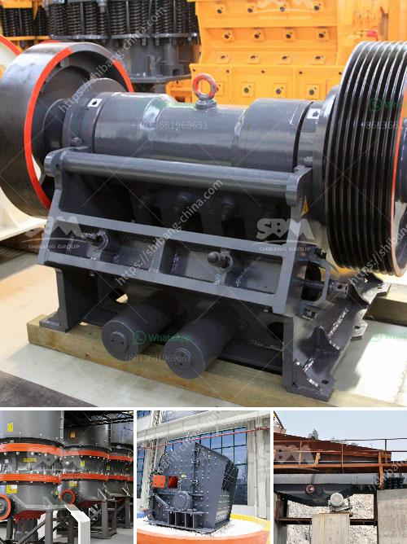

<h3>diatomite processing plant</h3>
Diatomite, also known as diatomaceous earth, is a naturally occurring sedimentary rock composed of the siliceous remains of microscopic organisms called diatoms. Ranging in color from white to light gray, diatomite is highly porous and has a unique structure that makes it an ideal material for a wide range of applications.

The demand for diatomite has been increasing over the years due to its unique properties and versatility. From filtration and insulation to agriculture and water treatment, this mineral is playing a vital role in various industries worldwide. To meet this growing demand, diatomite processing plants have emerged as a key player in the industry.

The primary objective of a diatomite processing plant is to process and refine the raw diatomite ore into a product that is ready for use in various applications. This involves a series of complex processes that require the utilization of advanced equipment and technology.

The first step in the processing of diatomite is the collection and extraction of the raw material from mining sites. Diatomite deposits are typically found in ancient lake beds or marine sediments. Once the ore is extracted, it is transported to the processing plant, where it undergoes various stages of crushing, drying, calcining, and classifying.

Crushing and grinding are crucial steps in the processing plant, as it helps to break down the ore into smaller particles for further processing. This is followed by drying, where the moisture content is reduced to a specified level. Calcination is the next step, where the diatomite is heated to high temperatures to remove impurities and enhance its absorbent properties.

Once the diatomite is properly processed, it is classified based on its particle size and other properties. This allows manufacturers to produce different grades of diatomite suitable for a wide range of applications. For instance, fine-grade diatomite is used in filtration systems, while coarser grades are used for insulation and absorbents.

One of the significant advantages of diatomite processing plants is their contribution to sustainable practices. Diatomite is a natural and renewable resource, and its mining and processing leave a minimal ecological footprint. The efficient use of energy and water resources, along with the responsible handling of waste, makes these plants a sustainable solution for both industry and the environment.

The applications of diatomite are varied and diverse. In filtration, it is commonly used as a filtering medium due to its high porosity and ability to capture fine particles. Its insulation properties make it an excellent choice for thermal insulation in buildings, helping to reduce energy consumption. Diatomite is also used in the agricultural sector as an additive to improve soil fertility and water retention.

In conclusion, diatomite processing plants play a significant role in meeting the increasing demand for this versatile mineral. Through a series of complex processes, these plants transform raw diatomite ore into a refined product suitable for various applications. The sustainable nature of diatomite mining and processing, along with its diverse range of applications, make it a valuable resource for both industry and the environment. As the demand for sustainable and eco-friendly materials continues to grow, diatomite processing plants are likely to become even more crucial in the years to come.
<h3>Contact us</h3><ul><li><strong>Whatsapp:&nbsp;<a href="https://wa.me/8613661969651">+8613661969651</a></strong></li><li><a href="https://swt.shibang-china.com/?git&amp;zhl&amp;diatomite processing plant"><strong>Online Service(chat now)</strong></a></li></ul><h3>Related</h3><ul><li><a href='stone jaw crusher machinery supplier.md'>stone jaw crusher machinery supplier</a></li><li><a href='mineral used for making talcum powder.md'>mineral used for making talcum powder</a></li><li><a href='vertical vertical grinding machine.md'>vertical vertical grinding machine</a></li><li><a href='broach grinding machine manufacture in china.md'>broach grinding machine manufacture in china</a></li><li><a href='mini jaw crusher saudi.md'>mini jaw crusher saudi</a></li></ul>