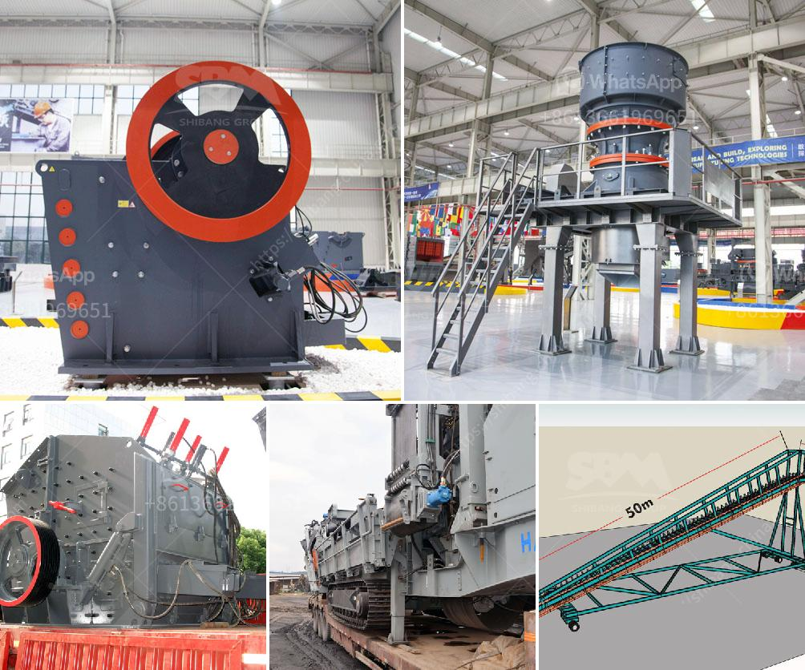

<h3>difference between horizontal milling machine</h3>
A milling machine is a versatile tool used in metalworking operations to create shapes, slots, holes, and dimensionally accurate parts. One of the most common types of milling machines is the horizontal milling machine, which features a horizontal spindle or cutter.

The main difference between a horizontal milling machine and other milling machines is the orientation of the spindle. While the spindle of a horizontal milling machine is placed horizontally, the vertical milling machine has its spindle positioned vertically. This fundamental difference determines the types of operations that each machine is best suited for.

Horizontal milling machines excel at removing large amounts of material quickly and efficiently. This machine is ideal for producing large, flat surfaces, such as plane surfaces, keyways, and gear teeth. Due to the horizontal orientation, the chips created during cutting easily fall away from the workpiece and do not interfere with the machining process. It allows for high-speed material removal, resulting in faster production.

Vertical milling machines, on the other hand, are better suited for more detailed work. The vertical orientation of the spindle allows for precise cutting and drilling of smaller, intricate shapes. This machine is typically used for tasks such as milling slots, drilling holes at various angles, and producing molds or dies.

Additionally, horizontal milling machines often come equipped with a worktable that can be swiveled, allowing for even more flexibility in machining operations. This feature is particularly useful for angle milling, helical milling, and slotting operations. On the other hand, the worktable of a vertical milling machine is stationary, limiting its versatility.

It's important to note that the choice between a horizontal milling machine and a vertical milling machine depends on the specific requirements of the project at hand. Factors such as the size, complexity, and material of the workpiece, as well as the desired accuracy and production speed, should be considered when determining which type of milling machine to use.

In conclusion, the main difference between a horizontal milling machine and other types of milling machines is the orientation of the spindle. The horizontal milling machine is best suited for tasks that require fast material removal and the production of large, flat surfaces. On the other hand, the vertical milling machine is more suitable for detailed work and tasks that involve drilling holes at various angles. Both types of machines have their own advantages and should be chosen based on the specific requirements of the job.
<h3>Contact us</h3><ul><li><strong>Whatsapp:&nbsp;<a href="https://wa.me/8613661969651">+8613661969651</a></strong></li><li><a href="https://swt.shibang-china.com/?git&amp;zhl&amp;difference between horizontal milling machine"><strong>Online Service(chat now)</strong></a></li></ul><h3>Related</h3><ul><li><a href='stone crushing machine for sale in uganda.md'>stone crushing machine for sale in uganda</a></li><li><a href='marble mine processing equipment manufacturers in india.md'>marble mine processing equipment manufacturers in india</a></li><li><a href='crushing rock export manufacturers india.md'>crushing rock export manufacturers india</a></li><li><a href='harare changfa diesel engine.md'>harare changfa diesel engine</a></li><li><a href='impact crusher zenith.md'>impact crusher zenith</a></li></ul>