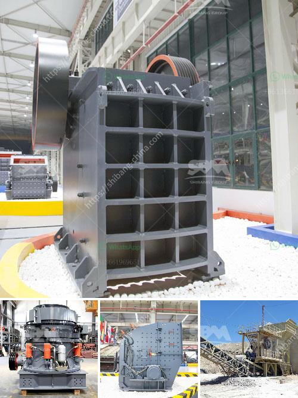

<h3>different ore beneficiation equipment all over the world</h3>
In the mining industry, ore beneficiation is a crucial step in improving the quality of ore and extracting valuable metals. With the depletion of high-grade ore deposits, the need for effective beneficiation equipment has become increasingly important. In this article, we will explore some of the different ore beneficiation equipment used all over the world.

One of the commonly used equipment in the beneficiation process is magnetic separators. These devices use magnetic forces to separate magnetic materials from non-magnetic ones. They are particularly effective in separating iron ores, which are often found in abundance. Magnetic separators can be used in both wet and dry processing, and they come in various configurations, such as drum, roll, and belt separators.

Gravity separation is another widely used beneficiation technique that relies on the differences in the specific gravity of ores. This method is suitable for separating materials with large density differences, such as gold and sand. One of the most common gravity separation devices is the jig machine. Jigging uses pulsating water currents to separate heavy and light minerals. The heavy minerals settle at the bottom, while the lighter ones are forced upwards.

Flotation is a popular method for concentrating and separating minerals. It involves adding chemicals to the ore slurry to make certain minerals hydrophobic, while others remain hydrophilic. Air bubbles are then introduced into the slurry, and the hydrophobic minerals attach to these bubbles and rise to the surface, where they can be collected. Flotation machines come in various types, such as mechanical and pneumatic cells, with different configurations depending on the volume and nature of the ore.

While most beneficiation equipment focuses on separating valuable minerals from gangue, leaching equipment works to extract valuable metals by dissolving them in a liquid solvent. Leaching is commonly used for the extraction of metals like gold, silver, and copper from low-grade ores. Various types of leaching equipment, such as heap leaching, agitated leaching, and vat leaching, are utilized to maximize the recovery of valuable metals.

In recent years, technological advancements have led to the emergence of innovative beneficiation equipment. For example, sensor-based ore sorting machines use sensors to identify valuable minerals in the ore stream and reject non-valuable ones. This technology enables more efficient ore processing by reducing the amount of unnecessary material that needs further treatment.

It is worth noting that different ore deposits require different beneficiation approaches, and the choice of equipment depends on several factors, including the ore type, mineralogy, and economics. Therefore, it is crucial for mining operations to carefully assess their ore characteristics and select the appropriate equipment to optimize their production and minimize operational costs.

In conclusion, ore beneficiation is a critical step in extracting valuable metals from low-grade ores. Magnetic separators, gravity separation devices, flotation machines, leaching systems, and sensor-based ore sorting machines are some of the commonly used equipment worldwide. As technological advancements continue, new and more efficient beneficiation equipment is being developed to meet the demands of the mining industry.
<h3>Contact us</h3><ul><li><strong>Whatsapp:&nbsp;<a href="https://wa.me/8613661969651">+8613661969651</a></strong></li><li><a href="https://swt.shibang-china.com/?git&amp;zhl&amp;different ore beneficiation equipment all over the world"><strong>Online Service(chat now)</strong></a></li></ul><h3>Related</h3><ul><li><a href='netherlands impact crushers.md'>netherlands impact crushers</a></li><li><a href='feldspar stone processing plant.md'>feldspar stone processing plant</a></li><li><a href='process of granite mining crusher machines used.md'>process of granite mining crusher machines used</a></li><li><a href='iron ore to iron process made in canada.md'>iron ore to iron process made in canada</a></li><li><a href='cost of setting up a stamp mill in zimbabwe.md'>cost of setting up a stamp mill in zimbabwe</a></li></ul>