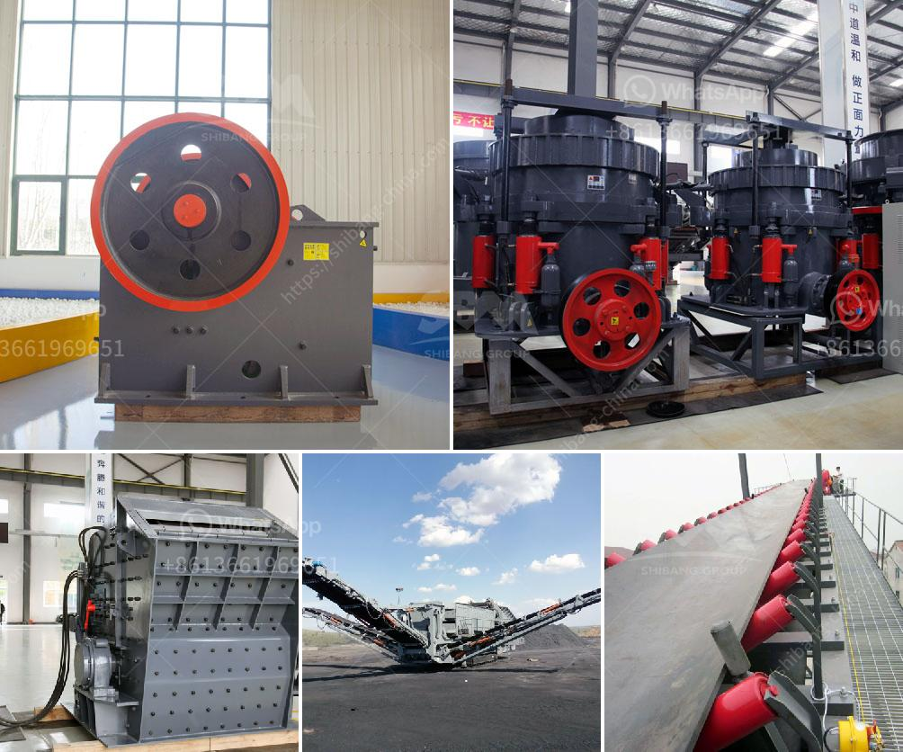

<h3>disintegrator grinder pulverizer</h3>
In today's fast-paced industrial world, the need for efficient size reduction equipment is more critical than ever. From food processing plants to pharmaceutical companies, various industries depend on grinding technology to convert raw materials into fine powders or granules. One such innovative machine that has gained popularity in recent years is the disintegrator grinder pulverizer. With its exceptional grinding capabilities and versatility, this equipment has become a staple in many processing facilities.

The disintegrator grinder pulverizer is a robust and sturdy machine designed to break down a wide range of materials into smaller, more manageable sizes. It stands apart from traditional grinders due to its unique operating principle. Instead of relying solely on sharp blades or hammers to pulverize the material, the disintegrator grinder pulverizer uses a combination of impact and shearing forces. This dual-action grinding process ensures maximum efficiency and consistency in particle size reduction.

One of the key advantages of the disintegrator grinder pulverizer is its ability to handle different types of materials. Whether it's dry or wet, fibrous or brittle, the machine can effectively reduce the size of almost any substance. This flexibility makes it an ideal choice for a wide range of applications. Food processing plants can use it to grind spices, herbs, and even biscuits. In the pharmaceutical industry, it can be employed to pulverize tablets, granules, and other medicinal compounds. The machine is also widely used in chemical, cosmetic, and agricultural industries.

Another noteworthy feature of the disintegrator grinder pulverizer is its ease of use and maintenance. It often comes equipped with interchangeable screens or sieves, allowing operators to adjust the output particle size according to their specific requirements. Additionally, most models incorporate safety features like automatic shutdown systems to prevent any mishaps during operation. The machine's modular construction enables quick and hassle-free cleaning, minimizing downtime and ensuring hygienic practices in food and pharmaceutical applications.

The disintegrator grinder pulverizer is known for its exceptional grinding efficiency. Thanks to its innovative design, it can achieve higher throughputs and finer particle sizes compared to conventional grinders. The dual-action grinding mechanism ensures that the material is pulverized completely, resulting in higher yields and improved product quality. The consistent, uniform particle size in the final product enhances its properties, such as flowability, solubility, and absorption, making it easier to handle, transport, and process further.

In conclusion, the disintegrator grinder pulverizer has emerged as a reliable and versatile machine in the grinding industry. Its unique grinding mechanism, which combines impact and shearing forces, ensures efficient and uniform size reduction of various materials. Whether it's for food, pharmaceutical, or chemical processing, this equipment can deliver consistent results and higher yields. Moreover, its user-friendly design, easy maintenance, and adaptability to different materials make it a valuable asset for any processing facility. As industries continue to demand faster, more efficient size reduction technology, the disintegrator grinder pulverizer stands out as an excellent solution to meet those needs.
<h3>Contact us</h3><ul><li><strong>Whatsapp:&nbsp;<a href="https://wa.me/8613661969651">+8613661969651</a></strong></li><li><a href="https://swt.shibang-china.com/?git&amp;zhl&amp;disintegrator grinder pulverizer"><strong>Online Service(chat now)</strong></a></li></ul><h3>Related</h3><ul><li><a href='equipos para triturado de mineria.md'>equipos para triturado de mineria</a></li><li><a href='silica flour mill.md'>silica flour mill</a></li><li><a href='rock crusher for quartz.md'>rock crusher for quartz</a></li><li><a href='portable crushers sweden.md'>portable crushers sweden</a></li><li><a href='calcium carbonate production line in germany.md'>calcium carbonate production line in germany</a></li></ul>