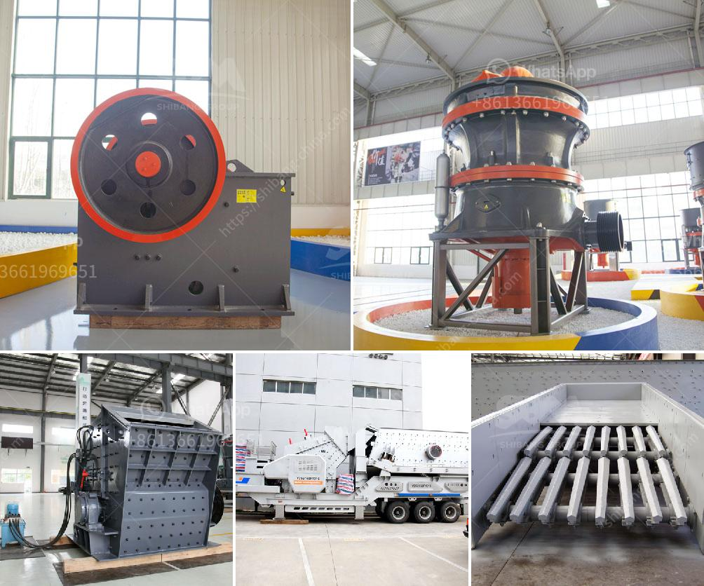

<h3>distributor jaw crusher merk khong chuan</h3>
When it comes to crushing and pulverizing materials for various industries, especially for the mining sector, distributor jaw crusher merk Khong Chuan is always the go-to brand. With over decades of experience in manufacturing jaw crushers, the company has been catering to the diverse needs and demands of its clients, ensuring high-quality and efficient crushing solutions.

The jaw crusher is a vital tool in the mining industry as it helps in breaking down large stones into small, manageable-sized pieces that can be further used for various purposes. It is commonly used for primary crushing, where the stones are initially processed before being sent for further grinding or crushing processes.

One of the key aspects that sets distributor jaw crusher merk Khong Chuan apart from its competitors is its commitment to quality and performance. The company utilizes advanced technologies, high-grade materials, and skilled craftsmanship to manufacture jaw crushers that can withstand the harshest operating conditions. Each component of the jaw crusher is carefully designed and tested to ensure its durability, reliability, and efficiency.

Another significant advantage of choosing distributor jaw crusher merk Khong Chuan is its wide range of options available to cater to different needs. The company offers a variety of models, each with unique features and specifications, allowing customers to choose the one that best fits their requirements. Whether it is processing hard and abrasive stones or handling softer materials, distributor jaw crusher merk Khong Chuan has a solution for every application.

Additionally, distributor jaw crusher merk Khong Chuan provides comprehensive after-sales support to its customers. The company offers maintenance services, spare parts availability, and technical assistance to ensure smooth and uninterrupted operation of their jaw crushers. This commitment to customer satisfaction has earned them a reputation for exceptional service and reliability in the industry.

Not only does distributor jaw crusher merk Khong Chuan excel in providing top-notch products and services, but the company also prioritizes sustainability and environmental responsibility. The jaw crushers are designed to consume less energy while maintaining optimal performance, reducing the carbon footprint and contributing to a greener future.

In conclusion, distributor jaw crusher merk Khong Chuan is a trusted and reliable brand for high-quality crushing equipment. With its commitment to excellence, customer satisfaction, and sustainability, the company continues to be a leader in the industry. Whether it is for mining operations or other industries requiring efficient crushing solutions, distributor jaw crusher merk Khong Chuan is the go-to choice for many professionals.
<h3>Contact us</h3><ul><li><strong>Whatsapp:&nbsp;<a href="https://wa.me/8613661969651">+8613661969651</a></strong></li><li><a href="https://swt.shibang-china.com/?git&amp;zhl&amp;distributor jaw crusher merk khong chuan"><strong>Online Service(chat now)</strong></a></li></ul><h3>Related</h3><ul><li><a href='limestone rock crushing company.md'>limestone rock crushing company</a></li><li><a href='barite processing plant.md'>barite processing plant</a></li><li><a href='quartz powder buyers 300 mesh.md'>quartz powder buyers 300 mesh</a></li><li><a href='gypsum processing plant in.md'>gypsum processing plant in</a></li><li><a href='model pe 250 400 bantalan jaw crusher.md'>model pe 250 400 bantalan jaw crusher</a></li></ul>